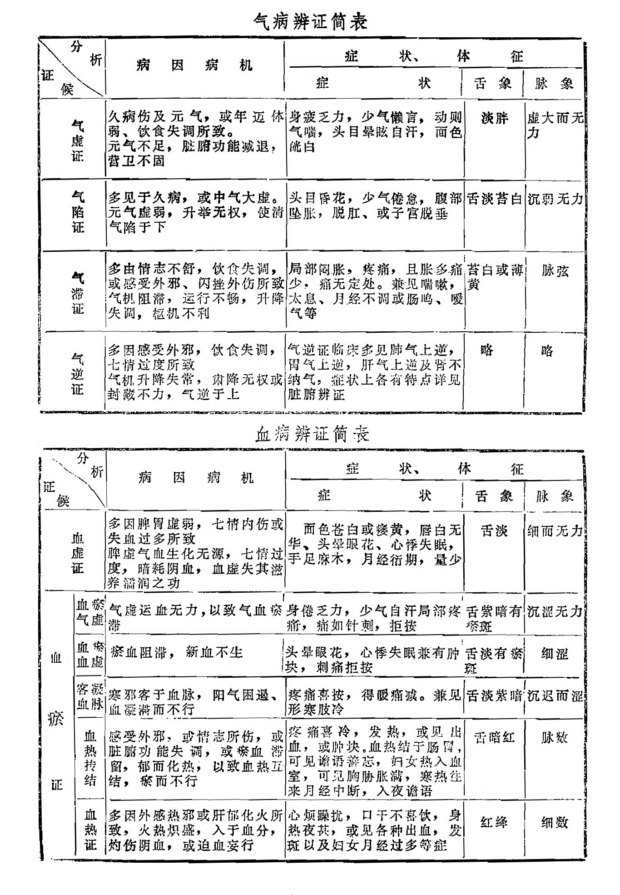
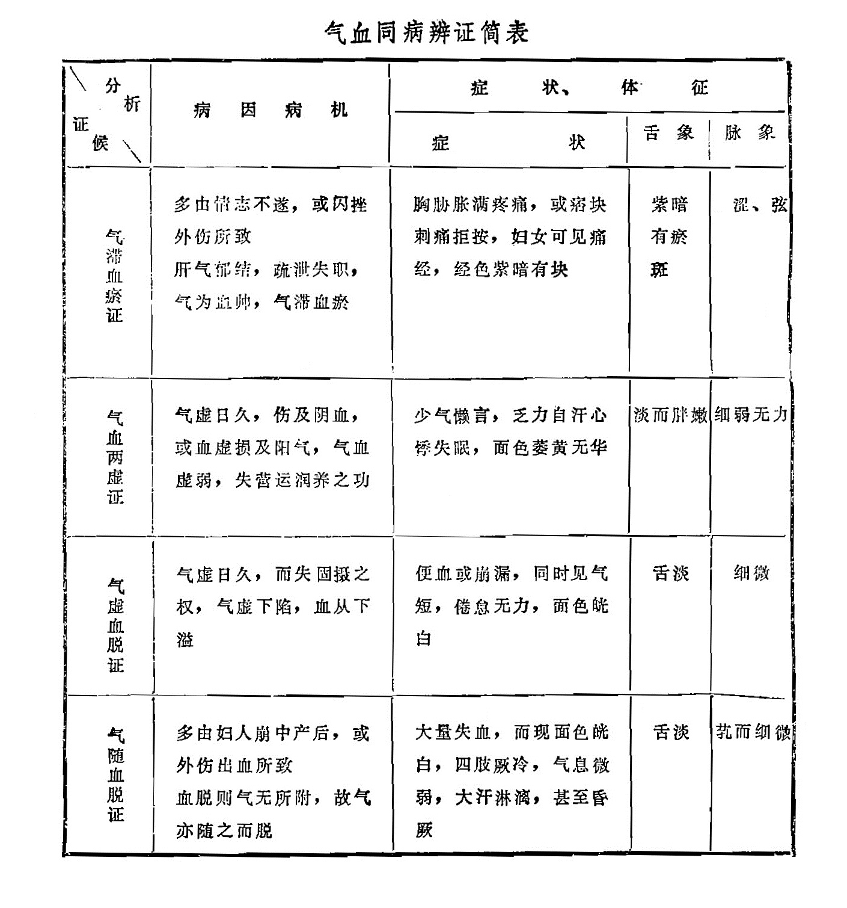
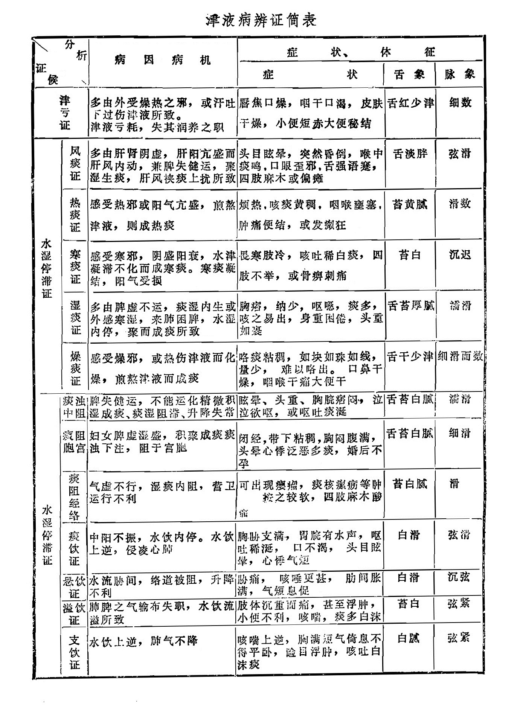

## 第二节  气血津液辨证

气血津液辨证，就是分析气、血、津液各方面的病理变化，从而辨识其所反映的不同证候的一种辨证方法。

气血津液病变与脏腑病变密切相关，二者常常相互影响，互为因果。气血津液辨证是对脏俯病变中气血津液失常的某些共同病理特征的概况，因而，掌握这一辨证，可为学习脏腑辨证奠定基础。

气血津液辨证包括气病的辨证、血病的辨证、气血同病辨证，与津液病的辨证。现分列简表如下：

气病辨证简表

|        | 病因病机                                                     | 症状                                                         | 舌象       | 脉象       |
| ------ | ------------------------------------------------------------ | ------------------------------------------------------------ | ---------- | ---------- |
| 气虚证 | 久病伤及元气，或年迈体弱、饮食失调所致。元气不足，脏腑功能减退，营卫不固 | 身疲乏力，少气懒言，动则气喘，头目晕眩自汗，面色㿠白         | 淡胖       | 虚大而无力 |
| 气陷证 | 多见于久病，或中气大虚，元气虚弱，升举无权，使清气陷于下     | 头目昏花，少气倦怠，腹部坠胀，脱肛、或子宫脱垂               | 舌淡苔白   | 沉弱无力   |
| 气滞证 | 多由情志不舒，饮食失调，或感受外邪、闪挫外伤所致气机阻滞，运行不畅，升降失调，枢机不利 | 局部闷胀，疼痛，且胀多痛少，痛无定处。兼见喘嗽，太息、月经不调或肠鸣、嗳气等 | 苔白或薄黄 | 脉弦       |
| 气逆证 | 多因感受外邪，饮食失调，七情过度所致 气机升降失常，肃降无权或封藏不力，气逆于上 | 气逆证临床多见肺气上逆，胃气上逆，肝气上逆及肾不纳气，症状上各有特点详见脏腑辨证 | 略         | 略         |

血病辨证简表

|        |          | 病因病机                                                     | 症状                                                         | 舌象         | 脉象     |
| ------ | -------- | ------------------------------------------------------------ | ------------------------------------------------------------ | ------------ | -------- |
| 血虚证 |          | 多因脾胃虚弱，七情内伤或失血过多所致 脾虚气血生化无源，七情过度，暗耗阴血，血虚失其滋养濡润之功 | 面色苍白或瘘黄，唇白无华、头晕眼花、心悸失眠，手足庥木，月经衍期，量少 | 舌淡         | 细而无力 |
| 血瘀证 | 血瘀气虚 | 气虚运血无力，以致气血淤滞                                   | 身倦乏力，少气自汗局部疼痛，痛如针剌，拒按                   | 舌紫暗有瘀斑 | 沉涩无力 |
| 血瘀证 | 血瘀血虚 | 瘀血阻滞，新血不生                                           | 头晕眼花，心悸失眠兼有肿块，刺痛拒按                         | 舌淡有瘀斑   | 细涩     |
| 血瘀证 | 客凝血脉 | 寒邪客于血脉，阳气困遏、血凝滞而不行                         | 疼痛喜按，得暖痛减。兼见形寒肢冷                             | 舌淡紫暗     | 沉迟而涩 |
| 血瘀证 | 血热抟结 | 感受外邪，或情志所伤，或脏腑功能失调，或瘀血滞留，郁而化热，以致血热互结，瘀而不行 | 疼痛喜冷，发热，或见出血，或肿块。血热结于肠胃，可见谵语善忘，妇女热入血室，可见胸胁胀满，寒热往来月经中断，入夜谵语 | 舌暗红       | 脉数     |
| 血瘀证 | 血热证   | 多因外感热邪或肝郁化火所致，火热炽盛，入于血分，灼伤阴血，或迫血妄行 | 心烦躁扰，口干不喜饮，身热夜某，或见各种出血，发斑以及妇女月经过多等症 | 红绛         | 细数     |

|            | 病因病机                                                     | 症状                                                         | 舌象       | 脉象     |
| ---------- | ------------------------------------------------------------ | ------------------------------------------------------------ | ---------- | -------- |
| 气滞血瘀证 | 多由情志不遂，或闪挫外伤所致 肝气郁结，疏泄失职，气为血帅，气滞血瘀 | 胸胁胀满疼痛，或痞块刺痛拒按，妇女可见痛经，经色紫暗有块     | 紫暗有瘀斑 | 涩、弦   |
| 气血两虚证 | 气虚日久，伤及阴血，或血虚损及阳气，气血虚弱，失营运润养之功 | 少气懒言，乏力自汗心悸失眠，面色萎黄无华                     | 淡而胖嫩   | 细弱无力 |
| 气虚血脱证 | 气虚日久，而失固摄之权，气虛下陷，血从下溢                   | 便血或崩漏，同时见气短，倦怠无力，面色㿠白                   | 舌淡       | 细微     |
| 气随血脱证 | 多由妇人崩中产后，或外伤出血所致 血脱则气无所附，故气亦随之而脱 | 大量失血，而现面色㿠白，四肢厥冷，气息微弱，大汗淋漓，甚至昏厥 | 舌淡       | 芤而细微 |

|            |          | 病因病机                                                     | 症状                                                         | 舌象     | 脉象     |
| ---------- | -------- | ------------------------------------------------------------ | ------------------------------------------------------------ | -------- | -------- |
| 津亏证     |          | 多由外受燥热之邪，或汗吐下过伤津液所致。 律液亏耗，失其润养之职 | 唇焦口燥，咽干口渴，皮肤干燥，小便短赤大便秘结               | 舌红少津 | 细数     |
| 水湿停滞证 | 风痰证   | 多由肝肾阴虚，肝阳亢盛而肝风内动，兼脾失健运，聚湿生痰，肝风挟痰上扰所致 | 头目眩晕，突然昏倒，喉中痰鸣，口眼歪邪，舌强语蹇，四肢麻木或偏瘫 | 舌淡胖   | 弦滑     |
| 水湿停滞证 | 热痰证   | 感受热邪或阳气亢盛，煎熬津液，则成热痰                       | 烦热、咳痰黄稠，咽喉壅塞，肿痛便结，或发癫狂                 | 苔黄腻   | 滑数     |
| 水湿停滞证 | 寒痰证   | 感受寒邪，阴盛阳衰，水津凝滞不化而成寒痰。寒痰凝结，阳气受损 | 畏寒肢冷，咳吐稀白痰，四肢不举，或骨痹刺痛                   | 苔白     | 沉迟     |
| 水湿停滞证 | 湿痰证   | 多由脾虚不运，痰湿内生或外感寒湿，来肺困脾，水湿内停，聚而成痰所致 | 胸痞，纳少，呕噁，痰多，咳之易出，身重困倦，头重如裹         | 舌苔厚腻 | 濡滑     |
| 水湿停滞证 | 燥痰证   | 感受燥邪，或热伤津液而化燥，煎熬津液而成痰                   | 咯痰粘稠，如块如珠如线，量少，难以咯出。口鼻干燥，咽喉干痛大便干 | 舌干少津 | 细滑而数 |
| 水湿停滞证 | 痰浊中阻 | 脾失健运，不能运化精微积湿成痰、痰湿阻滞、升降失常           | 眩晕、头重、胸脘痞闷，泣泣欲呕，或呕吐痰涎                   | 舌苔白腻 | 濡滑     |
| 水湿停滞证 | 痰阻胞宫 | 妇女脾虚湿盛，积聚成痰痰浊下注，阻于宫胞                     | 闭经，带下粘稠，胸闷腹满，头晕心悸泛恶多痰，婚后不孕         | 舌苔白腻 | 细滑     |
| 水湿停滞证 | 痰阻经络 | 气虚不行，湿痰内阻，营卫运行不利                             | 可出现瘿瘤，痰核瘰疬等肿块，按之较软，四肢麻木酸痛           | 苔白腻   | 滑       |
| 水湿停滞证 | 痰饮证   | 中阳不振，水饮内停。水饮上逆，侵凌心肺                       | 胸胁支满，胃脘有水声，呕吐稀涎，口不渴，头目眩晕，心悸气短   | 白滑     | 弦滑     |
| 水湿停滞证 | 悬饮证   | 水流胁间，络道被阻，升降不利                                 | 胁痛，咳唾更甚，肋间胀满，气短息促                           | 白滑     | 沉弦     |
| 水湿停滞证 | 溢饮证   | 肺脾之气输布失职，水饮流溢所致                               | 肢体沉重而痛，甚至浮肿，小便不利，咳喘，痰多白沫             | 苔白     | 弦紧     |
| 水湿停滞证 | 支饮证   | 水饮上逆，肺气不降                                           | 咳喘上逆，胸满短气倚息不得平卧，睑目浮肿，咳吐白沫痰         | 白腻     | 弦紧     |