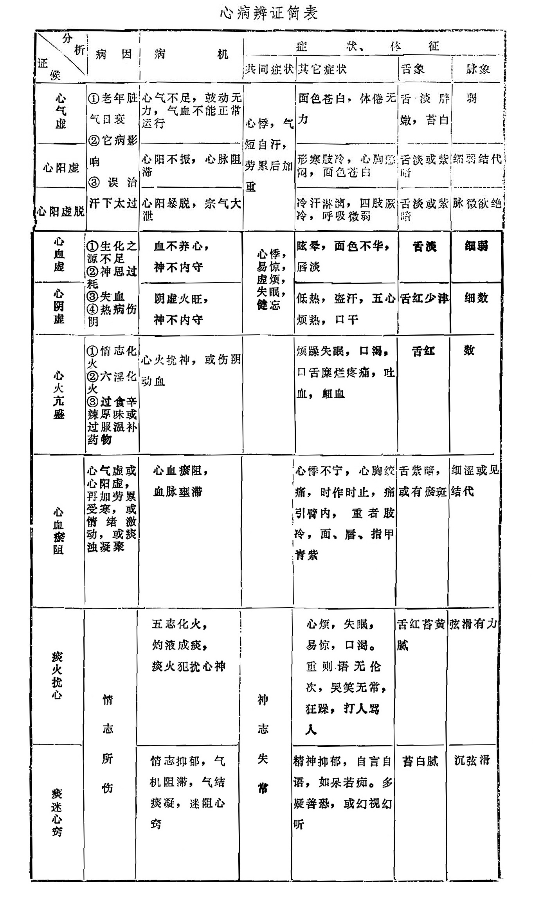
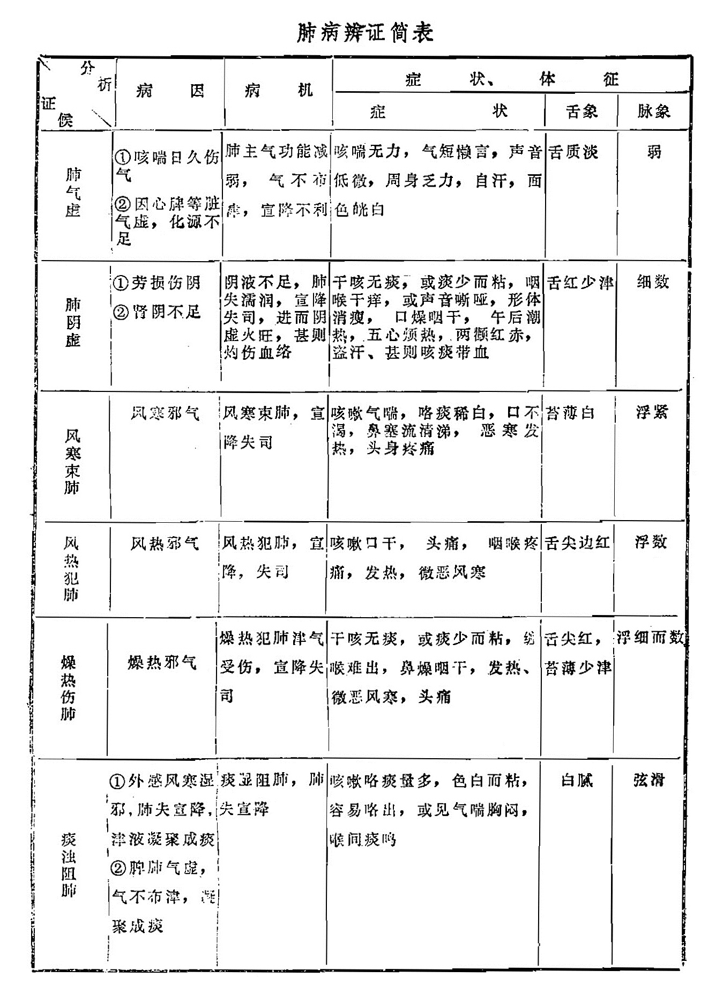
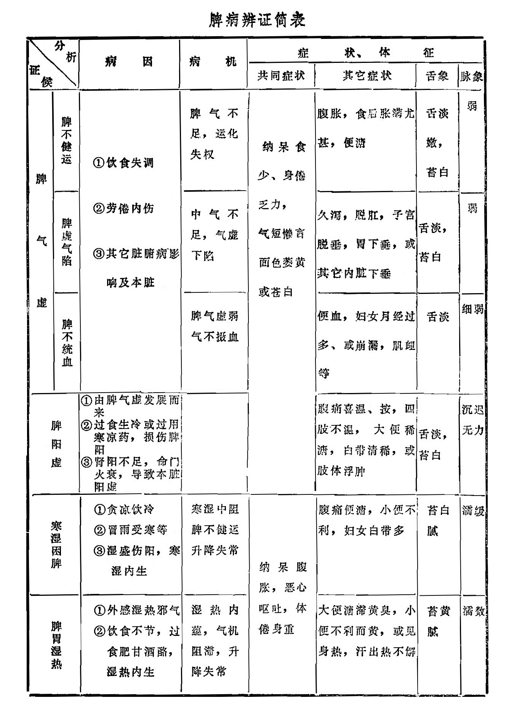
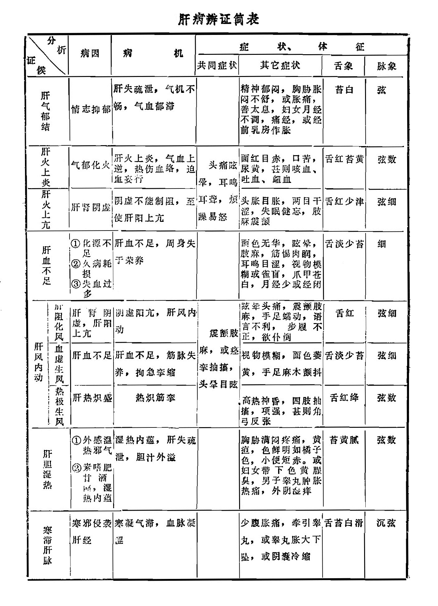
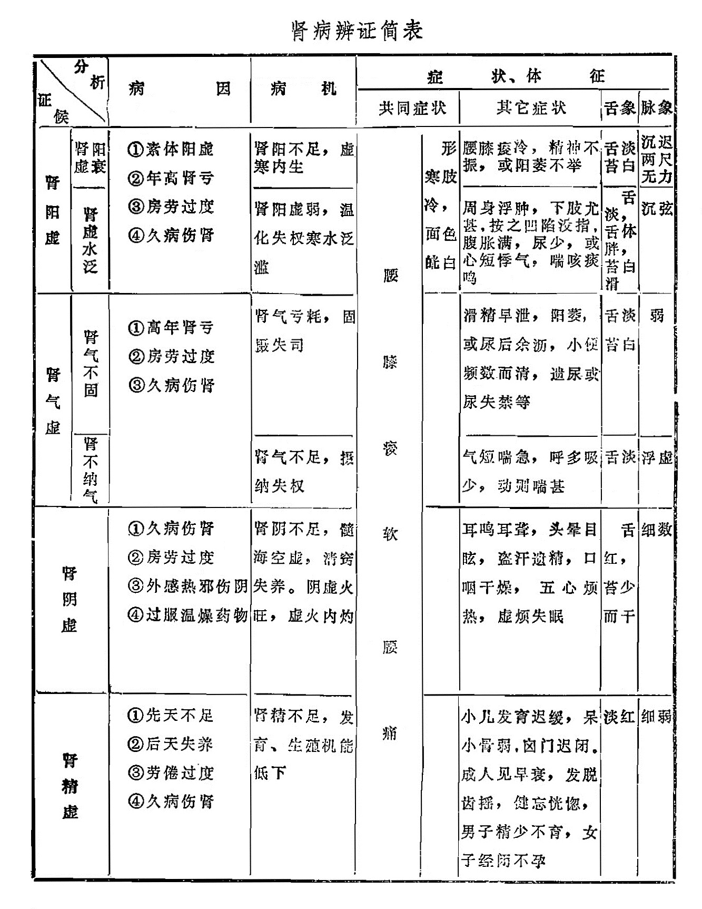
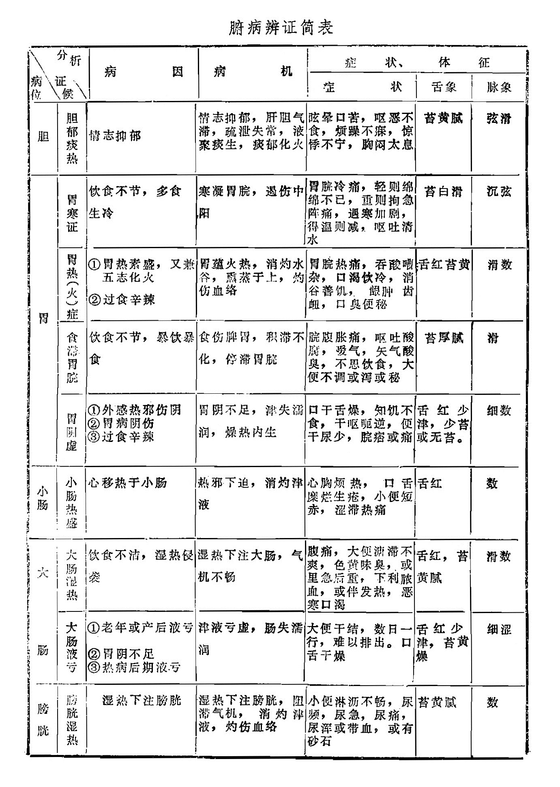

## 第三节  脏腑辨证

脏腑辨证主要是以脏象学说为基础，将四诊所获得的症状和体征进行综合分析，从而对病变所在的脏腑部位及其性质、正邪盛衰做出诊断的一种辨证方法。

脏腑是人体的重要组成部分，是生命活动的中心各种原因导致的病变，实际上都是脏腑功能失调的反映。由于各个脏腑的生理功能不同，所以它们在病变过程中所反映出来的症状和体征也各不相同。根据各脏腑的生理功能，结合病因病机来判断其病理变化，这就是脏腑辨证的方法和理论依据。中医学的辨证方法尽管多种多样，而且各具特长，但各种辨证方法最终都要落实到脏腑部位上。所以说，脏腑辨证是中医学辨证体系中的重要组成部分，其详细内容，将在《金匮要略讲解》及内科等教材中讲述。

脏腑辨证包括脏病辨证、腑病辨证及脏腑兼证辨证。本节将心、肺、脾、肝、肾脏病以及腑病的辨证列表作介绍。至于脏腑兼病辨证，因已在“脏腑之间的相互关系”中谈及，本节不再赘述。

|          | 病因                                                      | 病机                                   | 共同症状                     | 其它症状                                                     | 舌象             | 脉象         |
| -------- | --------------------------------------------------------- | -------------------------------------- | ---------------------------- | ------------------------------------------------------------ | ---------------- | ------------ |
| 心气虚   | ①老年脏气日衰 ②它病影响 ③误治汗下太过             | 心气不足，鼓动无力，气血不能正常运行   | 心悸，气短自汗，劳累后加重   | 面色苍白，体倦无力                                           | 舌淡胖嫩，苔白   | 弱           |
| 心阳虚   | 同上                                                      | 心阳不振，心脉阻滞                     | 同上                         | 形寒肢冷，心胸憋闷，面色苍白                                 | 舌淡或紫暗       | 细弱结代     |
| 心阳虚脱 | 同上                                                      | 心阳暴脱，宗气大泄                     | 同上                         | 冷汗淋漓，四肢厥冷，呼吸微弱                                 | 舌淡或紫暗       | 脉微欲绝     |
| 心血虚   | ①生化之源不足 ②神思过耗 ③失血 ④热病伤阴       | 血不养心，神不内守                     | 心悸，易惊，虚烦，失眠，健忘 | 眩晕，面色不华,唇淡                                          | 舌淡             | 细弱         |
| 心阴虚   | 同上                                                      | 阴虚火旺，神不内守                     | 同上                         | 低热，盗汗，五心烦热，口干                                   | 舌红少津         | 细数         |
| 心火亢盛 | ①情志化火 ②六淫化火 ③过食辛辣厚味或过服温补药物 | 心火扰神，或伤阴动血                   |                              | 烦躁失眠，口渴，口舌糜烂疼痛，吐血，衄血                     | 舌红             | 数           |
| 心血瘀阻 | 心气虚或心阳虚，再加劳累受寒，或情绪激动，或痰浊凝聚      | 心血瘀阻，血脉壅滞                     |                              | 心悸不宁，心胸绞痛，时作时止，痛引臂内，重者肢冷，面、唇、指甲青紫 | 舌紫暗，或有瘀斑 | 细涩或见结代 |
| 痰火扰心 | 情志所伤                                                  | 五志化火，灼液成痰,痰火犯扰心神        | 神志失常                     | 心烦，失眠，易惊，口渴。重则语无伦次，哭笑无常，狂躁，打人骂人 | 舌红苔黄腻       | 弦滑有力     |
| 痰迷心窍 | 同上                                                      | 情志抑郁，气机阻滯，气结痰凝，迷阻心窍 | 同上                         | 精神抑郁，自言自语，如呆若痴。多疑善恐，或幻视幻听           | 苔白腻           | 沉弦滑       |

|          | 病因                                                         | 病机                                                     | 症状                                                         | 舌象             | 脉象     |
| -------- | ------------------------------------------------------------ | -------------------------------------------------------- | ------------------------------------------------------------ | ---------------- | -------- |
| 肺气虚   | ①咳喘日久伤气 ②因心脾等脏气虚，化源不足                  | 肺主气功能减弱，气不布津，宣降不利                       | 咳喘无力，气短懒言，声音低微，周身乏力，自汗，面色㿠白       | 舌质淡           | 弱       |
| 肺阴虚   | ①劳损伤阴 ②肾阴不足                                      | 阴液不足，肺失濡润，宣降失司，进而阴虚火旺，甚则灼伤血络 | 干咳无痰，或痰少而粘，咽喉干痒，或声音嘶哑，形体消瘦，口燥咽干,午后潮热，五心烦热，两颧红赤，盗汗、甚则咳痰带血 | 舌红少津         | 细数     |
| 风寒束肺 | 风寒邪气                                                     | 风寒束肺，宣降失司                                       | 咳嗽气喘，咯痰稀白，口不渴，鼻塞流清涕，恶寒发热，头身疼痛   | 苔薄白           | 浮紧     |
| 风热犯肺 | 风热邪气                                                     | 风热犯肺，宣降，失司                                     | 咳嗽口干，头痛，咽喉疼痛，发热，微恶风寒                     | 舌尖边红         | 浮数     |
| 燥热伤肺 | 燥热邪气                                                     | 燥热犯肺津气受伤，宣降失司                               | 干咳无痰，或痰少而粘，缠喉难出，鼻燥咽干，发热、微恶风寒，头痛 | 舌尖红，苔薄少津 | 浮细而数 |
| 痰浊阻肺 | ①外感风寒湿邪，肺失宣降，津液凝聚成痰 ②脾肺气虚，气不布津，凝聚成痰 | 痰湿阻肺，肺失宣降                                       | 咳嗽咯痰量多，色白而粘，容易咯出，或见气喘胸闷，喉间痰鸣     | 白腻             | 弦滑     |

|          |          | 病因                                                         | 病机                         | 共同症状                                     | 其它症状                                               | 舌象         | 脉象     |
| -------- | -------- | ------------------------------------------------------------ | ---------------------------- | -------------------------------------------- | ------------------------------------------------------ | ------------ | -------- |
| 脾气虚   | 脾不健运 | ①饮食失调 ②劳倦内伤 ③其它脏腑病影响及本脏            | 脾气不足，运化失权           | 纳呆食少、身倦乏力，气短懒言，面色萎黄或苍白 | 腹胀，食后胀满尤甚，便溏                               | 舌淡嫩，苔白 | 弱       |
| 脾气虚   | 脾虚气陷 | 同上                                                         | 中气不足，气虚下陷           | 同上                                         | 久泻，脱肛，子宫脱垂，胃下垂，或其它内脏下垂           | 舌淡,苔白    | 弱       |
| 脾气虚   | 脾不统血 | 同上                                                         | 脾气虚弱气不摄血             | 同上                                         | 便血，妇女月经过多、或崩漏，肌衄等                     | 舌淡         | 细弱     |
| 脾阳虚   |          | ①由脾气虚发展而来 ②过食生冷或过用寒凉药，损伤脾阳 ③肾阳不足，命门火衰，导致本脏阳虚 |                              | 同上                                         | 腹痛喜温、按，四肢不温，大便稀溏，白带清稀，或肢体浮肿 | 舌淡，苔白   | 沉迟无力 |
| 寒湿困脾 |          | ①贪凉饮冷 ②冒雨受寒等 ③湿盛伤阳，寒湿内生            | 寒湿中阻脾不健运升降失常     | 纳呆腹胀，恶心呕吐，体倦身重                 | 腹痛便溏，小便不利，妇女白带多                         | 苔白腻       | 濡缓     |
| 脾胃湿热 |          | ①外感湿热邪气 ②饮食不节，过食肥甘酒酪，湿热内生          | 湿热内蕴，气机阻滞，升降失常 | 同上                                         | 大便溏滞黄臭，小便不利而黄，或见身热，汗出热不解       | 苔黄腻       | 濡数     |

|          |          | 病因                                         | 病机                                   | 共同症状                       | 其他症状                                                     | 舌象     | 脉象 |
| -------- | -------- | -------------------------------------------- | -------------------------------------- | ------------------------------ | ------------------------------------------------------------ | -------- | ---- |
| 肝气郁结 |          | 情志抑郁                                     | 肝失疏泄，气机不畅，气血郁滞           |                                | 精神郁闷，胸胁胀闷不舒，或胀痛，善太息，妇女月经不调，痛经，或经前乳房作胀 | 苔白     | 弦   |
| 肝火上炎 |          | 气郁化火                                     | 肝火上炎，气血上逆，热伤血络，迫血妄行 | 头痛眩晕，耳鸣耳聋，烦躁易怒   | 面红目赤，口苦，尿黄，甚则咳血、吐血、衄血                   | 舌红苔黄 | 弦数 |
| 肝火上亢 |          | 肝肾阴虚                                     | 阴虚不能制阻，至使肝阳上亢             | 同上                           | 头胀目胀，两目干涩，失眠健忘，肢麻震颤                       | 舌红少津 | 弦细 |
| 肝血不足 |          | ①化源不足 ②久病耗损 ③失血过多        | 肝血不足，周身失于荣养                 |                                | 面色无华，眩晕，肢麻，筋惕肉𥆧，耳鸣目涩，视物模糊或雀盲，爪甲苍白，月经少或经闭 | 舌淡少苔 | 细   |
| 肝风内动 | 肝阻化风 | 肝肾阴虚，肝阳上亢                           | 阳虚阳亢，肝风内动                     | 震颤肢麻，或痉挛抽搐，头晕目眩 | 眩晕头痛，震颤肢麻，手足蠕动，语言不利，步履不正，欲仆倒     | 舌红     | 弦细 |
| 肝风内动 | 血虚生风 | 肝血不足                                     | 肝血不足，筋脉失养，拘急挛缩           | 同上                           | 视物模糊，面色萎黄，手足麻木颤抖                             | 舌淡少苔 | 弦细 |
| 肝风内动 | 热极生风 | 肝热炽盛                                     |                                        | 同上                           | 高热神昏，四肢抽搐，项强，甚则角弓反张                       | 舌红绛   | 弦数 |
| 肝胆湿热 |          | ①外感温湿热邪气 ②素嗜肥甘酒酪，湿热内蕴 | 湿热内蕴，肝失疏泄，胆汁外溢           |                                | 胸胁满闷疼痛，黄疸，色鲜明如橘子色，小便短赤。或妇女带下色黄腥臭，男子睾丸肿胀热痛，外阴湿痒 | 苔黄腻   | 弦数 |
| 寒滞肝脉 |          | 寒邪侵袭肝经                                 | 寒凝气滞，血脉凝涩                     |                                | 少腹胀痛，牵引睾丸，或睾丸胀大下坠，或阴囊冷缩               | 舌苔白滑 | 沉弦 |

|        |          | 病因                                                        | 病机                                             | 共同症状     | 共同症状           | 其它症状                                                     | 舌象                | 脉象         |
| ------ | -------- | ----------------------------------------------------------- | ------------------------------------------------ | ------------ | ------------------ | ------------------------------------------------------------ | ------------------- | ------------ |
| 肾阳虚 | 肾阳虚衰 | ①素体阳虚 ②年高肾亏 ③房劳过度 ④久病伤肾         | 肾阳不足，虚寒内生                               | 腰膝痠软腰痛 | 形寒肢冷，面色㿠白 | 腰膝痠冷，精神不振，或阳萎不举                               | 舌淡苔白            | 沉迟两尺无力 |
| 肾阳虚 | 肾虚水泛 | 同上                                                        | 肾阳虚弱，温化失权寒水泛滥                       | 同上         |                    | 周身浮肿，下肢尤甚，按之凹陷没指，腹胀满，尿少，或心悸短气，喘咳痰鸣 | 舌淡，舌体胖,苔白滑 | 沉弦         |
| 肾气虚 | 肾气不固 | ①高年肾亏 ②房劳过度 ③久病伤肾                       | 肾气亏耗，固摄失司                               | 同上         |                    | 滑精早泄，阳萎，或尿后余沥，小便频数而清，遗尿或尿失禁等     | 舌淡苔白            | 弱           |
| 肾气虚 | 肾不纳气 | 同上                                                        | 肾气不足，摂纳失权                               | 同上         |                    | 气短喘急，呼多吸少，动则喘甚                                 | 舌淡                | 浮虚         |
| 肾阴虚 |          | ①久病伤肾 ②房劳过度 ③外感热邪伤阴 ④过服温燥药物 | 肾阴不足，髓海空虚，清窍失养。阴虚火旺，虚火内灼 | 同上         |                    | 耳鸣耳聋，头晕目眩，盗汗遗精，口咽干燥，五心烦热，虚烦失眠   | 舌红，苔少而干      | 细数         |
| 肾精虚 |          | ①先天不足 ②后天失养 ③劳倦过度 ④久病伤肾         | 肾精不足，发育、生殖机能低下                     | 同上         |                    | 小儿发育迟缓，呆小骨弱，囟门迟闭。成人见早衰，发脱 齿摇，健忘恍惚，男子精少不育，女子经闭不孕 | 淡红                | 细弱         |

注：原书肾虚水泛的其它症状（或心短悸气）应为（心悸短气）

|      |             | 病因                                            | 病机                                             | 症状                                                         | 舌象                   | 脉象 |
| ---- | ----------- | ----------------------------------------------- | ------------------------------------------------ | ------------------------------------------------------------ | ---------------------- | ---- |
| 胆   | 胆郁痰热    | 情志抑郁                                        | 情志抑郁，肝胆气滞，疏泄失常，液聚痰生，痰郁化火 | 眩晕口苦，呕恶不食，烦躁不寐，惊悸不宁，胸闷太息             | 苔黄腻                 | 弦滑 |
| 胃   | 胃寒证      | 饮食不节，多食生冷                              | 寒凝胃脘，遏伤中阳                               | 胃脘冷痛，轻则绵绵不已，重则拘急阵痛，遇寒加剧，得温则减，呕吐清水 | 苔白滑                 | 沉弦 |
| 胃   | 胃热（火)症 | ①胃热素盛，又兼五志化火 ②过食辛辣           | 胃蕴火热，消灼水谷，熏蒸于上，灼伤血络           | 胃脘热痛，吞酸嘈杂，口渴饮冷，消谷善饥，龈肿齿 衄，口臭便秘 | 舌红苔黄               | 滑数 |
| 胃   | 食滞胃脘    | 饮食不节，暴饮暴食                              | 食伤脾胃，积滞不化，停滞胃脘                     | 脘腹胀痛，呕吐酸腐，嗳气，矢气酸臭，不思饮食，大便不调或泻或秘 | 苔厚腻                 | 滑   |
| 胃   | 胃阴虚      | ①外感热邪伤阴 ②胃病阴伤 ③过食辛辣       | 胃阴不足，津失濡润，燥热内生                     | 口干舌燥，知饥不食，干呕呃逆，便干尿少，脘痞或痛             | 舌红少津，少苔或无苔。 | 细数 |
| 小肠 | 小肠热盛    | 心移热于小肠                                    | 热邪下迫，消灼津液                               | 心胸烦热，口舌糜烂生疮，小便短赤，涩滞热痛                   | 舌红                   | 数   |
| 大肠 | 大肠湿热    | 饮食不洁，湿热侵袭                              | 湿热下注大肠，气机不畅                           | 腹痛，大便溏滞不爽，色黄味臭，或里急后重，下利脓血，或伴发热，恶寒口渴 | 舌红，苔黄腻           | 滑数 |
| 大肠 | 大肠液亏    | ①老年或产后液亏 ②胃阴不足 ③热病后期液亏 | 津液亏虚，肠失濡润                               | 大便干结，数日一行，难以排出。口舌干燥                       | 舌红少津，苔黄燥       | 细涩 |
| 膀胱 | 膀胱湿热    | 湿热下注膀胱                                    | 湿热下注膀胱，阻滞气机，消灼津液，灼伤血络       | 小便淋沥不畅，尿频，尿急，尿痛，尿浑或带血，或有砂石         | 苔黄腻                 | 数   |