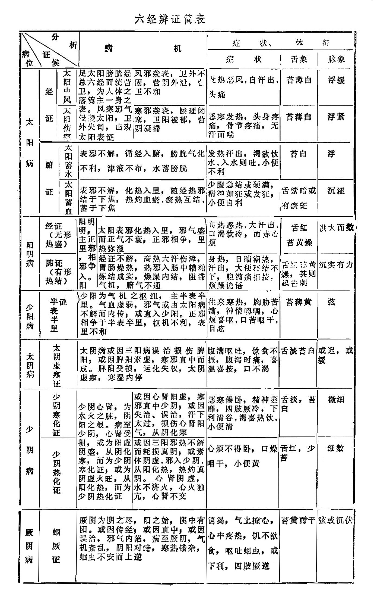

##  第四节六经辨证

六经辨证，是用于外感风寒之邪在发病过程中的辨证分类方法。是伤寒病的辨证纲领。它按照伤寒病的发生发展规律及其发展过程中各阶段的病变特点，将其分为六类病证，并以阴阳为纲，将其概括为三阳、三阴两大类别。具体地说，六经病证是太阳病、阳明病、少阳病，太阴病、少阴病、厥阴病的总称。它可以概括为三阳病和三阴病两大类。太阳病、阳明病、少阳病为三阳病；太阴病、少阴病、厥阴病为三阴病。三阳病证以六腑病变为基础，三阴病证以五脏病变为基础。所以说，六经辨证实际上是以六经统括共所络属的脏腑，因而它基本上概括了脏腑十二经病证，并以此来标示它们之间的传变规律。

六经病证从病变部位来划分，太阳病主表，阳明病主里，少阳病主半表半里，而三阴病统属于里。从病变的性质与邪正关系分，三阳病多热证、实证；三阴病多寒证、虚证。从传变规律来看，一般是由三阳传入三阴，由表入里，深入发展。

六经病证既可以单独出现，也可以两经或三经病证合并出现，又可以由这一经传变为另一经病。其中，两经或三经的病证同时出现的叫“合病”。一经病证未罢，另一经证候又见，两经交并为病，有先后次第之不同的叫“并病”。由这一经传变为另一经病的叫做“传经”。

六经病证的治疗原则，概括地说三阳病重在祛邪，三阴病重在扶正。

因为六经辨证的内容将在《伤寒论讲解》中详细讲述，本节列表概括介绍如下：

||||病机|病机|症状|舌象|脉象|
|------|----------------|--------|------------------------------------------------------------|------------------------------------------------------------|------------------------------------------------------------|----------------------|----------|
|太阳病|经证|太阳中风|足太阳膀胱经总六经而统营卫，为人体之藩篱主一身之表。风寒邪气侵袭太阳，卫外失司，出现太阳表证|风邪袭表，卫外不固，营阴外泄，营卫不和|发热恶风，自汗出，头痛|苔薄白|浮缓|
|太阳病|经证|太阳伤寒|同上|寒邪袭表，腠理闭塞，卫阳被郁，营阴凝滞|恶寒发热，头身疼痛，骨节疼痛，无汗而喘|苔薄白|浮紧|
|太阳病|腑证|太阳蓄水|表邪不解，循经入腑，膀胱气化不利，津液不布，水蓄膀胱||发热汗出，渴欲饮水，入水则吐，小便不利|苔白|浮|
|太阳病|腑证|太阳蓄血|表邪不解，化热入里，随经热邪结于下焦，热灼血瘀，瘀热互结，蓄于下焦||少腹急结或硬满，精神如狂或发狂,小便自利|舌紫暗或有瘀斑|沉涩|
|阳明病|经证（无形热盛）||阳明主里，邪入阳明，正邪相争|太阳表邪化热入里，邪气盛而正气不衰，正邪相争，里热弥漫|高热恶热，大汗出，口渴饮冷，面赤心烦|舌红苔黄燥|洪大而数|
|阳明病|腑证（有形热结）||同上|经证不解，高热大汗伤津，胃肠燥热，热邪入肠中糟粕炼结成实，燥屎内结，阻滞气机，腑气不通|身热，日晡潮热，汗出，大便秘结不下，腹满痛拒按，烦躁谵语|舌红苔黄燥，甚则起芒刺|沉实有力|
|少阳病|半表半里证||少阳为气机之枢纽，主半表半里。气血虚弱，邪气或由太阳病不解而内传；或直入少阳。正邪相争于半表半里，枢机不利，表里不和||往来寒热，胸胁苦满，神情嘿嘿，心烦喜呕，口苦咽干，目眩|苔薄黄|弦|
|太阴病|太阴虚寒证||太阴病或因三阳病误治损伤脾阳,或因脾阳素虚，寒邪直中而成。脾阳受损，运化失权，太阴虚寒，寒湿内停||腹满呕吐，饮食不振，腹泻时痛，喜温喜按，口不渴|舌淡苔白|或迟，或缓|
|少阴病|少阴寒化证||少阴心肾，为水火之脏，阴阳之根。病至少阴，心肾受损，或为阳虚阴盛，从阴化寒，而为少阴寒化证；或为阴虚火旺，从阳化热，而为少阴热化证|或因心肾阳虚，寒邪直中少阴；或因失治、误治，汗下太过，损伤心肾阳气，从阴化寒|恶寒倦卧，精神萎靡，四肢厥冷，下利清谷，渴喜热饮，小便清|舌淡，苔白|微细|
|少阴病|少阴热化证||同上|或因三阳邪热不解而耗损真阴；或素体阴虚，邪入少阴，从阳化热，热灼真阴。心肾阴虚，水不济火，心火独亢，心肾不交|心烦不得卧，口燥咽干，小便黄|舌红，少苔|细数|
|厥阴病|蛔厥证||厥阴为阴之尽，阳之始，阴中有阳。或因传经；或因直中；或因误治，邪气内陷，病至厥阴，气机紊乱，阴阳对峙，寒热错杂，蛔虫不安而上逆||消渴，气上撞心，心中疼热，饥不欲食，呕吐蛔虫，或下利，四肢厥逆|苔黄而干|弦或沉伏|

