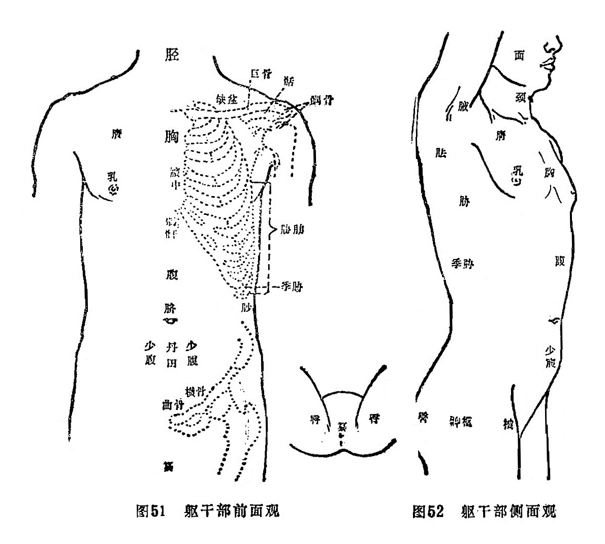

#### （一）前、侧面观（见图51、52）

胸：缺盆以下、腹部以上，两乳之间的部位。

膺（yīng英）：胸前两傍肌肉隆起处，相当于胸大肌的部位。

膻中：胸部两乳之中间部位。

𩩲骬（hé、yú合于）：又名鸠尾、蔽心骨，即胸骨下端，今称胸骨剑突。

腹：胸以下、横骨以上部位均称腹，其中脐以上称大腹，脐以下称小腹。小腹中，脐直下部位又称小腹，脐下两傍称少腹。

神阙：即脐。

丹田：脐下三寸左右的部位。

横骨：今称耻骨。

曲骨：横骨中央部，今称耻骨联合。

鼠蹊（xī夕）：即今称之腹股沟部。

毛际：阴毛部上缘。

阴门：女性外生殖器，已婚女性又称产门。今称阴裂，一般指阴道。

廷孔：女性尿道外口。

阴囊：阴茎后侧，内包睾丸者即是。

篡（cuàn串）：又名下极、屏翳、指前后二阴之间，即会阴部。

缺盆：今称锁骨上窝，在颈之下、巨骨上凹陷处。

锁子骨：又称巨骨，今称锁骨，即横于胸膺部上缘和肩端之骨，又名缺盆骨。锁子骨之肩侧端又称䯏骨。

两叉骨：肩胛骨和巨骨相接部，相当于今称之肩锁关节部。

髃（yú于）骨：又称肩端骨，系肩胛骨与锁子骨（巨骨）在肩端结合部。今称肩胛岗肩峰端。简称髃，俗称肩头。（部位名与骨名有别）。

腋：即腋窝。

胁：腋下至肋骨尽处的部位统称胁。一说又名胠。胁部的数条横骨名肋骨。

季胁：是胁部最下缘近腰侧的部位。其内有两条浮游的肋骨，名季肋、软肋、橛（jué决）肋，今称浮肋者即是。

䏚（miǎo秒）：季胁下无肋骨的空软处。
