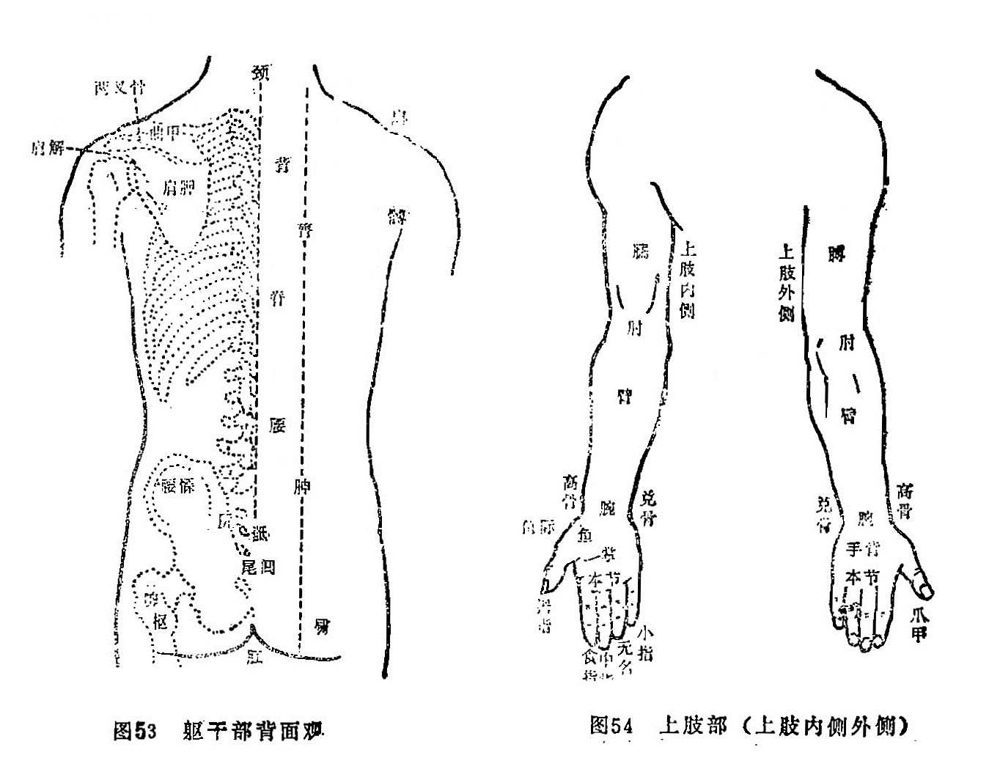

#### （二）背面观（见图53）

背：躯干后面统称背。

脊骨：即脊椎骨，又名膂骨， 中胎骨，由胸大椎（第一胸椎）算起，至第四骶椎棘突，共二十一节。

腰：躯干背面两侧，肋骨和髋骨之间之空软处统称腰。

膂（lǚ旅）：脊柱两侧纵行隆起之肌肉。相当于今之骶棘肌分布处。

胂（shēn申）：腰下两旁至髀骨上之间的肌肉。

髋骨：又名髂骨、腰坚骨、腰髁（䯊）骨。一说腰髁骨系腰部下端两侧凸起之骨，相当于今称之髂后上棘。

尻：尾骶骨的统称，即十七椎至第二十一椎。

骶：即尻骨最末节，即尾骨，又名尾骶、尾闾、穷骨、撅骨。

肛：即肛门，又名魄门，为大肠下口。

肩解：即肩端骨缝，由肩胛骨（髃骨部分）、锁子骨、臑骨（肱骨）组成，今称肩关节。

曲甲：肩胛骨上部之横行凸起，即今称之肩胛岗。

肩胛：即今称肩胛骨。

