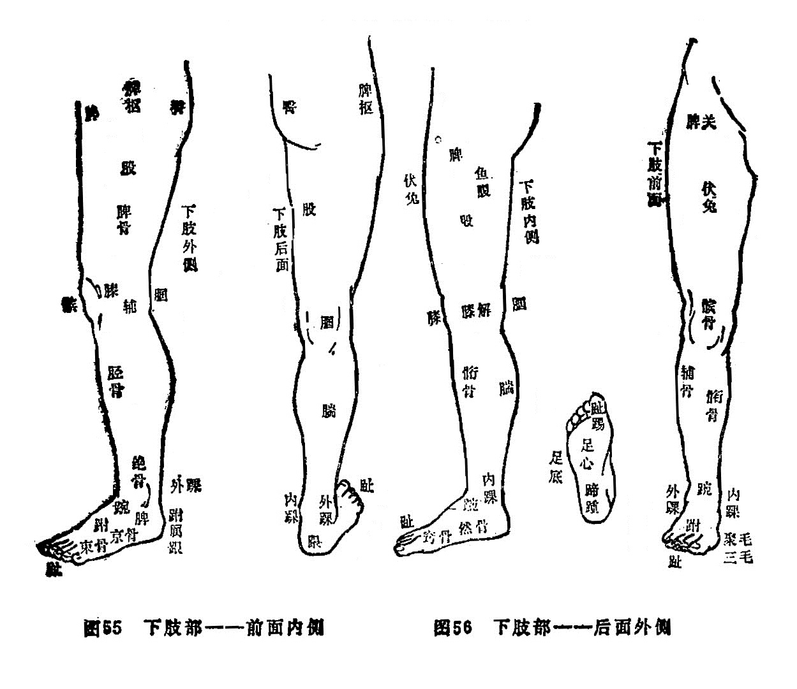

#### （二）下肢（见图55、56）

楗骨：指股骨，或指髂骨，坐骨。

髀（bì闭）：大腿上端部位。

髀骨：即大腿骨，今称股骨。

髀枢：今称髋关节外侧部位，又称髀厌，髀机。

髀关：与髀枢相对之（股）内侧，当鼠蹊中央之下为髀关。

髀阳：大腿外侧。

股阴：大腿内侧。

股：即俗称大腿。

鱼腹：大腿内侧形如鱼腹处，相当今称之内收肌群处。

伏兔：大腿前面肌肉纵行隆起处（股四头肌），形如兔之伏卧，故名。

膝：又称骸（hái孩）关，即今称之膝关节部位。

膑：膝前之圆形骨，又称膝盖骨、𩓹骨，今称膑骨。

腘：与膝相对之后面的凹窝，即腘窝。

辅骨：组成小腿之内，外辅骨，总称辅骨。其中内辅骨又称胫骨、䯒（háng杭）骨，外辅骨即今称之腓骨。由于小腿以胫骨为主，所以小腿又称胫或䯒。

臁肕：胫骨前凸起之棱，今称胫骨前嵴。

腨（zhuān专）：又写作𨄔，又名腓肠，今称腓肠肌部位。

踠：胫、足相连接处，今称踝关节。

踝：小腿下端两侧隆起之圆骨，内侧称内踝，外侧称外踝。

绝骨：外踝上三寸许之外辅骨凹陷处。

跗：即足背，又名趺或足趺。

然骨：内踝前下方隆起之大骨，今称舟骨。

核骨：足大趾后内侧凸起之圆骨。

京骨：足小趾本节后外侧凸起之圆骨。

踵：即足跟。内中之骨称跟骨。
