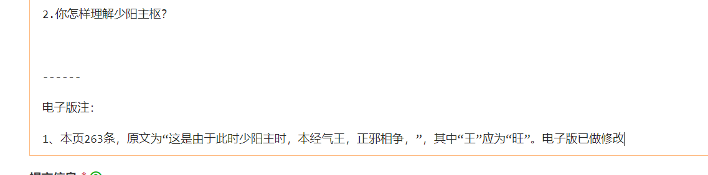

# 电子版录入规范

**1、选用markdown格式录入文件**

markdown语言是现在比较流行的文档编辑语言。因此我们选用此语言作为光明教材电子版的录入语言。

使用前请百度查询一下markdown格式的用法。

**2、编辑器**

如果单纯校对、简单修改，可以直接在网页进行。

如果大量录入、修改，将涉及复杂markdown语法、排版，推荐使用Typora编辑器，所见即所得。Typora 官网：https://typora.io/

如果对markdown和typora编辑器使用有困难，也可以在word中编辑，然后请我们的工作人员转为markdown格式。

**3、输入困难的生僻字：**

某些生僻古字，请查找下表看是否有解决办法。

[教材难输入字对照表](https://docs.qq.com/sheet/DVGRHQnpNa1hlWHNE)

如果文字不在上表中，也确实没法输入。此情况，如果能用两字合并表示，可用括号将两字括起来表示。实在无法显示可以用”？“代替。

**4、章节标题规范：**

例如：“第一章 绪论”，在“第一章”和章名”绪论“之间用一个空格进行分割。

**5、目录层级：**

以章为第一层级，节为第二层级，以下以此类推。

高于章的层级，比如”上篇“、”下篇“等，也用第一层级。

**6、古文原文加粗和缩小**

如果教材引用了古书原文，应对原文进行加粗显示：例如

**阴阳者，天地之道也（1），万物之纲纪（2），变化之父母（3），生杀之本始，神明之府也（4），治病必求于本（5）。**
						

教材中的小字用small标签进行缩小：例如


```
<small>臣亿等谨按，仲景本论，太阳中风自汗用桂枝，伤寒无汗用麻黄，今证云汗出恶风，而方中有麻黄，恐非本意也。第三卷有葛根汤证，云无汗、恶风，正与此方同，是合用麻黄也。此云桂枝加葛根汤，恐是桂枝中但加葛根耳。</small>
```

显示效果如下：

<small>臣亿等谨按，仲景本论，太阳中风自汗用桂枝，伤寒无汗用麻黄，今证云汗出恶风，而方中有麻黄，恐非本意也。第三卷有葛根汤证，云无汗、恶风，正与此方同，是合用麻黄也。此云桂枝加葛根汤，恐是桂枝中但加葛根耳。</small>

**7、分段：**

网络显示文本，段落之间已经加大了空行，所以电子版不需要段落前空2格来区分段落。

**8、关于表格：**

普通表格建议使用markdown的制表符建立，这样有利于检索。复杂表格（涉及跨行、跨列）可以截图。

**9、教材原文错误**

教材原文如有文字错误，将意见提交到：【腾讯文档】[光明中医教材疑似错误处理意见表](https://docs.qq.com/sheet/DVHhWdmt3UEZmUnRQ)

网校会统一组织修改加注。改后，会在文件的末尾加上如下说明：

```
------

电子版注：

1、原文有“大烦湿”，应为“大烦渴”，电子版已改。

2、原文有“阳阴气分实热”，应为“阳明气分实热”，电子版已改。

```
显示效果如下： 




