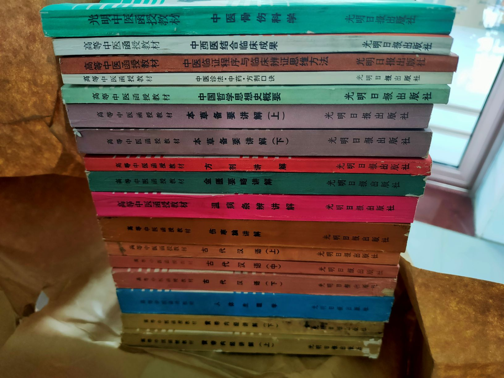
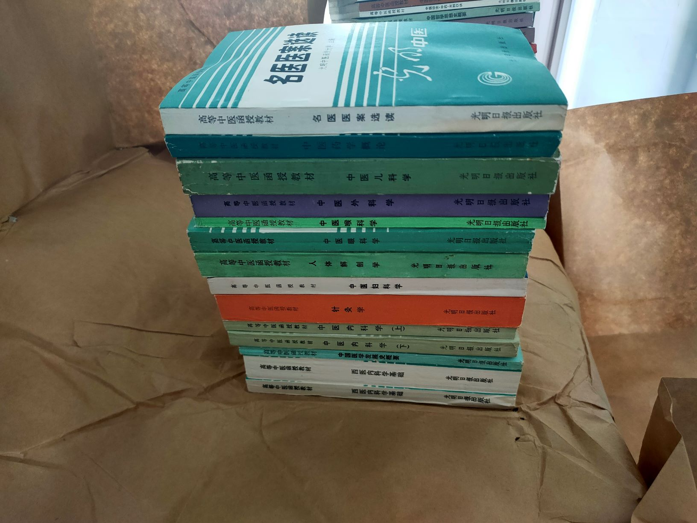

# 原版教材

目前还存有少量的成套光明中医原版教材，一直在仓库保存，已有30年，明细如下：

| 序号 | 课程名称                                                  |
| ---- | --------------------------------------------------------- |
| 1    | 中国医学发展史概要                                        |
| 2    | 中国哲学思想史概要                                        |
| 3    | 古代汉语-古文选读（2）                                    |
| 4    | 古代汉语-基础知识（1）                                    |
| 5    | 实用中医文献学（缺）                                      |
| 6    | 中医药学概论                                              |
| 7    | 中医诊法中药方剂口诀                                      |
| 8    | 中医临证程序与临床辩证思维方法                            |
| 9    | 中医学科学原理（缺）                                      |
| 10   | 黄帝内经讲解（2）                                         |
| 11   | 伤寒论讲解                                                |
| 12   | 金匮要略讲解                                              |
| 13   | 温病条辨讲解                                              |
| 14   | 本草备要讲解（2）                                         |
| 15   | 中医内科学（2）                                           |
| 16   | 中医外科学                                                |
| 17   | 中医骨伤科学                                              |
| 18   | 中医眼科学                                                |
| 19   | 中医妇科学                                                |
| 20   | 中医儿科学                                                |
| 21   | 针灸学                                                    |
| 22   | 中医喉科学                                                |
| 23   | 名医医案选读                                              |
| 24   | 现代医学知识（西医内科学基础(2)、人体解剖学、人体生理学） |
| 25   | 中国历代医籍选介（缺）                                    |
| 26   | 中西医结合临床成果                                        |
| 27   | 中医科研课题设计的探讨（缺）                              |
| 28   | 现代科技（缺）                                            |
| 29   | 方剂讲解                                                  |
|      | 共31本（本应36本，所缺5本见上表。）                       |

