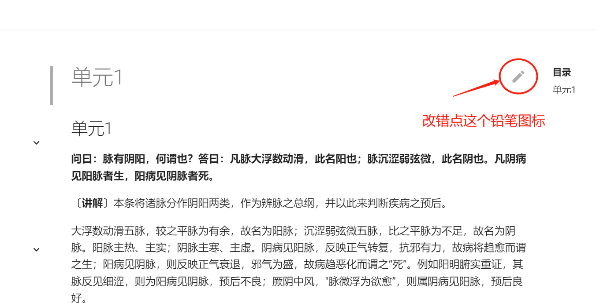
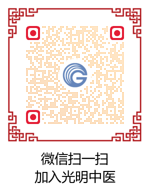

# 教材电子版如何纠错？

### 新版纠错方法：

发现教材中的文字错误，可以点击页面上的铅笔图标。

此时会进入教材编辑页面（需要注册）。

找到错误处，修改并提交即可。

我们会看到您提交的修改请求，审核无误后，会进行确认修改。

请认真比对教材，确认为电子版文字错误，再提交修改请求。原则上，如果教材本身没有明显的错误，尽量不修改。

如果没有纸质教材，可以在这里下载教材的扫描版，用于比对。[下载链接](https://drive.weixin.qq.com/s?k=AK8AFgezAAwPXGICzb ) 。

也可以直接在线查看扫描版进行对比：

| 课程名称                       | 在线查看扫描版                                               |
| ------------------------------ | ------------------------------------------------------------ |
| 中医诊法中药方剂口诀           | [扫描pdf](/bookspdf/07中医诊法中药方剂口诀.pdf)               |
| 方剂、口诀浅释                 | [扫描pdf](/bookspdf/方剂、口诀浅释.pdf)                       |
| 中医药学概论                   | [扫描pdf](/bookspdf/06中医药学概论.pdf)                                  |
| 本草备要讲解（2）              | [在线pdf-上](/bookspdf/14本草备要讲解上.pdf) [在线pdf-下](/bookspdf/14本草备要讲解下.pdf) |
| 方剂讲解                       | [扫描pdf](/bookspdf/方剂讲解.pdf)                                  |
| 黄帝内经讲解（2）              |  [在线pdf-上](/bookspdf/10黄帝内经讲解上.pdf) [在线pdf-中](/bookspdf/10黄帝内经讲解中.pdf)  [在线pdf-下](/bookspdf/10黄帝内经讲解下.pdf)                                                            |
| 伤寒论讲解                     | [在线pdf](/bookspdf/11伤寒论讲解.pdf)                                 |
| 金匮要略讲解                   | [在线pdf](/bookspdf/12金匮要略讲解.pdf)                                |
| 温病条辨讲解                   | [在线pdf](/bookspdf/13温病条辨讲解.pdf)                                |
| 中医内科学（2）                | [在线pdf-上](/bookspdf/15中医内科学上.pdf) [在线pdf-下](/bookspdf/15中医内科学下.pdf)                                                             |
| 中医外科学                     | [在线pdf](/bookspdf/16中医外科学.pdf)                                                                |
| 中医妇科学                     |  [在线pdf](/bookspdf/19中医妇科学.pdf)                                                               |
| 中医儿科学                     |   [在线pdf](/bookspdf/20中医儿科学.pdf)                                                              |
| 中医临证程序与临床辩证思维方法 |  [在线pdf](/bookspdf/08中医临证程序与临床辨证思维方法.pdf)                                    |
| 中医骨伤科学                   |  [在线pdf](/bookspdf/17中医骨伤科学.pdf)                                                               |
| 中医眼科学                     |   [在线pdf](/bookspdf/18中医眼科学.pdf)                                                              |
| 中医喉科学                     |    [在线pdf](/bookspdf/22中医喉科学.pdf)                                                             |
| 实用中医文献学                         |     [在线pdf](/bookspdf/05实用中医文献学.pdf)                                                            |
| 针灸学                         |     [在线pdf](/bookspdf/21针灸学.pdf)                                                            |
| 名医医案选读                   |   [在线pdf](/bookspdf/23名医医选读.pdf)                                                              |
| 历代医籍选介                   |    [在线pdf](/bookspdf/25中国历代医籍选介.pdf)                                                             |
| 中西医结合临床成果             |   [在线pdf](/bookspdf/26中西医结合临床成果.pdf)                                                              |
|                                |                                                              |

其它任何疑问请联系助教老师：

下述老版纠错方法效率较低，尽量减少使用。 

### ~~老版纠错方法：~~

<video id="video" controls="" preload="none" width="100%"  poster="https://zuoye.gmzyh.com/media/video/jiucuo.png">
<source id="mp4" src="https://zuoye.gmzyh.com/media/video/jiucuo.mp4" type="video/mp4">
</video>