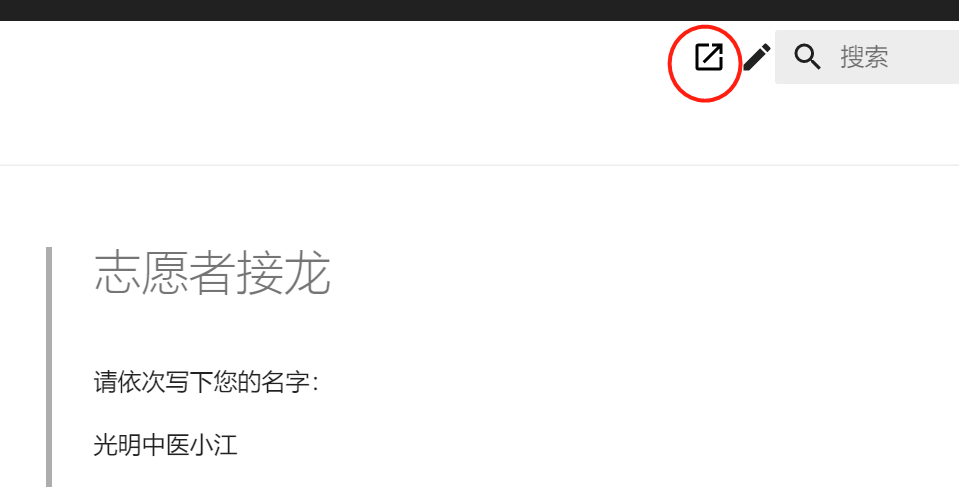

# 教材电子版如何纠错？

我们使用码云（gitee.com）进行教材内容的管理。纠错的工作流程为发现错误、进行修改、提交审核、审核通过、网页同步。

参与纠错工作请按以下步骤执行：

### 1、测试参与流程

我们制作了一个志愿者接龙网页，用来测试参与过程。

点击这个链接：[志愿者接龙](https://www.gmzyjc.com/read/gmjcintro/zhiyuanzhe.md)

打开的页面如下，点击页面右上的“铅笔”图标，即可编辑内容

此时会进入编辑页面，（如果没有在码云注册，需要先注册并登录才能看到内容）

将您的网名加入到内容的最下边，进行志愿者名字接龙（不要删除原来的志愿者名字）。

然后点击下面的“提交”按钮，提交即可。

我们会看到您提交的请求，然后进行确认修改。

确认后，您会在“[志愿者接龙](https://www.gmzyjc.com/read/gmjcintro/zhiyuanzhe.md)”网页看到您的名字

### 2、实际修改教材

通过以上测试步骤，您已经了解了修改教材的流程。

以后发现的教材文字错误，都可以在教材网站按照以上步骤，进行修正后提交。我们会对您的提交进行审核，无误的话会合并。合并后，正确的内容会立刻体现在教材网站上。若提交内容有误，我们会按照流程打回，并说明原因。

注意：请认真比对教材，确认为电子版文字错误，再提交修改请求。原则上，如果教材本身没有明显的错误，不要修改。

### 3、对比教材

如果没有纸质教材用于比对，可以在这里下载教材的扫描版。[下载链接](https://drive.weixin.qq.com/s?k=AK8AFgezAAwPXGICzb ) 。

也可以直接在线查看扫描版：

| 课程名称                       | 在线查看扫描版                                               |
| ------------------------------ | ------------------------------------------------------------ |
| 中医诊法中药方剂口诀           | [扫描pdf](/bookspdf/07中医诊法中药方剂口诀.pdf)               |
| 方剂、口诀浅释                 | [扫描pdf](/bookspdf/方剂、口诀浅释.pdf)                       |
| 中医药学概论                   | [扫描pdf](/bookspdf/06中医药学概论.pdf)                                  |
| 本草备要讲解（2）              | [在线pdf-上](/bookspdf/14本草备要讲解上.pdf) [在线pdf-下](/bookspdf/14本草备要讲解下.pdf) |
| 方剂讲解                       | [扫描pdf](/bookspdf/方剂讲解.pdf)                                  |
| 黄帝内经讲解（2）              |  [在线pdf-上](/bookspdf/10黄帝内经讲解上.pdf) [在线pdf-中](/bookspdf/10黄帝内经讲解中.pdf)  [在线pdf-下](/bookspdf/10黄帝内经讲解下.pdf)                                                            |
| 伤寒论讲解                     | [在线pdf](/bookspdf/11伤寒论讲解.pdf)                                 |
| 金匮要略讲解                   | [在线pdf](/bookspdf/12金匮要略讲解.pdf)                                |
| 温病条辨讲解                   | [在线pdf](/bookspdf/13温病条辨讲解.pdf)                                |
| 中医内科学（2）                | [在线pdf-上](/bookspdf/15中医内科学上.pdf) [在线pdf-下](/bookspdf/15中医内科学下.pdf)                                                             |
| 中医外科学                     | [在线pdf](/bookspdf/16中医外科学.pdf)                                                                |
| 中医妇科学                     |  [在线pdf](/bookspdf/19中医妇科学.pdf)                                                               |
| 中医儿科学                     |   [在线pdf](/bookspdf/20中医儿科学.pdf)                                                              |
| 中医临证程序与临床辩证思维方法 |  [在线pdf](/bookspdf/08中医临证程序与临床辨证思维方法.pdf)                                    |
| 中医骨伤科学                   |  [在线pdf](/bookspdf/17中医骨伤科学.pdf)                                                               |
| 中医眼科学                     |   [在线pdf](/bookspdf/18中医眼科学.pdf)                                                              |
| 中医喉科学                     |    [在线pdf](/bookspdf/22中医喉科学.pdf)                                                             |
| 实用中医文献学                         |     [在线pdf](/bookspdf/05实用中医文献学.pdf)                                                            |
| 针灸学                         |     [在线pdf](/bookspdf/21针灸学.pdf)                                                            |
| 名医医案选读                   |   [在线pdf](/bookspdf/23名医医选读.pdf)                                                              |
| 历代医籍选介                   |    [在线pdf](/bookspdf/25中国历代医籍选介.pdf)                                                             |
| 中西医结合临床成果             |   [在线pdf](/bookspdf/26中西医结合临床成果.pdf)                                                              |
|                                |                                                              |

### 4、临时标记

如果您在网站阅读教材的时候，发现了错误但是没时间修改，可以使用标记功能，暂时将错误记录下来。

使用下面这个按钮来提交标记:

这其实是以前的老版纠错办法，如果没用过，可以参考下面的视频：

<video id="video" controls="" preload="none" width="100%"  poster="https://zuoye.gmzyh.com/media/video/jiucuo.png">
<source id="mp4" src="https://zuoye.gmzyh.com/media/video/jiucuo.mp4" type="video/mp4">
</video>

如上方法提交后，错误会进入下面的错误列表，等待修改：

[https://gitee.com/gmzy/gmzyjc/issues](https://gitee.com/gmzy/gmzyjc/issues)

### 5、联系我们

其它任何疑问请联系助教老师： 

### 