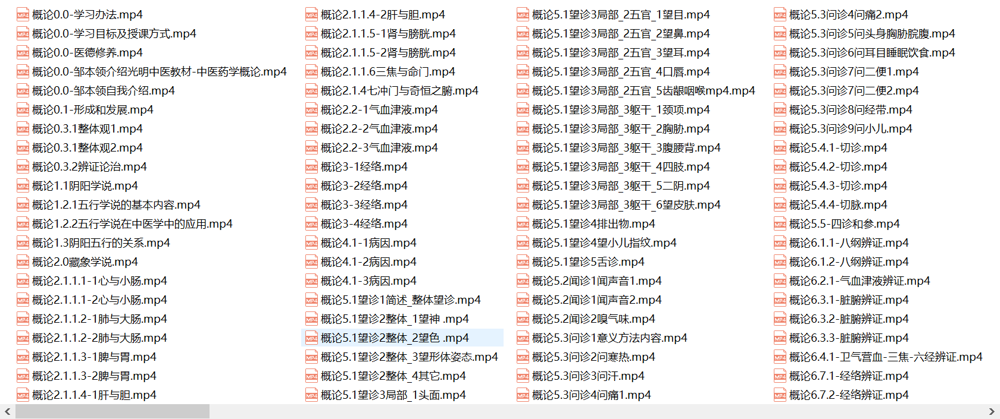
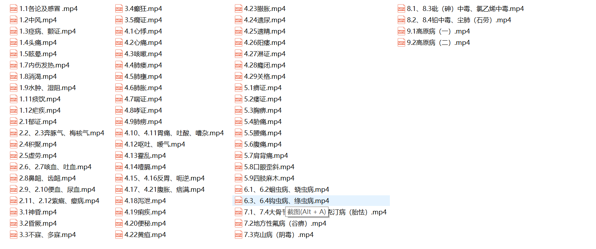
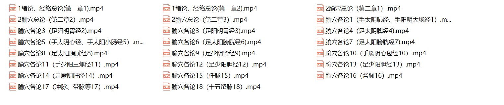
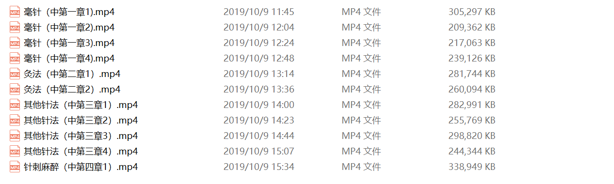
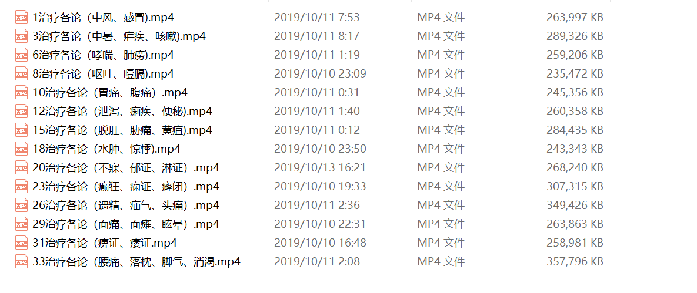

# 光明中医课件

学习以教材为主，但有的同学希望能有视频讲解课件。因此，我们录制了光明中医教材部分重要课程的讲解课件，包括《中医药学概论》、《中医内科学》、《针灸学》。

关于其它中药、方剂、内经、伤寒、金匮、温病的讲解视频，大家可网络搜索中药（高学敏）、方剂学（邓中甲）、伤寒论（郝万山）、金匮要略（王雪华）、温病学（刘景源）、内经（王洪图）。

### 1、《中医药学概论》

由光明中医校友邹本领讲解。下图是部分内容。

<video id="video" controls="" preload="none" width="100%"  poster="https://gmzyjx.com/media/video/gl.png">
<source id="mp4" src="https://gmzyjx.com/media/video/gl.mp4" type="video/mp4">
</video>

### 2、《中医内科学》

由光明中医校友于云老师整理，其子于文洋讲解。下图是部分内容

<video id="video" controls="" preload="none" width="100%"  poster="https://gmzyjx.com/media/video/nk.png">
<source id="mp4" src="https://gmzyjx.com/media/video/nk.mp4" type="video/mp4">
</video>

### 3、《针灸学》

由光明中医校友于云老师整理，其子于文洋讲解。下图是部分内容

<video id="video" controls="" preload="none" width="100%"  poster="https://gmzyjx.com/media/video/zhenjiu.png">
<source id="mp4" src="https://gmzyjx.com/media/video/zhenjiu.mp4" type="video/mp4">
</video>

### 说明

几位老师皆为执业医师，有丰富的临床经验，对教材进行了逐章讲解，并融入了老师的经验体悟，对初学者极具参考价值。

相关问题请扫描下面的二维码咨询助教老师： 

