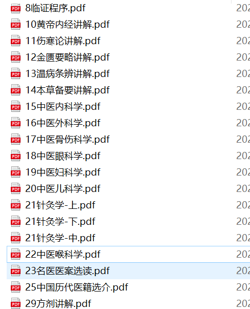

# 免费领取光明中医教材PDF电子版

光明中医教材是在80年代，由光明中医函授大学组织当时最好的一批名老中医共同编写的，是历代中医理论及经验的集大成者。教材着力培养学习者的中医思维，受到包括李可老中医在内的诸多中医专家的推荐，应该成为每一位中医学习者的参考资料。

光明中医网校经过一年半的努力，组织人员完成了光明中医教材大部分主要课程的电子化工作，共计20门，800万字。

现应广大中医学习者的要求，免费提供教材的PDF电子版，需要者在学习平台完成《了解光明》相关任务后，可以下载。

学习平台：[https://zuoye.gmzy.org.cn](https://zuoye.gmzy.org.cn) 

助教老师微信：

教材截图：

