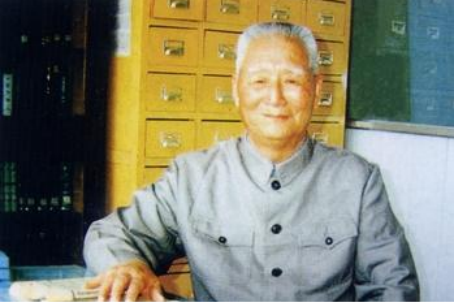

# 光明中医函授大学顾问丁光迪传略

丁光迪，1918年出生于江苏省武进市焦溪的一个中医世家，6岁时，丁光迪入读私塾。1935年他开始跟随父亲学医，3年后即可为父亲襄诊。解放后，丁光迪积极参加组织了武进卫生工作者协会，并担任副主任等职位。1951年，又筹建焦溪中心联合诊所，积极开展防治晚期血吸虫工作。他在防治中采取中西医两套方法，并虚心地向西医学习有关的诊疗技术和方法。由于工作成绩突出，联合诊所得到了县政府颁发的先进红旗。

后来，丁光迪又参加了恽铁樵、陆渊雷两位老师的函授学习。1956年留校任教，开始为办好中医学校而努力奋斗，备课试讲各个环节，操作认真，乐此不倦。他在实践中提出了许多好建议，向同事们介绍成功的经验，受到领导和师生们的一致好评。

　　

同时，丁光迪也致力于中医教材的编写，他根据[《金匮要略》](http://www.gmzywx.com/NewsDetail/1131129.html)一书编写了数本极具教育意义的教材，而他与当时有着“中医司令”之称的吕炳奎吕老也因中医教材而相识相知，1957年起，中央卫生部在江苏南京召集北京、上海、广州、成都、南京等中医院校召开座谈会，此即中医高等教育统编教材会议。郭子化副部长与吕炳奎教授共同主持了这场会议，吕老等人在会上的发言，给丁光迪留下了很深的印象。

　　

**两年后的1959年，上海又召开中医教材的补充修订会议，仍由郭老及吕老主持。这两次会议过后，有着同样理想的丁光迪与吕老两人的联系加深了许多。**

　　

**1963年的第三次会议上，丁光迪与吕老再次相聚了很长一段时间，吕老对逐个教材都加以审阅，尤其是对丁光迪主编的教材勉励有加。**

　　

丁光迪与吕老亦师亦友的感情一直延续到生命的最后，他们两人在同一年去世。

　　

2003年，丁光迪去世，享年85岁。