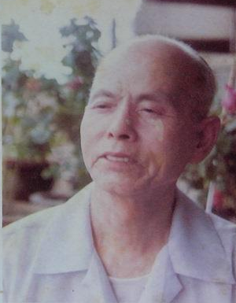
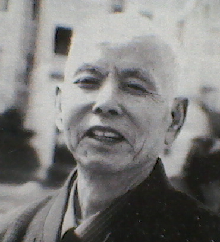

# 光明中医函授大学顾问万友生传略

万友生，1917年生于江西省新建县。他八岁入私塾读书，17岁求学于江西四大名医之首的姚国美先生创办的江西中医专科学校。在校苦读三年后，抗日战争爆发，学校停办。年仅20岁的万友生从此开始了颠沛流离的逃难生活。为了养家，他一面逃难一面行医，白天给人看病，晚间便挑灯夜读直到鸡鸣，如此数哉，乐此不疲。

30岁左右，万友生已经在江西樟树医名大盛。新中国成立后，他返回南昌，在当地卫生厅历任数职，为祖国医学的继承与发扬呕心沥血。在工作中，他深感发展中医药事业还得从中医药人才培养教育抓起，因此于1955年调入江西省中医进修学校，先后担任教导副主任、伤寒温病教研室主任等职，集中精力于中医教育，讲授[《伤寒论》](http://www.gmzywx.com/NewsDetail/1130351.html)和《温病学》。

　　

当时中医院校还没有统编教材，万友生就自己编写，用心之深已经达到了废寝忘食的程度，在家编写教材时，偶逢饭菜上桌，妻子总要三请四催请他出来吃饭，家人给他起个昵称叫“三请四催先生”。

从事中医教学的十余年中，万友生教授深深体会到，伤寒学说和温病学说是一脉相承的，前者是后者的基础，后者是前者的发展，分之则各有缺陷，合之则成完璧。早在1957年万友生就发表了《寒温纵横论》，至此他的寒温统一学术思想趋渐成形。1962年还编写了《伤寒论讲义》，以歌赋形式附上自撰的40首伤寒方歌，把113首伤寒方的理法方药概括在内。

文革中，万友生被定为“反动学术权威”，下放到学院农场劳动改造，吃尽苦头。万友生诗集《壶中吟》中诗载“桃花村不见桃花，叶落枝残风雨斜。堪叹斯文遭厄运，弃医罢教学桑麻。”“磨下耕耘春复秋，艰辛农事学从头。三年换骨脱胎后，学业荒芜志不休。”1972年在“教育要革命，教材要改造”的号召下，学院党委限令他短期写出新学科教材，先生厚积薄发，日夜不休，在规定的期限内完成任务，这也是国内第一部寒温统一的《中医热病学》新教材。

　　

20世纪80年代初，作为全国中医药学会常务理事，万友生应邀参加了在西苑医院召开的老中医座谈会，建言发展中医药。又和全国名老中医，建议召开首届仲景学术研讨会等。此时先生头衔众多，荣誉满身，德高望重。当时江西中医药界有两张靓丽全国的名片：一张是江中制药厂，它是全国校办工厂佼佼者；另一张就是万友生，他是江西省三位首批享受国务院政府特殊津贴专家之一。

1984年，万友生担任了光明中医函授大学的顾问一职。

2003年6月2日，万友生去世，享年86岁。