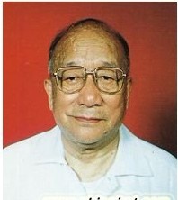
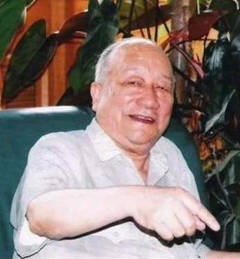

# 光明中医函授大学顾问于己百传略

于己百，1920年4月生于山东烟台。其父是华北国医学院第一届毕业生，是当时甘肃省的名医。18岁时，于己百开始随父学习中医并为人治病。

1947年，经国家考试院特考及格，获得中医师资格。1950年，又以同等学历考入兰州大学医学院，进行西医学知识的深造、1955年毕业后，先后在甘肃省中医门诊部、甘肃省中医医院工作，任医师、主治医师等职务，负责甘肃省中医院的医疗及教研工作。

　　

1970年，于己百调离甘肃中医院。开始负责筹建甘肃省新医药研究所，任研究所副所长，负责教学及新医所临床的组织工作，还亲自担任中医学基础、伤寒论、中医内科学等课程的讲授，为培养甘肃省中西医结合人才作出了贡献。

1978年调入甘肃中医学院，历任中医学院筹备组副组长、副院长、院长等职务。在此期间，还担任了光明中医函授大学顾问一职。

于己百教授一生致力于中医事业，从基础到临床，从教学到科研，已形成了自己的一套学术思想，临床经验十分丰富。

在临床实践方面，于己百教授十分强调"科学辨证的诊断，病证结合的治疗"。他曾说："中西医结合的途径，从临床上讲，主要是病证结合的诊断和治疗。病证结合的诊断，是整体反应与局部病变相结合的科学诊断；病证结合的治疗，是增进机体抗病能力和驱邪相结合的治疗。"

　　

于己百教授笔耕不掇，著述甚丰。他先后编写有《新编中医入门》、《中医简易方选》、《中医基础理论》、[《伤寒论释义》](http://www.gmzywx.com/NewsDetail/1130351.html)及《中医内科学讲义》等著作和教材，发表了《谈谈中西医结合》、《六经病证治提要》、《热病证治》、《2000年中医理论体系的发展》等论文数十篇。

他治学态度严谨，科研思路开拓。他对中医深究善思，师古不泥，既重视继承，更重视发扬，既重视整理，更重视提高。他认为，中医要发展，就必须与现代科学相结合，多学科、多层次、多途径进行研究，要勇于改革创新，绝不能墨守成规，固步自封。他在编写西医学习中医的试用教材时，即根据中医传统的理论和现代中西医研究的成果，采取 "以证带病，病中辨证，病证结合"的体例，便全书内容系统、全面，形式新颖、条理，堪称中医学教材中的一枝奇葩。是后代中医从业者的楷模。