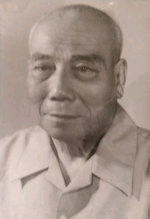
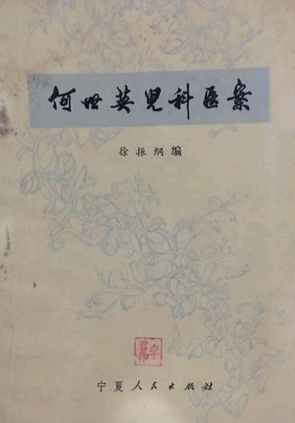

# 光明中医函授大学顾问何世英传略

1912年6月6日，何世英生于天津。他祖籍江苏，世代多位读书人和名医，后因战乱，太爷一脉举家迁徙，辗转来到天津，因家境突变而一贫如洗。爷爷被迫成侵华俄军劳工，父亲做搭棚工人维持生计。

因家境贫寒，少时只读几年私塾后即辍学在家，但自幼好学，或到学堂外偷听，或到旧书摊看书，回来在心中背诵诗书、在地上临摹习字，既练得记忆力超常又练得一手好字。尤以医学经典为偏爱，《濒湖脉学》、《药性赋》、[《本草备药》](http://www.gmzywx.com/NewsDetail/1130054.html)、《汤头歌诀》等可以倒背如流。

　　

十五岁开始在社会上谋生，曾漂泊四方寻求出路，从一般苦力到报社校对员等，做过多种行业工作。其间，曾受当时津门著名中医陈泽东先生启蒙和指点，进一步学习[《黄帝内经》](http://www.gmzywx.com/NewsDetail/1122341.html)、[《伤寒论》](http://www.gmzywx.com/NewsDetail/1130351.html)、[《金匮要略》](http://www.gmzywx.com/NewsDetail/1131129.html)等中医经典，为后来求学治医奠定根基。

1932年，一富家亲戚到京都名医施今墨先生创办的北平华北国医学院就读，何世英作为“书童”陪同前往。其间，除照料亲戚的起居生活外，经常躲在课堂外偷听。偶被施今墨先生发现，予其板凳而成“编外旁听生”。其间，亲聆施今墨、施光致、周介人、方伯屏、朱壹山、顾鹰陀等人的教诲，加之个人天资聪颖、勤奋好学，参加考试，每每名列前茅，深得施今墨先生器重，出诊时经常将他带在身边。何世英不仅从先生那里得到亲传和秘籍，还深受先生为人豁达、思维开阔、治医严谨、处方精妙的影响，为日后成为出类拔萃的杏林中人奠定了基础。

1936年，何世英正式悬壶，从此行医二十余年，主要搞大方脉，内、外、妇、儿科通治，以医术精湛、为人和气成名于津门、享誉京津一带。

日伪时期，何世英冒一家老小生命危险掩护我党多位地下工作者，其中有刘琪（曾任周总理秘书）、姚昕（解放后任吉林延边自治州州委书记）等同志。

新中国成立后，心情振奋，虽个体行医，但立志为新中国培养一代新型中医大夫，于1953年撰写了《新中医病理学讲义初稿》，1954年撰写了《临症验案》等讲义，次年，参加了天津市中医学会。

　　

1984年，出任光明中医函授大学顾问一职。

1990年5月8日，因病去世，享年78岁。