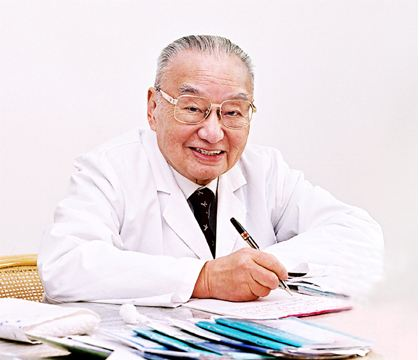

# 光明中医函授大学顾问何任传略

何任，1921年出生于浙江省杭州市一个世医家庭。父亲何公旦是杭州颇负盛名的中医，就诊者远及湘、滇、蜀、粤、苏、鲁等地。家庭陶冶，令何任从小就萌发了学医志趣。中小学时，除涉猎《四书》、《史记》、《古文观止》等书外，还熟读了[《本草备要》](http://www.gmzywx.com/NewsDetail/1130054.html)、《药性赋》、《汤头歌诀》、《医学心悟》等医书，这对他以后医学深造，奠定了基础。

　　

卢沟桥事变后，日本侵略军将战火烧到浙江，何任一家避难到浙东缙云乡间。1937年7月他考取上海新中国医学院二年级插班生。

当时的医学院设备简陋，环境艰苦，何任只能住在里弄中一个小亭子间里。他每天除上课之外，便刻苦自学，潜身于图书馆的医书之中，还经常向中医和西医各科老师请教，遂使他对中医理论和诊治疾病的方法逐步有了全面的了解。

4年后，何任于新中国医学院毕业。此后不久，其父逝世。当时江浙一带疾病流行，诸如天花、鼠疫、疟疾等烈性、急性传染病随处可见。出校门不久的青年中医何任沉着应诊，并不断地总结、摸索诊治温病的规律，使许多危重病人转危为安。

中华人民共和国建立后，何任以极大的工作热情投身于中医事业。他先是负责杭州市中医协会工作。1955年，他开始筹建浙江中医进修学校并担任副校长。

近40年来，何任潜心于中医教育事业，从学校的学制长短、课程设置，到教学计划、学生工作等，都进行了认真的探索和实践。

他长期坚持临床医疗，经验丰富，屡起沉疴；在教学、医疗之余，他孜孜不倦地研究中医学术，勤于著述，出版了研究[《金匮要略》](http://www.gmzywx.com/NewsDetail/1131129.html)的专著等7种；在中国外中医药刊物上发表了近百篇学术论文，是中国研究《金匮要略》的知名专家。

　　

1984年，何任担任了光明中医函授大学顾问一职。

1988年起，何任开始担任全国人大代表。现为浙江中医药大学终身教授、主任医师，桃李满天下。