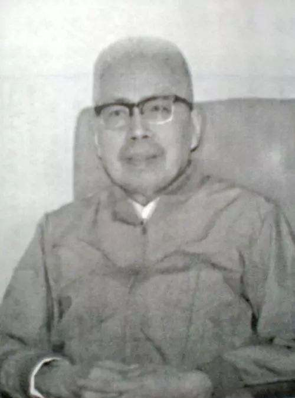

# 光明中医函授大学顾问何时希传略

在中国大地上延绵时间最久的中医世家，当属江南何氏医学。何氏医学世代相传，从未中断。何氏医学始于南宋，经元、明、清至今，已有二十八代，八百四十多年的历史了。

1915年，何氏医学第二十八代传人何时希降生在上海市青浦县重固镇，7岁时，他便从祖父读书学医，15岁考入私立上海中医专门学校学习，毕业后留校任教，19岁时拜泸上名医程门雪为师，后来，又跟随名医秦伯未学习。拜师数位名家的经历，使何时希能够博采众方而不囿于一家。正如他本人的诗中写道：“年当十七始临床，小印新镌署疗芳。转学多师专带下，程秦蔡沈与初唐”

何时希40岁时，接受了新中国中央卫生部的邀请，参加中医研究院的工作，再次获得了与全国一流的中医名家朝夕相处的机会，尤与章次公、岳美中、钱伯煊、赵锡武等人相交甚欢。

　　

何时希先生著有《何氏八百年医学》一书，在整理和编写过程中，受到了程门雪、章次公、秦伯未等前辈的重视与督促，并得到近代医史学家朱孔阳、陈邦贤、范行准三位先生的鼓励与鞭策，与众多中医界人士亦师亦友的感情，影响了何时希先生的一生。

何时希先生不仅是名医，还是艺术造诣很深的京剧名票，尤擅小生，曾在上海等地演出，且与梅兰芳、萧长华、姜妙香等人交情深厚。

何老还酷爱书法，写得一手苍劲有力的毛笔字，家学时临帖王羲之、赵孟頫，师从程门雪后也学“颜底魏面”的赵之谦，其诗联中又可见楷书功力。

何时希先生1984年担任了[光明中医函授大学](http://www.gmzywx.com/)的顾问一职。

1997年，何时希先生去世，享年82岁。