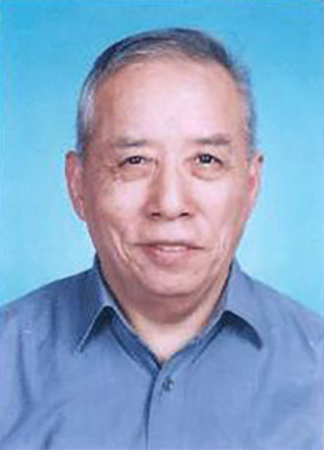
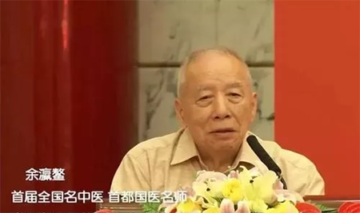

# 光明中医函授大学顾问余瀛鳌传略

余瀛鳌，男，1933年生，江苏阜宁人。出身于名医世家。中国中医研究院研究员，院学术委员会委员，研究生部客座教授，博士生导师。兼任国家古籍整理出版规划领导小组成员，北京中医药大学客座教授，当代中医药技术中心顾问等职，曾任中国医师文献研究所所长。1955年毕业于上海第二医学院，1955年12月参加卫生部全国第一届西医学习中医研究班学习，1958年5月结业后留中国组中医研究院工作至今。擅长于中医内科及中医临床文献。

余瀛鳌出身世医名家，1956年自中央卫生部顾问秦伯未先生为师，兼得其父余无言先生亲授。多年来余氏致力于若干疾病的通治方研究，精于内科，对肝肾，泌尿生殖系统疾病，脑血管病，呼吸系统疾病，糖尿病，癫痫病，肺炎等病尤为专擅，兼治妇科，长于月经病崩漏，不孕症等，他的经验方颇多，如生地连栀汤，润腑通幽丸等，有相当显著的临床疗效。

1958年以优异成绩结业，分配在中医研究院工作迄今。现任中国中医研究院专家委员会委员、研究员、研究生部客座教授、博士生导师。

曾任中医文献研究室主任、中国医史文献研究所副所长、所长等职。兼任国务院古籍小组成员、当代中医药技术中心顾问、中国中医药学会文献分会副主委等，是我国中医临床文献学科带头人。

生平著作很多，主编《中国传统医学大系》、《中医大辞典》、《现代名中医类案选》、《中医古籍珍本提要》等多种医籍，发表学术论文近200篇， 并获得国务院颁发的政府特殊津贴。已被收入《当代世界名人传》等多种传记性著作，并被英国剑桥传记中心收载于《国际知识分子名人录》。 临床精于中医内科，尤长于治疗肝病、肾病、心脑血管病、泌尿生殖系疾病、 糖尿病、癫痫等多种疑难病证，其经验方已被收于《名医名方录》、《当代名医证治汇萃》等书。