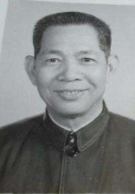
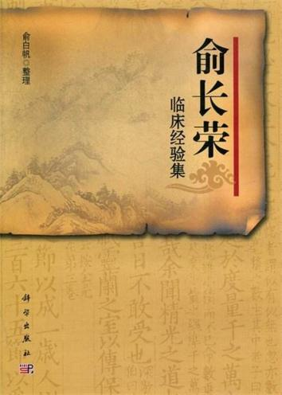

# 光明中医函授大学顾问俞长荣传略

俞长荣，1919年8月出生于福建省永泰县葛岭乡。俞家祖辈五代行医，父亲余晓峰擅长内、妇科，精通《伤寒论》。俞长荣幼承庭训，13岁起随父行医，25岁独立开业。

由于受父亲的熏陶，加以自己勤学苦练，基础扎实，因此，俞长荣悬壶不久就得到广大群众的信赖，业务水平不断提高，并于1947年领到考试院颁发的《中医师考核及格证书》。

　　

1956年在福建省中医进修学校进修，1957年起，先后担任福建省中医研究所临床研究室中医师、主任中医师、福建中医学院教师、教授等职务。

1983年至1986年任福建中医学院院长。任职期间，为该院扩大规模，开展多形式多规格办学，进行教学改革作出很大贡献。

俞长荣是中国当代著名中医学家。俞氏学术思想主要渊源于中医四大经典著作，又以《伤寒论》对其影响最为深刻。他善于汲取历代医家之长及民间医疗经验。在长期临床实践与教学、科研工作的基础上，逐步形成独特的学术思想和医疗风格。他认为，要学好中医，必须扎扎实实打好基本功。他有一句治学名言：“不好高骛远是庸才，只图好高骛远是劣才，惟有好高骛远再加上脚踏实地才是良才。”

他是这样说的，也是这样做的。他平素勤奋好学，手不释卷。从他作为自勉的《西江月》词中“最惜三更灯火，莫教霜上吾头，时光一去不复留，岁月蹉跎谁咎？”这几句，便可想见其勤学精神了。即使是十年动乱时期，他身隐“牛棚”，也仍然孜孜不倦，潜心学问。

俞长荣著述丰富，撰写《中医辨证论治与唯物辩证法》、《伤寒论汇要分析》、《伤寒医诀串解校注》、《高血压病中医疗法》、《俞长荣医案》（五集）及中医药科学小品集《枝杏出墙》。并在《中医杂志》、《中国中医药学报》等杂志上发表学术论文60多篇。

　　

1984年，他担任了[光明中医函授大学](http://www.gmzywx.com/)的顾问一职。

2003年，俞长荣教授逝世，享年84岁。