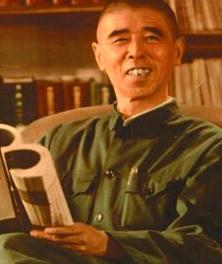
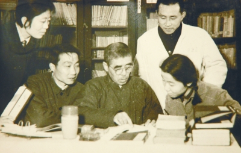

# 光明中医函授大学顾问傅宗翰传略

傅宗翰，1917年出生于江苏省南京市的中医世家，祖上是清朝的八旗子弟。

傅宗翰幼承家学，后与1932年跟随民国一代名医张简斋学习医术，成为张氏四大嫡传弟子之一。民国之时，张简斋的大名如雷贯耳，曾被国民政府主席以匾额“一代医宗”相赠，因而有“国医”之称。作为全国中医的旗帜，张简斋有四大嫡传弟子名扬后世，傅宗翰便是其中之一。

　　

1937年，年仅20岁的傅宗翰已经开始坐堂行医。当时南京疫病流行，病人很多，而傅宗翰善于综合运营所学知识、总结诊疗经验，治好了不少病人。有一次，他妙手回春，将一个重病垂危的病人救活。病家感激涕零，在南京城敲锣打鼓放鞭炮，亲送锦旗上门，在当时南京城里哄传一时。傅宗翰自此打响了名气，成为年轻一辈中医中的佼佼者。

1956年，当时的南京市政府集中金陵中医的精华，在夫子庙成立南京市中医院。由于南京曾为民国政府首都，南京市中医院因而得以集中了当时大部分闻名全国的中医大家，堪称星辉灿烂，蔚为大观。当时年仅39岁的傅宗翰，以其扎实的中医底子和精湛的医术，赢得众中医大家的敬服，担任南京市中医院副院长。

身为一代传奇中医，傅宗翰在呕心沥血研究中医中药的同时，并不排斥对西医西药的吸纳与应用。遍观他的医学生涯，研究领域十分宽广，所著《论肝》全面论述了肝的生理病理特征，成为现代中医学的重要参考著作；在活血化瘀、萎缩性胃炎、妇科病、自身免疫性病（风湿病）等各个领域，他都颇有建树，最典型的例子莫过于他对“干燥综合征”这一当时的疑难杂症的研究贡献，取得了里程碑式的跨越。除此之外，傅宗翰在药学方面也涉猎很广，譬如对虫类药和花类药的应用，也是他的贡献之一。

　　

傅宗翰的一生都奉献给了中华中医事业，他曾任中华全国中医学会理事、南京市中医学会会长。他对中医的贡献不仅仅是治病救人，更体现在他的行医准则、高尚医德之上。他为后人留下的不仅仅是学术遗产，更是金陵医脉精神的传承。

1984年，傅宗翰担任了[光明中医函授大学](http://www.gmzywx.com/)的顾问一职。

1994年，傅宗翰去世，享年77岁。
