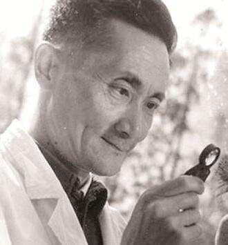
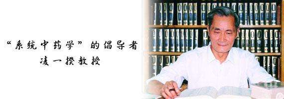

# 光明中医函授大学顾问凌一揆传略

凌一揆，四川省永川市人。他是我国第一位中药学博士导师，第一批享受政府特殊津贴的专家，曾担任中华全国中医学会副会长、高等院校中医教材编审委员会主任等职。

1925年，凌一揆出生于四川省永川。1942年考入四川国医专科学校，同年秋转入四川国医学院就读，1944年毕业。1953年冬，调成都参与四川省中医代表会议筹备工作。1954年春，调入成都中医进修学校任教。1956年，调成都中医学院工作。历任教务处教学科研科科长、中药方剂教研组主任、中药教研组主任、教授、副院长、名誉院长。

　　

中华人民共和国成立以后，中医药教育纳入了现代正规教育序列。凌一揆教授在课程设置、教材建设、教学形式和方法等方面倾注了大量心血。50年代末，他完成了主编《中药学》统编教材的任务。1973年至1984年，该书又经修订，出第三版，凌教授始终是该书的主编。

在教学中，凌一揆注重教学内容和方法，教学效果好。他强调，教学的重要目的，在于培养学生的思维能力，使学生掌握良好的治学方法，这样才能使学生真正终生受益。率先建立了中药标本室和标本园。标本室经不断充实扩大，成为全国医药院校中内容最丰富，规模最大的中药标本中心之一。

凌一揆教授50年代发表的论文3篇。70年代以后，他倡仪、策划和主持了3项重大科研项目：《四川中药志》的编纂和修编、川产道地药材系统研究，国家中医药管理局“七·五”重大课题“解表方药研究”。

凌一揆教授在国内外享有很高的知名度。1985年他应邀赴日本进行了3周的访问、考察和讲学，并被特邀参加了日本药学会的年会活动。1988年应邀至瑞典哥德堡大学讲学，得到瑞典药学界朋友的敬佩。他与日本学者矢数道明博士、田中治教授以及英国、德国、美国、法国、新加坡等国家和香港地区的许多学者进行了广泛的学术交流，扩大了中医药学在世界的影响。

　　

1984年，他担任了光明中医函授大学的顾问一职。

1992年，凌一揆教授离世，享年67岁。