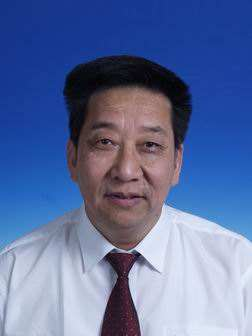
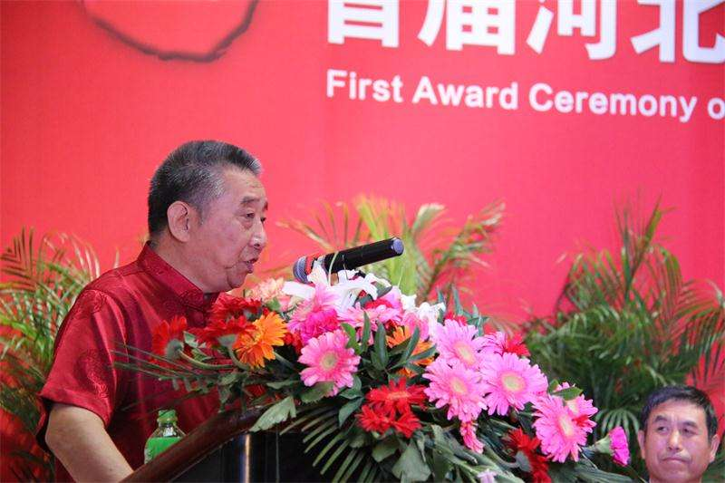

# 光明中医函授大学顾问刘亚娴传略

刘亚娴，全国首届、河北省最早的中医硕士。河北医科大学第四医院中医科主任医师、二级教授、博士生导师。第三、四、五批全国老中医药专家学术经验继承工作指导老师，河北省有突出贡献中青年专家、省管优秀专家、享受国务院政府特殊津贴专家。

　　

1944年，刘亚娴出生于河北省霸州胜芳的一个中医世家，是家中第四代传人。

1962年，刘亚娴考入中国医科大学，在北京大学生物系医预专业学习。后因病退学，随父习医。1965年重考入天津中医学院，1978年考入陕西中医学院《伤寒论》专业研究生。1980年获得陕西中医学院硕士学位，为全国首届、河北省最早的中医硕士。

刘亚娴教授从医近50年，临床以擅用中医药治疗恶性肿瘤、疑难病证为业内及患者所熟知，因临床疗效显著而求诊者甚多。

2008年，刘亚娴被河北省卫生厅、人事厅、中医药局评为“河北首届十二大名中医”。可他却常说，“我不是什么名医，我就是一个普通的看病大夫”、“作为一名医生，看病是最主要的，业务一定要精”。 他强调：酷爱中医乃为医之根基。三个注重“苦读书、勤临床、善思维”乃为医之先决条件。他是这么说的，也是这么做的，他常以自己的父亲因长期盘腿读书而磨出茧子来激励自己和徒弟们苦读书。

临床中，刘亚娴教授主张“重文（重视中华文化）、善思（思维要活）、活法（施治要活）”，强调“四个坚持”，即“坚持突出中医特色，坚持中医理论指导下的辨证论治，坚持中西医结合，坚持认知的不断更新”。看起来抽象，但绝不是空话，是他从事中医临床数十年之感悟。

在临床上，刘亚娴教授坚持辨证论治，平中出奇；中西医结合，衷中参西，刘亚娴教授认为可参考西医的检查结果，但不能受其束缚，不能一说肝硬化就活血化瘀，见到肿瘤就软坚散结，一听血压高就镇肝潜阳，而应该根据临床证候进行辨证论治。

继承不泥古，发展不离宗，认为中医作为传统医学，前人经过多年实践，总结了许多宝贵经验，应当首先继承，再谈发展。

　　

刘亚娴教授主编的《燕赵当代名中医》曾获中国科协优秀图书称号，《怪病妙治选析》获卫生厅科技进步三等奖。为河北省有突出贡献中青年专家，省管优秀专家，享受国务院政府津贴专家，全国带徒中医药专家，并获首届中医药传承特别贡献奖。