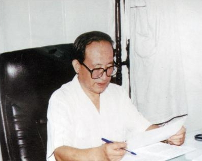

# 光明中医函授大学顾问刘冠军传略

刘冠军，1930年出生于吉林省辉南县。弱冠时，承舅父田润周先生亲传医术。后就学于辽源伤寒专家洪哲明先生门下，专攻《内经》、《难经》、《伤寒论》诸经。由于他勤奋刻苦，治学严谨，每夜青灯黄卷，六年寒暑不辍，故尽得二位名医之真训。

出师后，刘冠军在里郡挂牌行医，他医术高超，活人甚众。

　　

解放后，刘冠军于1951年出任辽源市中医门诊副主任。1953年，执教于省中医进修班。1956年，调入吉林省中医进修学校执教。1958年，被聘执教于长春中医学院，历任温病、针灸教研室主任。1981年晋升为教授，曾任长春中医学院附属医院院长、中华全国中医学会理事等职务。

1979年来，刘冠军教授连续被评为省、市科技先进工作者、市劳动模范、全国卫生模范工作者，现任终身教授。

刘冠军教授为振兴中医事业做了大量工作。他曾赴日本、西欧等地传播中国医学，受到外国学者的欢迎，被聘为大阪教育文化研究所顾问，近年被阿根廷中华针灸学会聘为顾问，为促进国际交流做出了贡献。

刘冠军教授从医近50年，学验俱丰，擅长针灸，兼精内科，尤对脉诊、经络、流注的医学研究。成绩卓越，曾先后讲授《金匮要略》《中医诊断学》《温病学》《各家学说》《方剂学》以及《针灸学》等学科。

在治学上，刘冠军主张“博览通读要有韧劲，划地求知要有专劲”。其临床诊疗，多博采众长。

　　

刘冠军教授诊病时，重视脉诊，认为诊断不明，很难收敛。故而他主张“辨脉证，探求本源”，在长期医疗实践中，积累了丰富经验，认为切脉识病早见于《周礼》，是古代医家反复实践所创造的“以常衡变”、“以变识病”的一种有效诊断方法。同时，刘冠军师古而不泥古，他勇于实践，敢于求新立异，故能够有所发现，有所创新。他常说“一花独放不是春，百花齐放春满园。”几十年来，他的学生在他的培养下分布全国，成为中西医教学、医疗、科研的骨干力量。

2002年11月25日，刘冠军教授去世，享年72岁。