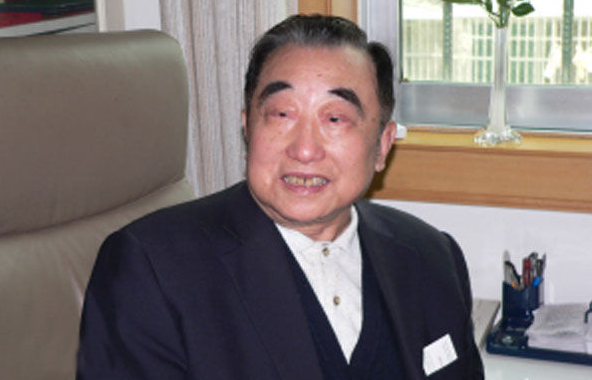
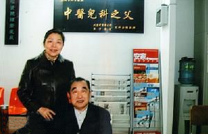
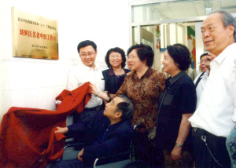

# 光明中医函授大学顾问刘弼臣传略

刘弼臣，男，汉族，生于1925年6月6日，江苏省扬州市人。北京中医药大学东直门医院儿科研究室主任、教授，著名中医儿科专家、儿科教育家、研究生导师。国务院首批享受政府特殊津贴的专家、国家教委确定的全国9位中医终身教授之一。中医儿科学会名誉会长，全国中医药高等教育学会儿科分会理事长，全国中医儿科科研成果评审会主任，高等中医药院校教材编审委员会委员，第八、第九、第十、第十一届北京市人大代表，第八届全国政协科教文卫体委员会委员。

北京中医药大学终身教授，全国著名老中医。从事中医儿科医疗、教育、科研工作达60年之久，医德高尚医术高超，国内誉为“东方小儿王”。享受政府特殊津贴。主持国家“七五”攻关课题，并荣获科技进步三等奖。

擅长治疗：小儿高热、肺炎、急慢性气管炎、哮喘、小儿厌食症、紫癜、肾炎、肾病、癫痫、脑积水、川畸病、情感交叉磨擦症、脑功能轻微障碍症等疑难病证，尤其对小儿重症肌无力、病毒性心肌炎、抽动—秽语综合征疗效显著。

1954年,他到泰州参加扬州地区中医进修班学习。1955年南京中医药大学的前身——江苏省中医学校成立，刘弼臣被选拔到首个师资班中培训。在师资班里，他接触了来自全省各地的名医，聆听他们的授课，不但学到了各家名医的专长，而且接受了系统的中医基础理论培训，并阅读了大量中医经典著作，同时学习和掌握了中医教学的基本方法。这段经历，为他以后步入北京中医药大学任教，乃至成为闻名世界的中医知名专家和中医儿科教育家奠定了坚实基础。

1959年，北京地区小儿腺病毒肺炎流行，病死率较高，而西药疗效欠佳，于是刘弼臣参与协作，发挥中医优势进行治疗。他与466空军医院协作攻关，治疗35例肺炎患儿，无1例死亡。其中1例危重患儿，曾3次呼吸暂停，他积极配合抢救，在人工呼吸、输血、吸氧的同时，用大剂量人参煎汤鼻饲，以益气固脱，从而使病情得到控制。后患儿又现肢体抽搐，二目失明不能视物。他分析辨证，遂以缓肝理脾汤加减治之，叠进28剂而愈，无任何后遗疾患。

1978年,恢复研究生制度后，作为硕士生导师，他总是亲自拟订培养方案，制定培养计划，认真指导研究生进行选题，开题以及进行临床能力的训练。先后来培养出中医儿科硕士研究生10名。

1990年,刘弼臣教授被国家中医药管理局、卫生部、劳动人事部确定为全国老中医药专家学术经验指导老师，承担起带徒的任务。他将自己多年积累的宝贵经验和心得体会毫无保留地悉心传授。他亲笔为两位继承人题写医名，一为“济臣”，一为“洪臣”，良苦用心，可见一斑。同时，他还谆谆告诫：“继承是为了发展，光学是不行的，必须有发展，形成自己独特的东西。中医之所以有生命力，名家辈出，这一点非常重要。”同时，他还强调：“学习不能只学一家，不能闭关自大，要广泛吸取别人的好经验，要引进先进的科学技术，中医才能发展。”他倾注心血，圆满完成了继承带教工作。他从事中医儿科教育工作近60年，聆听过他的教诲，经他带教的学生，遍及祖国四面八方及世界各地，可谓“桃李满天下”。

刘弼臣教授在科研方面，他牵头完成的国家“七五”攻关课题——“复力冲剂”治疗小儿眼肌型重症肌无力的研究，治愈率85%，总有效率95%。1991年获国家中医药管理局科技进步奖三等奖。

1992年，作为学校级课题负责人，进行“调肺养心冲剂”对小儿病毒性心肌炎的临床与实验研究的科研工作，历经两年，圆满完成了科研任务。

1994年，进行了小儿抽动—秽语综合征的临床研究。近3年来曾连续获得国际学术交流金杯奖、科研成就金牌奖、学术创新理论奖。

主持的国家“七五”攻关课题《小儿眼肌型重症肌无力的临床研究》以及运用“五轮学说”创制的“复力冲剂”，获国家科技进步三等奖。主编儿科专著10余部，发表学术论文100余篇。

2008年9月，刘弼臣去世，享年83岁。