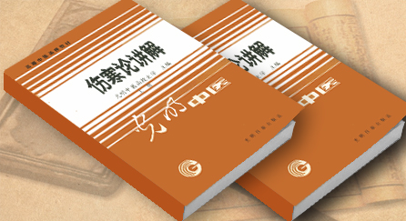

# 刘渡舟-《伤寒论讲解》主编&

　　 

刘渡舟（1917年10月9日-2001年2月3日），原名刘荣先，1917年10月9日出生于辽宁省营口市。幼年时，因体弱多病，常年请中医大夫治疗，亲身感受到了中医药的疗效，逐渐对中医药产生了兴趣。由于他体质虚弱的原因，他的父亲在择业时给他选择了中医这条道路。16岁时在营口正式拜当地名医王志远先生为师，矢志学习中医，从而迈出了此后漫长中医生涯的第一步。

### **个人经历：**

1931—1932年，在营口德育堂随王志远学习中医基础理论，系统地学习中医经典著作，以及《药性赋》、《方歌括》等基础知识。

1933—1936年，在大连市志远药房跟随老师学习临床知识及临床技能。

六年的学习结束后，他又在大连寿民药房跟随谢泗泉学习中医临床一年。谢先生曾告诉他：“学中医临床，莫过于外感与内伤两大类。学外感病必须读张仲景的[《伤寒论》](http://www.gmzywx.com/ProductDetail/2743554.html)，而学内伤杂病则应该读《医宗金鉴·杂病心法要诀》”。因而，这一年他主要在柯韵伯的《伤寒来苏集》与《医宗金鉴·杂病心法要诀》二书上下了功夫。这对于他此后的治学道路有着非常重要的影响。

1938年，刘渡舟在大连志远药房坐堂行医。为了让他铭记行医的职业道德，努力救治患者，使患者从疾病的苦海中得以解脱，他的父亲正式给他取字为渡舟。

1945年5月，刘渡舟随家迁居北京。

1946年冬在北京参加并通过了“中医师特种考试”。

1947年5月至1950年底，在北京东四钱粮胡同挂牌行医。期间，曾受华北国医学院之聘担任教授，讲授中医基础。中华人民共和国成立后，他参加了卫生部组织举办的“中医进修学校”学习西医基础知识，学期一年，于1951年毕业。之后，被分配到北京天坛华北人民医院中医内科工作。此后又先后任北京永定门联合诊所中医科主任，北京南苑区大红门联合诊所主任。

1956年，中国共产党和人民政府为了振兴中医事业，决定在北京、广州、成都、上海四市建立中医学院。这是医疗卫生系统的一件大事，各级部门对筹建北京中医学院给予了高度的重视，千方百计为中医学院的教师队伍寻找人才。经人推荐，刘渡舟来到北京中医学院参加中医教学工作。先后任伤寒教研组副主任、主任，兼任金匮教研组主任。

1978年任北京中医学院教授，并开始培养中医硕士研究生。

1985年又成为全国第一批招收中医博士研究生的指导老师。他还任北京中医学院院务委员会委员、职称评定委员会委员、学位评定委员会委员、教材编写委员会委员以及《北京中医学院学报》总编等职。在教学中，他辛勤工作，获得群众的拥戴。

1983年被评为全国卫生系统先进工作者，北京市教育系统先进工作者，1985年又被评为北京市劳动模范。

1986年，响应祝谌予教授号召，协助薛钜夫院长，参与筹建全国第一个中西医结合门诊部——顺义国医院（现名北京杏园金方国医医院）。

从1978年至今，他历任第五、六、七、八届全国人大代表；1985年2001年，任国务院学位评议委员会学科评议组（医学）成员，1987年以来任中华全国中医学会（1991年更名为中国中医药学会）常务理事。

刘渡舟于1956年加入中国农工民主党，1984年以来任中国农工民主党北京市委员会副主任委员。

### **刘渡舟与《伤寒论》：**

刘渡舟注重对中医经典著作的研究，特别是对《伤寒论》六经辨证理论体系的研究。刘渡舟认为，研习《伤寒论》，一定要结合《内经》、《神农本草经》和《金匮要略》诸书，这不但有利于全面地正确理解六经辨证理论体系，而且，在学习后世医家论着时，也就有源可寻，有本可依。他潜心研究数十年，撷古采今，旁涉诸家，结合自己的心得体会，著有《伤寒论通俗讲话》、《伤寒论十四讲》、《伤寒论诠解》、《伤寒契要》、《新编伤寒论类方》等书，有理论、有临床，深入浅出地介绍了《伤寒论》的六经辨证理论体系，深受广大读者欢迎。尤其是《伤寒论通俗讲话》与《伤寒论十四讲》二书，在国内多次重印，并被日本东洋学术出版社译成日文在日本出版发行。同时，他还任主编，组织编写了自研究《伤寒论》以来的第一部专门工具书——《伤寒论辞典》。

《伤寒论》的核心是六经辨证。但长期以来，对于“六经”实质的理解，却见仁见智，莫衷一是。针对各种不同的学术观点，特别是针对有人提出的“六经非经络”的观点，刘渡舟从辩证唯物主义的立场出发，强调了六经的实质是经络。他认为，《伤寒论》的六经辨证思想是在《内经·热论》六经分证方法的基础上发展起来的。六经辨证是以三阴三阳的六经经络及其相互络属的脏腑的生理、病理变化作为物质基础的。离开六经经络及其相互络属的脏腑组织，则六经辨证就成了空中楼阁。六经辨证首先要解决的问题就是辨阴与阳，以三阴三阳的阴阳两纲统摄六经，然后进一步探求病位之表里，病情之寒热，病势之虚实。但是，如果辨证只辨到阴阳表里、寒热、虚实，那还是很不够的。因为它还没有具体地与人体脏腑经络的病理变化联系起来，仍然不能明确而深刻地阐明各种复杂的病理变化，以指导临床治疗。所以，六经辨证必须要以经络为基础，通过经络而落实到具体的脏腑组织，使辨证言而有物，从而达到辨证以论治的目的。他认为能否正确地理解六经实质，关系到能否正确地运用六经辨证理论以指导临床治疗，这是学习、研究《伤寒论》的一个至关重要的问题。

刘渡舟还十分重视六经病提纲证的作用。《伤寒论》六经病证，各有提纲证一条。提纲证是指能够反映出每一经络及其相关脏腑之生理、病理基本特点的证候群，对于某一经的辨证具有比较普遍的意义。例如太阳病提纲证曰：“太阳之为病，脉浮、头项强痛而恶寒”。“脉浮”，是邪气客于肌表，人体正气抗邪于外的反映；“头项强痛”，是太阳经脉受邪，而经脉气血不利的反映；因为太阳经脉络脑下项，头项是太阳经脉所主之专位，故头项强痛是太阳经受邪独有的证候；“恶寒”与“脉浮”并见，是卫阳被伤，不能温煦肌表的反映。此一脉二证反映了太阳经病变的基本脉证特点，揭示了太阳主病在表的病变规律，因而，临床辨证只要掌握了提纲证，就能做到纲举目张，心中了然。

此外，刘渡舟还认为六经辨证方法，原为邪气伤人而立论，并非只针对伤寒之一病。应该看到，辨证之法是从六经之体而求证，由于六经之体各异，与六经相互络属的各脏腑的生理、病理特点各不相同，所以每一经的证候特点也就随之不同。六经病提纲证反映了六经各自证候的共同特点，因此，掌握了六经病提纲证，不仅能够掌握其在伤寒病中的辨证规律，而且还可以将其扩大至杂病的辨证范围。正如清代医学家柯韵伯所说：“仲景之六经，为百病立法，不专为伤寒一科。伤寒杂病，治无二理，咸归六经之节制”。

对于《伤寒论》398条条文排列意义，刘渡舟认为《伤寒论》398条是一个有机的整体，在条文之间，或隐或现，或前或后，彼此间都有联系。作者在写法上，充分发挥了虚实反正，含蓄吐纳，对比互明，言简义永的文法与布局，从而把辨证论治方法表达无遗。研究《伤寒论》，首先要领会条文的组织排列意义，要在每一内容中，看出作者的布局和写作目的，能学到条文以外的东西，要与作者的思想共鸣，才能体验出书中的精神实质。例如《辨太阳病脉证并治·上篇》30条：从第1条到第11条的内容是全书的纲领，具有指导全书，统领辨证的意义；从第12条到第28条，以穿插交叙的方法阐述了桂枝汤方的临床适应证、禁忌证以及加减变化诸证，并引出麻黄桂枝合方的3个小汗法，作为其后论述麻黄汤证之先序；第29条与第30条，以误治救逆的形式具体地为“观其脉证，知犯何逆，随证治之”作了示范。可见《伤寒论》之398条有经有纬，发生着纵横的联系，以尽其辨证论治之能事。

### **临床经验：**

刘渡舟还有着十分丰富的临床经验。辨证时抓主证是他临床上的一大特色。他认为，主证是决定全局而占主导地位的证候，直接反映了疾病的基本性质及规律，所以是最可靠的临床依据。抓住主证，不但是辨证的关键，而且也是取得疗效的关键，具有带动全局的作用。如有一次，为一崔姓产妇治疗，患者因产后腹泻，被误认为是脾虚，多次服用补益剂无效；又因其舌绛，苔薄黄，脉沉滑，下利而口渴，按厥阴热利证，投白头翁汤亦无效。后详审其证，知有小便不利、下肢浮肿，寐差，咳嗽等水气表现，因而抓住小便不利及“渴呕心烦咳不眠”之主证，参以舌绛脉沉，乃知此属少阴阴虚，水热互结之证，与猪苓汤5剂，小便得利而腹泻诸症皆除。

擅长用经方治疗疾病，是刘渡舟临床上的又一大特色。仲景之方谓之经方。他认为，仲景制方，不拘病名为何，但求脉证切当，病机合宜，有其证则用其方，故不论外感、内伤，随手拈来，因证而施治。他还认为，经方治病有两大优势，一是组方精简，配伍严密，药少量轻而功捷；二是方证结合紧密，观脉证而定病情，随证施治，不拘一格。他在临床上运用柴胡剂治疗肝胆疾病，泻心剂治疗脾胃疾病，苓桂剂治疗水气病变等，都取得很好的效果。他还从临床实践出发，结合自己多年的临床经验，师仲景之意而广仲景之法，创制了不少疗效很好的新方。如柴胡解毒汤、柴胡三石解毒汤、柴胡活络汤、柴胡鳖甲汤等治疗各种急、慢性病毒性肝炎及早期肝硬变的系列方剂，疗效显着。

水气病，是中医特有的病证概念。但自仲景之后，还没有哪位医家对水气病证治疗进行过系统的论述，致使水气的概念不清，证治不明。通过长期临床观察与治疗，刘渡舟发现水气为病在临床上既常见又多发，涉及面很广，特别是冠心病、心绞痛患者，常常表现为水气病变，临床上不得其法，常难取效。因此，他刻意对水气病进行了系统的研究，发表了《试论水气上冲证治》、《谈谈人体的津液链》、《谈谈“水证”的证治》等专题学术论文。他认为：“水气”的概念，应该是既有水饮，又有寒气。其发病的机理与心、脾、肾三脏的阳气虚衰有关。心为阳中之阳，上居于胸中，能行阳令而制阴于下；脾为中土，能行津液而制水于中；肾为水脏而主宰水液的气化作用。若心、脾、肾三脏阳气虚衰，则水阴之邪无制而汪溢为害。其中，尤是以心阳虚不能降伏下阴而为二：一是由“心下”部位气往上冲，主要责之于心脾阳虚；二是由“脐下”部位气往上冲，主要责之于心肾阳虚。水气病的辨证，典型者可出现明显的气由下往上冲逆的感觉。不典的辨证，典型者可出现明显的气由下往上冲逆的感觉。不典型者，虽不见明显的气冲之感，但从下往上依次出现的或胀、或满，或悸等证也十分明显，故临床不难辨认。甚者水气上冒清阳之位，还可以出现头目眩晕，或眼、耳、鼻、舌诸窍因之不利，亦当注意。此外，色诊，脉诊对诊断水气病也很有意义。水气之色上于头面，其人面带虚浮，其色黧黑，或出现水斑（额、颊、鼻柱、口角等处，皮里肉外，出现黑斑，类似色素沉着），谓之水色；舌淡嫩而苔水滑，甚者舌面津津然欲滴，谓之水舌；脉沉而弦，谓之水脉。色脉相应，便可辨为水气病而无疑。治疗水气病，法当温阳降冲，化饮利水为主。获苓桂枝白术甘草汤是治疗水气病的基本方。方中以获苓、桂枝为主药，获苓之用有四：甘淡利水而消阴其一；宁心安神而定悸其二；行肺治节之令而通利之焦其三；补脾固堤而防水汪其四。桂枝之用有三：通阳消阴其一；下气降冲其二；补心制水其三。此方若有获苓而无桂枝，则不能化气以行津液；如有桂枝而无获苓，则不能利水以伐阳。故苓桂相辅相成，缺一不可。其余如苓桂姜甘汤、苓桂枣甘汤、苓桂杏甘汤、苓桂味甘汤等苓桂剂，皆可视作在此基础上的加减化裁。除了将经方有效的用治于水气病外，刘渡舟还创制了苓桂茜红汤、苓桂杏苡汤、苓桂龙牡汤、三参救心汤等治疗水气病的有效方剂，丰富并发展了中医治疗水气病的内容。

### **刘渡舟于中医教育的贡献：**

刘渡舟在中医教育这块园地上辛勤耕耘了30多年，深知教书育人、培养中医接班人的重要性。在长期的中医教学中，他积累了两点非常宝贵的经验：**一是读书须要背书；二是理论必须结合临床实践。**

他认为，背书有两大好处：第一，背书有益于明理识证。《医宗金鉴•凡例》中说：“医者书不熟则理不明，理不明则识不清，临证游移，漫无定见，药证不合，难以奏效”。他指出“背”是为了“书熟”，“书熟”是为了“理明”，“理明”是为了“识清”，而“识清”最终是为了临床上能够准确地辨证用药。第二，背书有益于日后进一步理解中医理论。由于经典著作文字简要，理论深奥，初学者难以一下子弄懂其全部义理，如果能够先将书中的内容熟记于心中，日久以后，随着所学知识的广泛与深入，尤其是随着临床知识的提高，对某些疑难问题就逐渐地有触类旁通之功，这可能就是人们通常所谓的“悟性”吧，这种“悟性”越多，其中医水平也就越高。刘渡舟曾说：“巧者人皆受之，若平时不下苦功先熟书于心中，则临证之时又有何巧之可言”？这对初学中医者来说，尤为重要。

在扎扎实实的理论基础上，他十分重视理论与临床实践相结合。他常常跟学生们说：“中医之所以能几千年而长盛不衰，就是因为它在临床上能解决很多问题。在课堂上学习基础理论，就是为了能在临床上正确地运用它。如果一个中医不会中医临床，那他就不能算是一个真正的中医。通过临床实践，不但可以验证已经掌握的理论知识，而且还可以激发对理论学习的兴趣，在实践中求发展。

刘渡舟对青年中医总是予以极大的关怀与支持。在他门诊时，周围总是围着一大群本科学生跟他抄方学习。对于学生的提问，从来都给予耐心细致的指点与教诲。在刘渡舟家里他的书案的玻璃台片下压着河南中医学院学生小杨的一篇散文，从中可以看出他为人师表的崇高品德。标题为《不曾见面的老师》。文中写道：“1982年，我还是个中医盲，考入河南中医学院之后，听高年级的同学说，在北京有一个著名的中医专家对《伤寒论》颇有研究。我怀着渴望知识和仰慕名人的心情，给在远方的老专家发出了第一封信。信中写道：‘敬爱的老师，我是多么渴望成为您的学生啊！’没想到，7天后就接到了回信。信中说：‘你的精神很使我感动，我认为，中医要发展，老年人就应该授业于年轻人，因此，我愿与你交个朋友，共研医道’。信是用正楷写的，苍劲有力。虽然我没见过他的手迹，但我相信，这封信是老专家亲自书写和发出的”。

“一个青年，能与闻名于世的医学家交朋友，真绝了，我失眠了”。

“随着学习进行，大脑里的问号愈来愈多了，我们的通信也就愈加频繁了。3年，到底通了多少封信，我告诉您，没统计过”。

“时间越长，我和他相见的心情愈急迫。我想，将来，或许能成为他的亲授弟子。我终究是他的学生，我一定要见到他，我最尊敬的老师，刘渡舟教授”。

除繁忙的教学，临床工作及大量的日常事务外，刘渡舟还承担着多项部级科研任务。如《中医古籍整理研究——伤寒论》、《柴胡鳖甲汤治疗慢性迁延肝炎，早期肝硬变的实验与临床研究》、《老中医电脑程序——苓桂术甘汤加减的临床运用》等。其中，《中医古籍整理研究——伤寒论》的科研工作，历经5年，经过反复的研究和专家论证，已经通过鉴定。

“老骥伏枥，志在千里”。如今刘渡舟虽年逾古稀，但仍精神抖擞，坚持工作在教学、科研和临床的第一线，决心为弘扬中医事业，培养新一代的中医人才，贡献自己全部的力量。

### 学术思想：

刘渡舟认为，《伤寒论》之方，叫经方；后世之方，叫时方。在方剂的运用上，他提出古今接轨的新观点。因为古今人异气迁，以及体质强弱、生活习惯的改变，均能导致“证”的变化。如果机械地固守古方而不越雷池一步，就不能做到方证灵活，随机应变。所以，应该把时方与经方巧妙地结合，以古方补今方之纤弱，用时方补古方之不全，使古方、今方、古今接轨方，三足鼎立，共同发展。

此外，他认为气机运动是人体生命运动的基本特征。气机运动的基本形式是升降出入，人体内各个脏器均具有气机的运动。人的各种生理活动，也都有赖于气机的升降出入来完成。在人体脏器中，与气机关系最为密切的脏腑是肝胆和脾胃。因此，刘渡舟临床善于调气，而尤以重视调肝胆和脾胃之气为主。调肝胆之气以疏利肝胆为法，他常用张仲景的“柴胡剂”系列方。调脾胃之气以升降脾胃为法，他常用《伤寒论》的“泻心剂”系列方。总之，刘渡舟认为，运转枢机、疏利肝胆、调理脾胃是临床治疗疾病的重要方法。

刘渡舟在张仲景“水气凌心”的理论基础上结合自己的临床经验，将此证命名为“水心病”，并总结出“水舌”、“水色”、“水脉”、“水症”以补仲景叙述之略，发展“水心病”的诊断，将苓桂术甘汤灵活运用于临床，并在此方基础上创制治疗水气上冲证的系列方剂，如三参苓桂术甘汤、苓桂茜红汤、苓桂杏苡汤等，丰富了张仲景有关水气为病的理论，同时扩大了经方的使用范围。

**临床经验：**

刘渡舟一生致力于《伤寒杂病论》，对张仲景辨治火热病深有研究。他指出，张仲景非常重视对火热病的诊治，尤其在阳明病、少阳病、厥阴病中用清凉的方法颇多，如白虎汤类的清泻法、承气汤类的凉下法、茵陈蒿汤类的清利法、柴胡剂的清胆法以及白头翁汤的凉血解毒法等。因此，刘渡舟根据现在火热证临床多见的事实，提醒人们对火热证要给予足够的重视，并结合自己的临证经验，提出许多新的火热论观点，用清热泻火法治疗脱发、面瘫、肢体疼痛麻木、半身不遂、痞证、吐衄、狂证、吐利及皮肤病等，常获捷效。

对于肝病的病理变化特点，刘渡舟认为，一者肝病的基本矛盾在于体用失调；二者肝病的主要临床表现是气血病证。因此，他在治疗肝病时着重以下几个方面：一，疏通气血，条达为要。二，体用结合，补泻适宜。三，明辨标本，缓急有度。四，整体治疗，治养兼顾。刘渡舟临床善于治疗病毒性肝炎、肝硬化、胆囊炎、胆结石等肝胆疾病，使用气血阴阳的辨证方法辨别邪气留恋的不同阶段，分别使用疏肝理气、活血化瘀、滋养肝阴、温运脾阳等方法，常用四逆散、大小柴胡汤、柴胡桂枝汤、柴平煎、越鞠丸、下瘀血汤、桃核承气汤、茵陈蒿汤、一贯煎、柴胡桂枝干姜汤、理中汤等方剂，并创制了柴胡解毒汤、柴胡活络汤、柴胡鳖甲汤、柴胡消石汤等许多治疗肝胆疾病的方剂，极大地丰富了中医治疗肝胆病的方法。

### 后世影响：

刘渡舟一生致力于中医教学及临床工作，是中国首批硕士生导师和博士生导师之一。几十年来，为国家培养了硕士、博士研究生近40人，现在均已成为中医界的骨干力量。