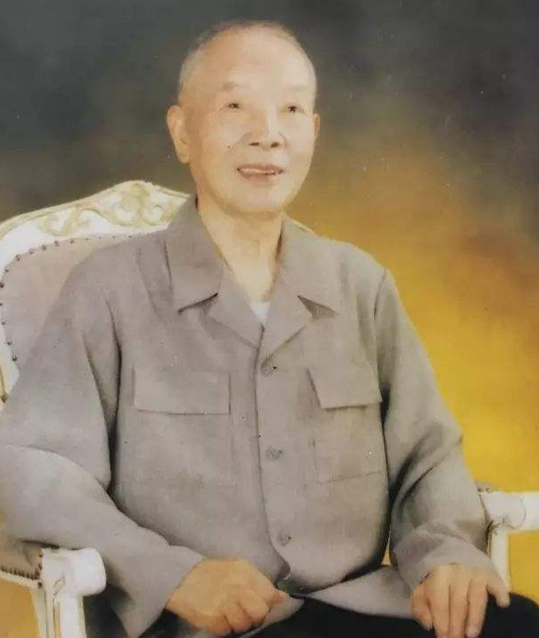
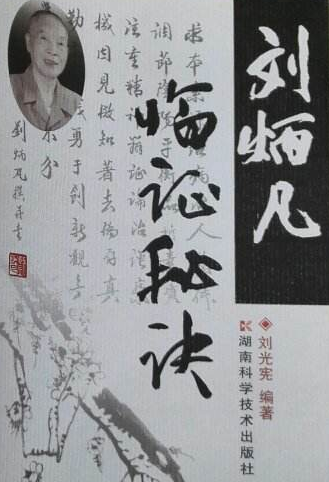
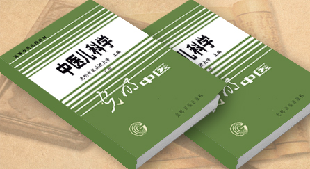

# 光明中医函授大学顾问刘炳凡传略

刘炳凡，著名中医学家，首届全国名老中医学术经验继承导师，湖南省中医药研究院研究员，院学术顾问，湖南省首届白求恩奖章获得者。

1910年，刘炳凡出生于湖南省湘阴县的一个穷苦之家，父亲以篾工为生。家境虽贫寒，但其父深知读书的重要性，省吃俭用供刘炳凡读了七年书。

　　

14岁的刘炳凡开始随父亲学工，但他求知若渴，每日边做工边读书。周围邻居都笑称他做“篾匠秀才”。

刘炳凡自小便认为：“至善至乐，莫过于救人一命。”于是立下了业医的志向。一次刘炳凡的母亲生病，家人辗转请到寄居当地的名医柳缙庭诊治，很快便治好了母亲的病。此事更坚定了刘炳凡学医的决心，经亲友的介绍引荐，柳缙庭考验了刘炳凡三个月后，破例免费收他为徒。

拜师时，柳缙庭要刘炳凡写一张“投师字”，内容是一个“诚”字。含义是：对医道要诚，终生只为此业，不论任何艰难风险，不得见异思迁；对学问要诚，触疑即询，遇惑即问，不得不懂装懂，浅尝辄止；对师傅要诚，业师乃孤单一个，年老力衰，若四体不用，须朝夕服侍，百年之后，要妥为安葬，立碑为记。就这样，在一片赤诚之心中，刘炳凡走上了岐黄之道，从此与中医事业结下了不解之缘。

在老师的指导下，他白天做工以维持家计，夜间庵中攻读，每隔七八天集中解疑一次。通过勤思苦读，执经问难，并遵师嘱采取一证一得的学与练，随师五年，学完了有关方药、脉法、医经以及临床各科近20部医著，阅历了许多疑难杂症，为以后的深造精研奠定了坚实的基础。1933年，刘炳凡在长沙东长街开业应诊，自题“仲山医社”，取其廉洁奉公之意。1934年滨湖大水，长沙灾民屯集，疾病丛生。目睹这悲惨的情景，他自动参加义务巡诊，不顾疲劳，早出晚归，奔走于难民营中。

在70年的医学生涯中，他始终坚持“临证不忘读书，读书不忘临证。”从不满足理论上的一知半解，临床上的一方一药之效，而是将读书与临证有机的结合起来，反复比较鉴别，分析归纳，从中探求真知。

　　

刘老在长期的中医药医疗、科研、教学中，坚持以医济世，活人无算；以德泽业，惠人无穷。始终不渝地奉献丹心仁术，不倦地耕耘杏苑科圃。他主持开展天花、霍乱、麻疹、血吸虫病、肿瘤、糖尿病、老年病、脾胃病等急重病疑难病的中医药防治研究，多次受到卫生部、省、市嘉奖，多次被评为优秀共产党员、劳动模范、先进工作者，授予湖南省科技之星称号并荣获湖南省首届白求恩奖章。

　　

刘老是光明中医教材《中医儿科学》的主编。

2000年，刘炳凡去世，享年90岁。