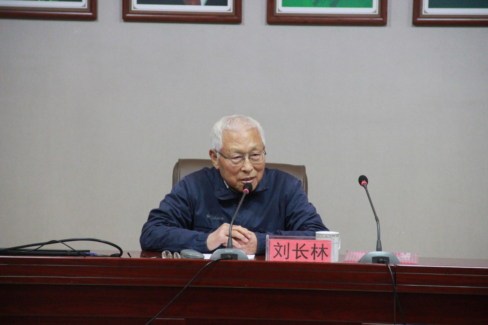

# 光明中医函授大学顾问刘长林传略

作为中国“中医大师”评选的一大权威，《中华中医大家》曾列出了具备“国医大师”资格的五个硬性指标：“我辈中医大师，一须望、闻、问、切，镂骨铭肌，辩明病机，以执万病之牛耳；二须君、臣、佐、使，组方有度，固本清源，以斩万病之根源；三须辨证施药有独创医术和独创方剂；四须杏林施药三十载以上，开方救疾万人以上；五须医德高尚，出诊施药不论贫富贵贱，皆一视同仁。”以此为标准，2009年，《中华中医大家》共在全国评选出76位国医大师。作为中医心脏病施治领域的带头人，“刘长林”的名字赫然在列。

　　

刘长林教授4岁习文，12岁学医，16岁便师从陕北名医张怀安，18岁初入杏林便能为心脏病患者独立开方施药。

因受先师遗训，经四年中医本科深造，一直潜心于心脏病临床研究与治疗，竟达43年之久。是中医界公认的治疗心脏病时间最长、治愈患者最多的国医大师。

43载心脏病研究，刘长林教授被誉为“把脉准，不差毫厘；开方神，对症病除”的神医，在我国中医界享有“刘圣手”之美誉。

刘教授自创的心脏病治疗方剂达到49组，其中13组中药组方更是获得了国家特别突出贡献甲等奖项。刘教授对治愈心脏病十分的自信，“除非你已经心衰，其他任何心脏病我都有把握运用中医让你药到病除”。

1984年，他曾担任了[光明中医函授大学](http://www.gmzywx.com/)的顾问一职。