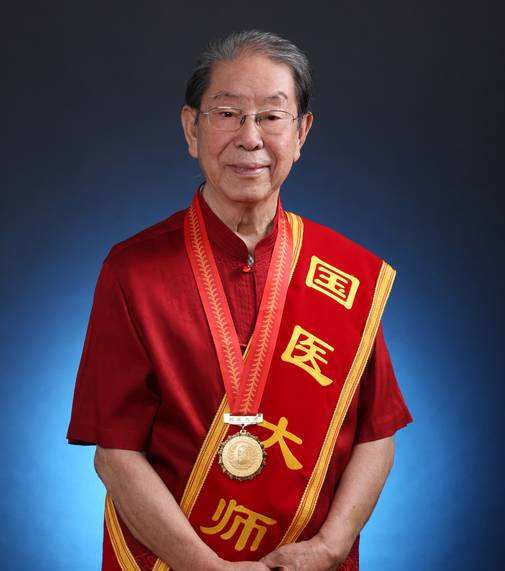
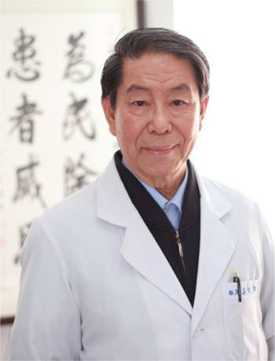

# 光明中医函授大学顾问吕仁和传略

吕仁和，北京中医药大学教授，主任医师，中医内科学专业博士生导师。现任北京中医药大学东直门医院肾病糖尿病研究室主任、是受到国家认证的老中医专家。

　　

1934年9月，吕仁和出生于山西省原平县。他能够走上中医之路，家庭的影响是重要原因。

吕仁和的外祖父是当地颇有名气的中医，很受人尊敬。旧社会医疗卫生条件差，很多儿童死于白喉。吕仁和也曾罹患此病，是外祖父治好了他。所以，他从小就对中医有一种特殊的感情。

1953年，吕仁和考入山西太原第一卫生学校。当时，卫校里以西医学习为主，针灸等中医内容也有所涉及。吕仁和本就对中医有浓厚的兴趣，经过亲身体验，发现中医药方法简单、疗效神奇，更引发了学习的动力，同学之间互相扎针，不亦乐乎。1956年，北京中医学院成立。吕仁和报考后顺利通过，成为我国第一批中医大学生中的一员。

作为国务院最早批准成立的四所中医学院之一，北京中医学院人才济济。施今墨、祝谌予等一批名师的教诲让吕仁和受益终生。

时任卫生部中医顾问的秦伯未也在北京中医学院授课，每学期都要查房。吕仁和记得，在病房里，秦伯未最喜欢讲《内经》的阴阳平衡学说，总是背诵“阴阳者，天地之道也，万物之纲纪，变化之父母，生杀之本始，神明之府也，治病必求于本”，还要求大家都背。这一思想对吕仁和产生了深远影响。在名师的指导下，吕仁和如饥似渴地学习。到今天，他仍然保持着刻苦勤奋的学习态度。

1962年，吕仁和毕业留校于东直门医院从事医疗、教学、科研工作。1969年，响应国家号召，吕仁和与夫人魏执真前往广西桂林南溪山医院内科工作。

1976年，吕仁和返回东直门医院。在诸多名师的影响下，融汇中西医之长，吕仁和逐渐形成了自己的学术特色。

　　

吕仁和教授从事中医内科教学、医疗、科研工作四十余年，主要研究领域为糖尿病、肾脏病的中医药防治等。先后主持与承担部局级以上科研课题7项，获得部级科技进步奖6项。培养博士后、博士、硕士共37名。多次应邀到德国、日本、韩国等国进行讲学和医疗。1989年应邀出访阿联酋，圆满完成为阿拉伯国家元首诊疗疾病的任务。
