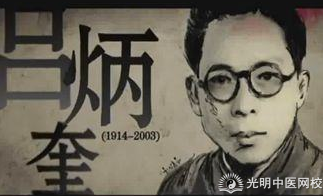
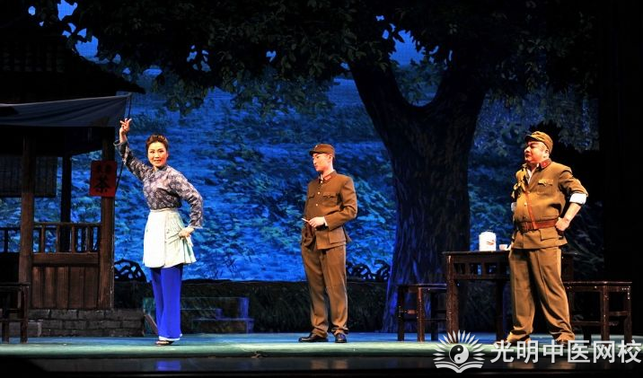
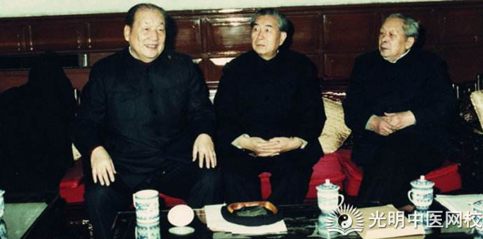
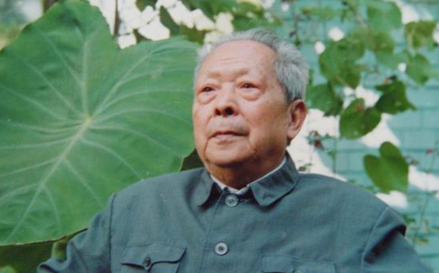
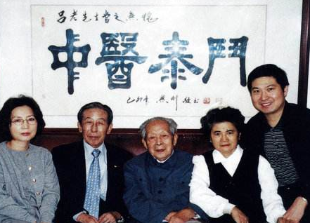

# 中医司令吕炳奎

2003年12月10日，忠诚的共产主义革命家，祖国中医事业的奠基人，吕炳奎吕老在北京因病逝世，享年九十岁。那一天，中医界失去了一位公认的领头人。那个中医们挥洒着热血的时代,也随着吕老的逝世而消亡了。

**年少从医**

1914年1月，吕炳奎出生于江苏嘉定。他的童年本该无忧无虑，但却在幼时身染重症，家人都束手无策，幸好在此时他得到了一位走方郎中的救治，从病魔手中脱身的吕炳奎，立下了学医济世的志向。

16岁时吕炳奎拜嘉定名医汪志仁为师，他学习刻苦，才思敏捷，很受师傅喜爱。20岁他便学有所成，随即挂牌应诊。他不吝金钱，对穷苦人家舍医送药，在当地积累下很高的威望。

 

**保境安民**

1937年7月7日，卢沟桥事变，抗日战争随之爆发。11月14日，嘉定沦陷。嘉定境内先遭到国民党残军的的骚扰，而后又遭到日军的烧杀，当地民众苦不堪言。

那一年吕炳奎23岁，正在热血蓬勃的年纪，又哪里能坐视家乡父老受苦受难？国民党军队溃败后流散在嘉定当地的枪支很多，吕炳奎便出资购买，很快就收集了200余支枪。为他将要谋划的大事做足了准备。

1938年春节后，吕炳奎发起建立了“杨甸民众自卫队”，这支队伍甫一建立就展示了威力。清明节前，四五个自寻死路的土匪到杨甸来敲诈农民，立刻就被自卫队打跑了。不久，队伍在朱家桥镇抓到了做尽坏事的汉奸徐朴民和刘世民，随即大快人心地将二人就地枪决。自卫队除暴安民的行动，在当地影响很大，嘉定城外出了一支真正抗日锄奸的游击队的消息，一时盛传周边。八一三周年时，自卫队500余武装还到嘉定城外向日军鸣枪示威一小时，真可谓意气风发，极大地鼓舞了队伍的士气。

**投身革命**

1938年9月初，通过好友的牵线，吕炳奎与中共党员邱生凡会面，邱生凡向吕炳奎阐明了抗战形势与共产党的主张，给他的思想带来很大的震撼。为了提高吕炳奎的思想觉悟，党组织还安排他参观了当时有“孤岛上的解放区”之称的、由我党主办的难民收容所。这也是吕炳奎后来成为一名优秀的共产主义革命家的第一步。

很快，“杨甸民众自卫队”成为了我党领导下上海郊县的三支抗日武装之一。这支队伍在敌后活动，他们烧毁日本军用飞机；伏击日军运输汽车；截击日军汽艇；铲除汉奸、土匪，深受当地百姓拥戴。吕炳奎更是走到哪里都不忘为百姓看病，乡亲们亲切地称呼他为“中医司令”。

1939年7月20日，吕炳奎在青浦正式入党。次日他便配合后来成为开国上将的叶飞将军全歼邓敬烈匪部一千余人，可谓是我党革命过程中一段传奇性与戏剧性并存的佳话。1940年2月吕炳奎调到苏常太地区的江抗东路司令部，跟随谭震林政委行动。对于自己这段经历，吕炳奎在后来有过这样的描述：“1940年到来到江抗东路司令部之后，在随谭震林政委一起行动时，每天晚上谭政委都给我和任天石同志上课，十几次课之后，我提高了对革命的认识，认清了两条路线的斗争问题。”也是在谭政委的特别教育之下，吕炳奎从一个单纯的爱国热血青年，转变成了一位真正的革命家。

从那以后，吕炳奎便一心投入到革命之中。1941年5月吕炳奎任路南特委委员兼军事部长，他利用医生身份积极开展地下工作，<51号兵站>、<沙家浜>等电影就反映了当时的地下斗争。

**
**

**临危受命**

建国之初，医疗条件十分艰苦，传统的中医带徒已经无法满足人民对中医师的需要，中医事业百废待兴。当时吕老曾一度远离了自己热爱着的中医行业，在江苏军部历任数职。直到1953年初，江苏省委书记柯庆施邀请几十位中医专家到家中过除夕，席间向专家们提及中医问题，并提出由吕炳奎领头，来创办一所中医院和一所中医学院。作为一位老中医，能够在建国后建设中医事业想必是吕老期盼已久的事，他当即表示愿意重操医业，为祖国的医学事业奉献余生。

1954年，吕炳奎任江苏省卫生部长。在任上，他创立了新中国第一所中医药大学——南京中医学院。数十位老中医都为这所学校的建立尽了力，有的编写教材，有的在校内任教。南京中医学院很快取得了成功，并引得全国各地纷纷效仿。

1956年，吕老调任中央卫生部中医司司长，正式赴任前，省委书记柯庆施还对他有过这样一番话：“你在部队里搞过经济工作，你改行搞经济工作会对你的发展有好处。你如果一直搞中医，可能对你没什么发展。”但吕老却全然不在意自身的“前途”，直言回答道：“我就是喜欢搞中医！”原来当年嘉定水乡那个满腔热血的青年，时至今日也未曾丢失这颗赤诚之心。他不屑做官场上风生水起的职业官僚，而是一心为祖国的医学事业奉献。

但此时首都中医界的形势却远非一片光明，反而显得十分暗淡。29年余云岫“废止中医案”的余威犹在，中医被视为封建残余，中医从业人员也是士气低落，对未来充满悲观失望情绪。而吕老到中医司上任之际就大着嗓门对司里的同仁说“你们要抬起头走路！那些人看不起中医，是奴才相的表现。你看不起我，我还看不起你呢。中医工作和其他卫生工作是平等的！”

为了发展中医事业这一目的，搞好中医教育是必须的。吕老上任中医司司长后的第一件事，就是解决北京中医学院创校之初遇到的诸多难题。当时学院无教师、无教材，学生入学后的抵触情绪很大，甚至上街游行。一番波折后，吕炳奎回到江苏省求援，求得教师40名及南京中医学院的教材，这才使北京中医学院的教学工作走上了正轨。诸如此类的困难，吕老还克服了很多。

但吕老恐怕没想到，这些困难与后来遇到的相比，还是微不足道的！

**中医劫难**

1962年2月，国家精简教育规模，卫生部计划将全国23所中医学院精简到5所。吕老得知消息，连夜上书周总理，称：“中医学院的班子不太大，现在全部中医学院的人数只及两三个西医院校那么多”、“过去好多人反对办中医学院，这是不了解祖国医学教育发展史” 、“中医学院的建立对中医界产生了巨大影响，中医的地位提高了，有的中医称中医学院是中医的命根子”、“砍掉十多所中医学院则需要从实际情况加以考虑，恳请保留各省市中医学院”。言辞恳切，句句在理。最终23所中医学校得以保留下21所。

1962年7月，北京中医学院第一批学生即将毕业。毕业前夕，院内任教的中医专家：于道济，陈慎吾，秦伯未，李重人，任应秋等五人联名向卫生部写信，指出学校教学中存在的问题。信中，五位教授就中医知识教学时长，学生中医基本功，文字功等方面向卫生部提出了五点建议，史称“五老上书”。

原来，建国以来创立的中医学院中，都存在着一定问题，那就是中西医混学。名为中医学院，实际的教学中却是中西医各占一半。这一点在五老上书时被一针见血地指出：“两年半学完中医课，两年半学完普通课和西医课。中西课时数的对比是1∶1，这似乎是培养中西兼通的教学计划，可因此西医没学好，中医也没学深透。”学生无法对中医精髓融会贯通，又因缺少实习课时而缺乏临床经验，故而毕业后也难以成为合格的中医师。五位教授正是指出了这些问题。

这次上书本是轰动整个中医界的壮举。可牵动着无数人心魄的那封信函，却如同泥牛入海，始终没有传出回音。尽管如此，以吕老为首的有识之士仍在努力，他们怀抱着希望，期盼中医院校的教学方式能够得到改善，从而重新缔造祖国医学的鼎盛之态。只可惜天不遂人愿，四年后，中医大师们期盼着的改变还未到来，另一场中医界的浩劫却浩荡而至。

1966年开始的文革中，老中医们被定性为牛鬼蛇神、反动学术权威，中医学院被停课拆并，中医司也被取消。曾经上书直言的五位教授被批为毒草，遭到迫害。程度之深，除年纪最轻的任应秋教授外，其他四位教授都在文革期间含恨离世。吕老也遭到批斗，一次竟被“造反派”生生打断两根肋骨。四人帮强制推行 “中西医结合”，堵死了中医独立发展的道路。那是中医界危急存亡之际，最黑暗的时刻，莫过于此时。

不过黑夜过后的黎明，往往最是耀眼。

****

**暮年壮志，寻求光明**

1976年，文革结束，中医事业经过许久的破坏,已是满目萧瑟。1977年，吕炳奎恢复工作，接管了中西医结合办公室。这一年他已经63岁，但接手工作后仍不辞辛劳地做了许多调查和研究，并向中央上交了关于中医工作建议的详细报告。这份报告引起了中央领导的重视，便召集卫生部的部长和副部长到中央开会，共同研究报告中的内容。而其中一位副部长，就是后来给予了吕老莫大帮助的崔月犁。

崔月犁，1920年生于河北省深县。他曾投身革命，潜伏在敌后的西医院，立下过不小功勋。1976年，崔月犁出任卫生部副部长，分管中医工作。只在中药铺做过三年学徒的他从未深入了解过中医，但他工作作风端正，态度认真，进行了大量的实地考察。考察中，他发现了祖国中医事业衰落的现状，晚年的自述中他写道：“文革前全国有371所县以上的中医院，最后只剩下171所，这剩下的171所，基本上是西医掌权，里面的医疗方法也基本上全是西医，即挂着“梅兰芳的牌子，唱着朱逢博的调子”。

人生何幸？得逢知音。当崔月犁看到吕炳奎那份关于中医的报告时，我们不难想象他心中的激动和欣慰，两个志同道合的人很快走到了一起。1982年4月，崔月犁出任卫生部长。4月16日，全国中医院和高等中医药院校建设工作会议在衡阳展开，史称衡阳会议。会议持续了六天，吕炳奎在会议上进行了发言，呼吁中医教育的改良和中医机构的建设。备受中医界瞩目的衡阳会议本该是中医事业复兴的起点，但此时即使是在崔月犁任部长的卫生部中，中医所遭受的阻力也是空前巨大的，大多数人的理念都与老中医们不同，中医的地位甚至不如文革之前。仅仅在会议开完一个多月后，在卫生部里反中医人士的周旋下，衡阳会议为中医所做的复兴措施被搁置，中医界所期待的官方支持成为泡影。吕炳奎也在会议后被通知退居二线，中医们失去了在政府内部的中坚力量，

此种情境下，只得另辟蹊径了。

**重现光明**

经过数年的筹划，在1984年12月18日，光明中医函授大学成立大会在全国政协礼堂隆重举行。光明函大的校领导中：李德生、崔月犁任名誉校长；汪一真、童陆生为总顾问；吕炳奎、王恩厚两位老中医任校长；王伯岳、王绵之、方药中、巫君玉、张协和、周凤梧、白永波、王德嘉等人任副校长，顾问达两百余人，几乎囊括了社会上大多数中医专家。

遥知兄弟登高处，遍插茱萸少一人。可惜的是，曾直言上书的“五老”中最后一老，任应秋老先生先已在同年十月去世。1976年文革结束后，他仍投身于中医教育事业，且笔耕不息，著书数卷。他关心中医事业的发展，还曾为衡阳会议做出总结报告。无奈驾鹤西去，终是没能看到中医界即将来临的黎明。

祖国中医事业的黎明的确已经到来了，1985年2月2日，光明函大的校长和副校长在政协礼堂举行茶话会，招待全国中医学会的第二次代表大会的70多位代表和本校顾问。5月18日，光明中医函授大学第一次分校校长会议在北京举行，函大校长、副校长和总顾问，以及18所分校校长等27人出席了会议。5月21日，光明中医函授大学开学典礼在全国政协礼堂隆重举行，校领导、总校顾问、分校校长、学员代表等千余人出席。卫生部长崔月犁、校长吕炳奎分别在会上发表了讲话。

光明中医函大的成立，是建国以来中医界最隆重的盛举之一。光明函大不同于以往的中医学院，它的中医课程相较其他中医院校更加纯粹、系统、全面，其教学思想非常注重临床实践，毕业考试的要求非常严格。也因此函大能够培育出十分优秀的传统中医师，“函大学生”这一身份，也在后来成了中医界的一道标杆。

1985年，那是光明中医函授大学最辉煌的一年。自从前一年12月正式成立后，社会各界不断有人报名学习，人数几乎逼近十万。光明函大学制四年，学习过程相当艰苦。出于培养精英中医生的意图，毕业考试的标准被设置的很高，最初的报名者们在学习过程中也在不断地被筛选着。最后，在第一批85届学员毕业的89年，只有15000名学员通过了毕业考试。而这些学员在多年之后，理所当然地成为了中医界新一代的中坚力量。直至今日，在中医界，光明函大85、86届的学员的名头仍然最为响亮。

通过创办光明函大，吕老收获了中医界的无数赞誉。这是吕老等人对中医事业做出的巨大功绩， 他“中医司令”的称号也正因这份实至名归，才得以流传至今。

**时势弄人**

但历史总是充满遗憾。当初在光明函大创校招生时，本已和学生们保证，毕业考试通过后，能够得到国家承认的正式学历。但在第一批学员毕业前，因为政策的问题，学历证明始终批不下来。没有学历,则无法考取行医资格证；没有行医资格，则无法行医。勤奋学习了数年的毕业生们，空有一身本领却无从施展，岂不成了笑话？一部分学生通过其它方式拿到了行医证，却也有一部分人始终没能如愿。时光飞逝，朱颜辞镜，这一本行医证竟成了许多良医毕生的遗憾。

学历证明无法下批的消息传开后，求学者们对光明函大的失望可想而知。85年的毕业生超过15000，86年的毕业生却不到3000人，随后更逐年递减，光明函大再也不复当初的辉煌。本已穿透黑夜的黎明，竟在不知不觉间，散尽了它全部的光辉。

1990年前后，光明函大被要求变更为公办或民办。为了保持中医教学的特色，函大毅然选择了民办形式。而后数年间，大大小小的打击又接二连三地到来。无数的艰难险阻，光明函大却仍然苦苦坚守着纯中医教学的道路。学校的创建者又何尝不辛苦？何尝不疲惫？但他们不敢倒下，因为他们的背后空空如也，无人能够接过这面旗帜。

****

**遗憾落幕**

2003年12月10日，新中国中医事业奠基人吕炳奎逝世，享年九十岁。即使在人生的最后一年，吕老也未曾放下自己的本职。03年春季非典横行，已是白身的吕老主动向有关部门请缨，要求亲赴前线抗击非典。虽然亲赴之事终究未能成行，但仍得到了组建医疗小组的许可。

为了振兴中医吕老奋斗了大半生，也在中医发展史上写下了浓墨一笔。人们叫他“中医泰斗”，把许多头衔加在他身上。但吕老本人又几时在意过那些虚名？他曾对邀

请自己去中医司任司长的徐部长说过这样一段话：“我来这里，不是为了当官，而是为了中医事业。我是中医，一定为中医讲话，为中医事业工作，这就是我的决心。”

他真的为中医奉献了一生。

而那所在1984年创立的光明中医函授大学，也在艰难地维持了近20年后，随着吕老的逝世落下帷幕。它培育出数万名优秀学子，印证了吕老所坚持的道路的正确性。它也目睹了中医的起落艰辛，也许它能感受到医生们的悲伤和惆怅。但它无能为力，所有人都无能为力。

旧的时代已经远逝，新的时代即将到来。在这个时代，等待着中医的又将会是什么？是黑暗？还是光明？