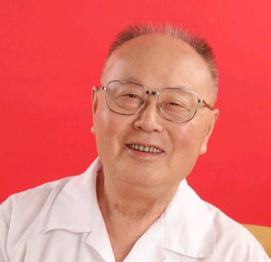

# 光明中医函授大学顾问周仲英传略

　　1928年，周仲英出生在江苏省南通市马塘镇，祖辈数代都以医为业，济世救人。周仲英出生时，他的父亲周筱斋已经是闻名乡里的中医大夫了。他从小目睹父亲帮助乡亲邻里治疗病症摆脱疾苦，自然而然地被神奇的中医所吸引了。

　　

　　13岁时，周仲英小学毕业，开始正式随父亲研习中医。严格的父亲并没让他立刻开始研读医书，而是要求他“业医必先精文”。先选读古文，再系统地学习[《内经》](http://www.gmzywx.com/ProductDetail/2743547.html)、[《伤寒》](http://www.gmzywx.com/ProductDetail/2743554.html)等典籍。

　　

　　1945年，17岁的周仲英开始随父亲出诊。他白天随父亲侍诊看病，晚上听父亲传经授道。1947年，他又考入上海新中国医学院中医师进修班学习。当时上海著名的老中医章次公、朱鹤皋等人都在校内任教。在这里，周仲英进一步夯实了中医经典和临床功底。

　　

　　1949年，周仲英回到家乡马塘开始独立行诊。开业后不久，他熟练运用医术，救治了一位高烧不退、濒临死亡的病人。一时间在当地名声大噪。

　

　　1955年，江苏省中医进修学校招募学员。周仲英参加了选拔考试，并顺利入选。学习期间，他重新温读了许多中医专著，还接受了西医知识，开拓了思路，增长了见识，为自己日后的行医之路奠定了扎实基础。

　　

　　20世纪70年代末，流行性出血热肆虐我国江浙一带。正在江苏省中医院工作的周仲英临危受命，开始了流行性出血热的临床研究。他身先士卒，带领研究团队深入疫区，到达疾病流行最为猖獗的地区，建立了临床研究基地。当地的生活条件艰苦异常，医护人员随时有着被感染的危险，但周仲英和战友们不畏险阻，在防护设施极为有限的情况下，设立门诊和病房，在第一线救治患者。经过一番艰苦奋斗，周仲英终于带领团队取得了辉煌的战果。统计表明，周仲英的团队治疗了1127例流行性出血热患者，病死率仅为1.11%，远低于其他地区。

　　

　　另一方面，周仲英十分重视中医教育。他在学术上对学生要求十分严格，他认为作为中医研究生，一定要有深厚的中医理论功底，要能够运用中医的理法方药分析和处理临床问题，要做到知常达变、学以致用。

　　

　　周仲英从1979年开始招收硕士生、1983年开始指导博士生。几十年来，他以独特的模式，培养了一大批中医事业的栋梁之才。桃李不言，下自成蹊。周仲瑛培养的这些学生，都己成为中医学科领域的骨干力量。

​    **光明中医函授大学办校期间周仲英曾出任光明中医函授大学顾问。**

　　

　　**2007年，周仲英成为第一批国家级非物质文化遗产项目“中医诊法”代表性传承人。**

　　

　　**2009年，周仲英被评为首届国医大师。**