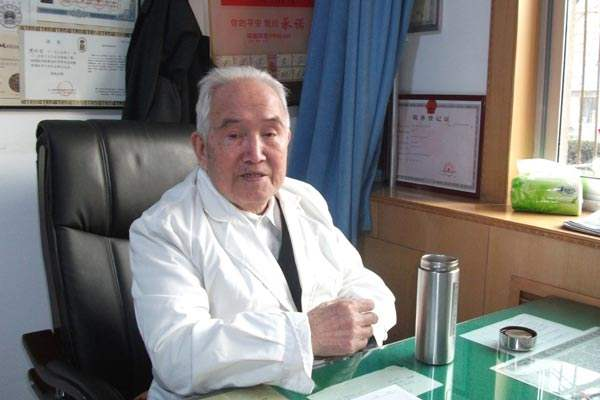
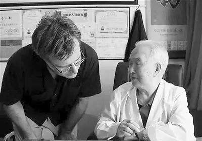

# 光明中医函授大学顾问周信有传略

周信有，1921年出生在山东牟平的一个武术世家。因家境贫寒，9岁时周信有随父亲背井离乡，辗转到东北安东谋生。时值日军侵略，战事频起、百姓贫病交加，民不聊生。这一切深深地刺痛了少年周信有的神经，激发了他投身医门，惠及百姓的决心。

　　

15岁时，周信有辍学，投拜至安东名医李景宸、顾德有门下学习中医。虽然身处战乱频繁、时局纷乱的动荡年代，但李景宸、顾德有两位名医仍然认真研习诊疗技术及方法、整理病例、研读医经。两位名医每晚挑灯夜读的身影和勤奋不倦的治学态度深深感染并影响着少年周信有。

浩瀚的中医药宝库对于没有中医药底子的年轻周信有来说既神秘又遥远。在老师的指导下，周信有从《药性赋》《濒湖脉诀》《汤头歌诀》《医学三字经》等启蒙书开始学习。“初学中医最有效的方法就是熟读强记。”周信有坚信“书读千遍，其义自见”，便在背诵上狠下功夫。在背得滚瓜烂熟的基础上，再请老师一一讲解，以加深理解。学通、学懂启蒙典籍后，周信有又研读《医宗金鉴》《温病条辨》等经典著作。

寒暑数易，周信有的少年时期在战乱颠沛与刻苦攻读中医典籍、跟随老师临床侍诊中度过。1941年，日本统治下的伪满政府实行汉医考试，时年20岁的周信有虽然对伪满政府十分不满，但一心想着治病救人的他还是顶着压力参加了考试并一举合格，获得了《汉医许可证》。此后他挂牌行医，走上长达77年的行医之路。

1960年，北京中医学院在全国范围内选聘教师，周信有被选中，主要从事[《黄帝内经》](http://www.gmzywx.com/NewsDetail/1123200.html)教学，兼任临床带教。从此，他便开始对《黄帝内经》中的阴阳学说、藏象学说和病机十九条理论等进行全面、系统、深入的研究，并有自己独到的见解，被誉为西北《黄帝内经》泰斗。

“《黄帝内经》本来比较枯燥，但在周老的讲解和演示下变得十分有趣。”回忆起在北中医上周信有讲解的内经课时的场景，作为周信有学生的甘肃省名中医王道坤满是敬佩。“有一次周老师讲病机十九条中火邪引起腹泻的‘暴注急迫’，他就抱着肚子做出急迫地想上厕所的样子，令我印象深刻。”王道坤说，“周老师《黄帝内经》研究的水平高，贡献大，使我受益良多。”

　　

虽然学校的教学和组织工作已占据了周信有的大部分时间，但他从未间断过临床研究与诊疗工作。周信有尊古而不泥古，将深谙的《黄帝内经》旨要和诸家之学灵活、准确地应用于临床，因而他临证思路开阔明达，辨证灵活，“复方多法、综合运用、整体调节”是周信有临床遣方用药原则，也集中体现了他的学术观点与临证思路。

1984年，他担任了光明中医函授大学的顾问一职。

2018年3月10日，国医大师周信有因病医治无效逝世，享年97岁。