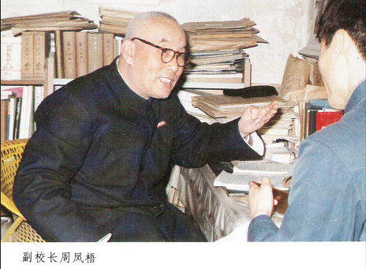
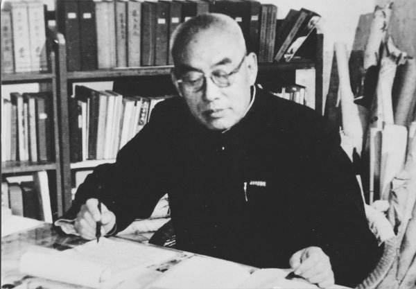

# 光明中医函授大学副校长周凤梧传略

1912年12月19日，周凤梧出生于山东临邑县。他出身于三世医家，祖父，伯父，父亲都是医生。16岁高小毕业后，他便开始随表兄张文奇学医。期间，他勤奋学习，刻苦钻研。广泛阅读中医典籍，打下了坚实的中医理论基础。

1937年，周凤梧迁居济南登门求教王静齐、吴少怀、徐鞠庐等三位名医，医术大有进益。1940年他通过济南市中医考试，正式在济南市永安堂药店坐堂行医。

　　

解放后，周凤梧响应政府号召，成立了济南市医务进修学校以及济南市中医协会。他本人担任了进修学校的副主任、济南市中医学会副主席，负责教务及开展中医学术活动。1951年，周凤梧创立济南市第一中西医联合诊所，亲自遴选了30余位技术高明的中医药人员在诊所内任职。因服务周到，疗效显著，很快就发展了6个门诊分所，职工达300余人。后又购地建起门诊楼一栋。**1953年秋，济南发生流行性乙型脑炎，诊所研制的紫雪丹、安宫牛黄散、清热镇痉散等药物，供市各传染病房抢救使用，疗效显著，与其他疗法配合治疗后，竟无一例死亡。周凤梧白天门诊，晚间授课，百忙之中仍不忘为中医界培育后续人才。**

山东中医学院于1958年8月建校初期，由于缺乏师资，无法单独分科任教。几年间周凤梧在校内承担医史、金匮、内科、妇科、中药、方剂等多门课程的教学。他在学院任教30余年，培育学生有数千之众，可谓“桃李满天下”。周凤梧本人也对此十分自豪，他曾说：“吾以区区坐堂中医，竟能执教于最高学府，欣慰之至。得天下英才而教之，一乐也。”

**1984年12月，受中医界的挚友之邀，周凤梧在北京担任了光明中医函授大学的副校长，并在校内任教。通过一众中医界老前辈的努力，光明中医函大达到了建国以来纯中医教育的顶峰。**

　　

1997年9月，为中医事业操劳了一生的周老驾鹤西去。悼亡声从全国各地传来，那是人们对这位良师的感怀。有人曾为周老题过一轴条幅，可看作是他一生的写照。词曰：“钢笔是武器，阵地是处方，三个指头探明病魔来路，一双慧眼望穿罹患迷障。一生戎马倥偬，两鬓吐絮飞霜。指挥无数扶正祛邪的战斗，培养几多杏坛精兵与良将。半个世纪的风风雨雨，写就十部辉煌的乐章。抽暇翰墨自遣，丹青百花齐放，笔下莺歌燕舞，纸上寒梅生香。”