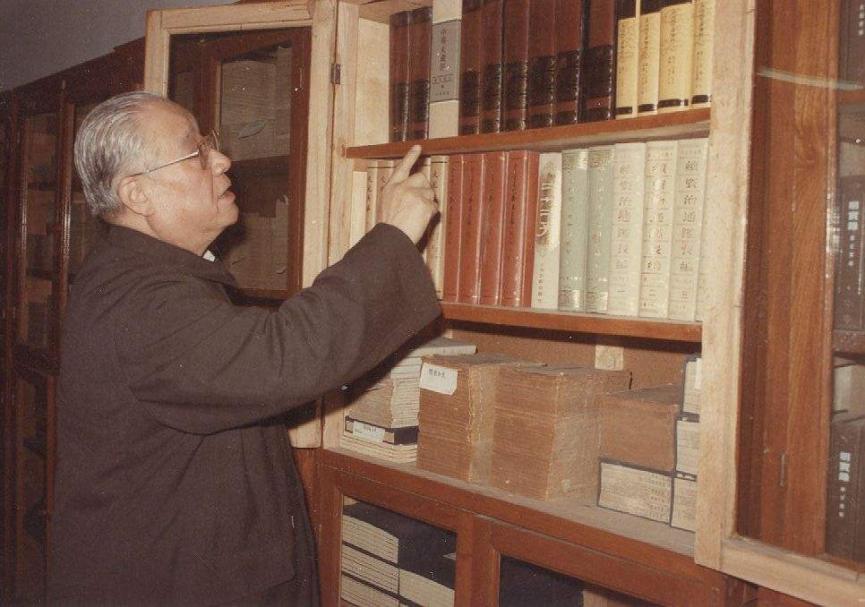
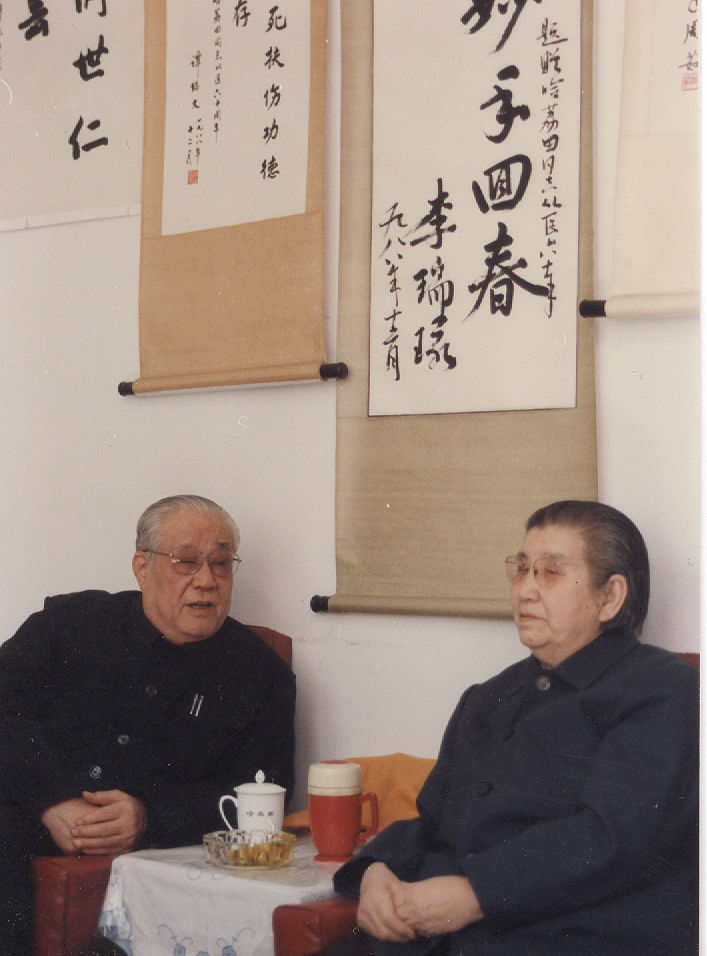

# 光明中医函授大学顾问哈荔田传略

哈荔田，1911年生于河北保定。他出身中医世家，幼承庭训，家学渊源。早年师从国医泰斗施今墨先生，1930年19岁时便开始为人看病，增加了临床经验。

1935年，他毕业于北平华北国医学院。次年开始在河北区平安街的哈氏诊所行医，因医术精湛而享誉津门。

　　

建国前，哈荔田曾协办北平国医专科学校，并任教与天津市国医训练班。建国后，他积极响应国家号召，创立了天津首家公立联合诊所。1954年底经天津市委决定，任市卫生局副局长。到任后，他积极贯彻执行党的中医政策，先后领导筹办了天津中医学校、天津中医学院，并积极组织了西医离职学习中医的工作，为发展中医事业不遗余力。

1955年2月，哈荔田被周恩来总理亲自任命为天津市卫生局副局长，他走上领导岗位后的第一件事就是对全市中医药行业进行调查。1955年12月，天津市政府采纳了他和陆观虎、赵寄凡等人的建议，成立了天津市中医医院，郭沫若先生亲自为医院提写了院名，这是天津乃至全国中医药历史上的一件大事。此外，在哈荔田等人的倡导下，天津市政府在各个西医院设立了中医科，广纳天津市名医，从而结束了中医个体坐堂行医的历史。

1958年，哈荔田遵照周恩来总理指示，将中医学校改建为天津中医学院，将中医医院改为附属医院，又将王串场工人医院改为中医学院第二附院，增加了实习教学基地。同时在课程安排上增加了西医课。从1958年到1965年，天津中医学院共培养高级中医人才800多人。

　　

哈荔田自幼喜读经书，对[《内经》](http://www.gmzywx.com/NewsDetail/1123200.html)、《素问》、《金匮翼》等医籍颇有研究。他学术造诣精深，治学严谨，博采众长，旨在创新，在古稀之年仍不予遗余力地从事研究生培养与临床科研工作。他主持的两项课题获得天津市科技进步奖，主编的《哈荔田妇科医案医话选》、《中医妇科验方选》、《扶正固本与临床》等著作在学术界影响颇大。

1984年，他担任了光明中医函授大学的顾问一职。

1989年9月9日，哈荔田教授去世，享年77岁。