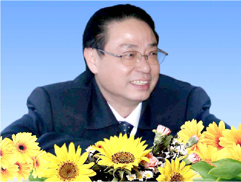

# 光明中医函授大学顾问孙光荣传略

孙光荣，国医大师、中医药文献学家、临床家，中医药文献研究学术带头人之一，中医药现代远程教育创始人之一。他使中医药文化成为显学，首倡“中和”临床学术思想。他研究并创立了中医药现代远程教育模式。

1941年11月，孙光荣出生于湖南浏阳。他幼承庭训，10岁开始随父亲正式学医。父亲告诫他：“做医生要有菩萨心肠，救死扶伤是医生的本分。先立德，而后才可出为良相，入为良医。”

　　

1964年，孙光荣开始随父行医。此后他在乡里行医近十年，医术医德在浏阳、株洲、醴陵、长沙一带都颇有声誉，还被评为“浏阳县农村医疗卫生先进工作者” “人民的好医生”等称号。

1978年，卫生部在全国开展选拔中医师统一考试，孙光荣以全县第一名的成绩录取。分配至湖南省中医药研究所理论实验室，师从著名中医药学家李聪甫研究员。此后7年半，孙光荣协助李聪甫临床诊疗、整理医案、开展科研。真传授受，师生情深，他也完成了从中医临床实践横跨中医文献理论研究的飞跃。

“如果说，中华文化的灵魂是‘和’，中医医德的核心价值就是‘仁’。中医医术的最高水平就是‘调’，中医疗效的终极指标就是‘平’。”孙光荣在临床诊疗实践中，无不秉持了中正平和的中医药文化内涵，贯穿了“贵中尚和”的理念。如同王维“诗中有画，画中有诗”的境界，孙光荣临证、教学之时，往往传递出清雅的中医药文化气息，令人如入芝兰之室。

1982年，李聪甫、刘祖贻、孙光荣承担国家中医药管理局第一批中医药古籍整理研究课题“《中藏经》整理研究”。当时课题经费有限，为寻找失传的《中藏经》赵孟頫手写本，孙光荣坐硬座、带干粮、睡地铺，独赴北京、上海等地。后来找到线索，上海博物馆一位退休技师知情《中藏经》赵本下落，但他拒绝接待。孙光荣硬是在他家门口守候3天，终于感动了老技师。正逢老技师的妻子风心病加剧，苦不堪言。孙光荣立即主动诊治、购药，治疗7天后好转。老技师感恩之余，指引他找到《中藏经》绝本。历经4年整理研究，《中藏经校注》《中藏经语译》及《中国历代名医名术》等著作相继出版，揭开了尘封千年的《中藏经》真貌，发掘了《中藏经》脏腑辨证八纲，揭示了判顺逆、断生死的规律和处方用药特点。

　　

多年来，孙光荣不遗余力地通过讲座、科普、写作传播中医药文化，普及中医药知识，在海内外主讲中医药文化及养生专题近90场。因其书、文两绝，他撰写并亲书“药王德业碑”和“祭药王文”，矗立在药王山大殿广场。

2013年，他向台湾提出中医药交流合作建议方案，获得海峡两岸有关领导大力支持，已开始付诸实施。2014年12月，国家中医药管理局中医药改革发展专家咨询委员会成立，他成为35名专家委员之一，继续为中医药改革发展建言献策。

新中国中医药事业奠基人吕炳奎教授曾为孙光荣教授题词：“杏苑英才，承先启后；医界志士，继往开来。”