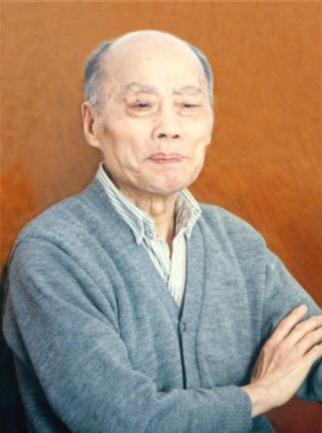
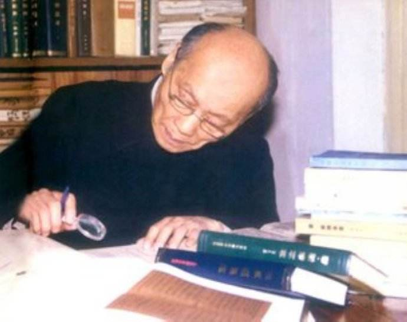

# 光明中医函授大学顾问尚志钧传略

尚志钧，1918年2月4日出生于安徽省全椒县的一个普通农家，在幼年时，他不幸丧母。

1940年，尚志钧考入重庆国立药学专科学校，毕业后，他在合国立第一制药厂任职。1945年，尚志钧返回安徽，在安徽合肥省卫生处任职。在卫生处任职期间，是尚志钧立志专攻本草文献的重要时期。当时因派别关系，他无具体事可做，因此有时间读书，而且经常返回全椒，同他的族兄尚启东（当地的名老中医）交往。尚启东爱好中医古籍的研究，在繁忙的诊务之余，仍从事中医古籍的整理工作。由于尚志钧多年来酷爱本草，恰好遇到亦喜爱研究中医古籍的尚启东，两人志同道合，谈得十分投机。于是，他们商定分头从事中医药古籍的整理研究，尚启东以中医古籍为主，尚志钧则以本草文献为主。

　　

尚志钧原是学西药的，做学生时就很想用现代科学的实验方法来研究中药。由于毕业后得不到实验研究的机会，他只好转向本草文献的研究。从1945年起，尚志钧一有空就到图书馆借阅有关清代乾嘉考据学派的著作，获得了很多辑校方面的知识。

尚志钧清醒地意识到，从事本草辑佚的研究，除具备药学知识外，还必须掌握一些跨学科的知识，如训诂学、目录学、校雠学等。因此，他用了2年多的时间阅读有关跨学科的书籍，这就为他研究本草文献打下了坚实的基础。

1949年，尚志钧在济南白求恩医学院任教。1950年，回安徽省芜湖参与筹办卫生训练班，该班即芜湖中级卫生技术学校，1958年，改为芜湖医学专科学校，1970年，更名皖南医学院。尚志钧一直在该校从事教学、临床和本草文献研究工作。1979年，晋升为副教授，1986年为教授。曾任中国药学会药学史分科学会委员，现任安徽省中医学会理事、[光明中医函授大学顾问](http://www.gmzywx.com/)、《基层中药》主编、《安徽中药志》编委等职。

　　

1990年9月，《新修本草》辑复本在北京举办的首届中国中医药博览会上展出，受到了医药界专家们的普遍关注和赞誉。正如“安徽厅简介”所说的：“尚志钧教授钩沉辑复《唐·新修本草》等18种本草文献，饮誉海内外。”

1986至1991年，尚志钧担任了中国药学会药学史分科学会委员。

2008年10月9日，尚志钧去世，享年90岁。