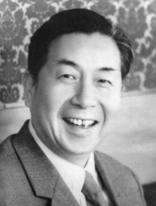
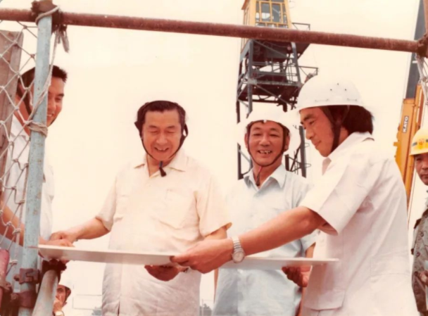
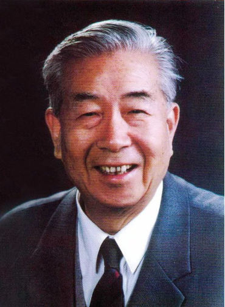

# 崔月犁传略

崔月犁，1920年出生于河北省深县，原名张广印。1937年6月参加革命，同年12月加入中国共产党。1982年4月任卫生部长、党组书记，兼任全国爱国卫生运动委员会副主任。在中共第十二次全国代表大会上当选为中央委员，在中共的第十三次全国代表大会上当选为中央顾问委员会委员。

崔月犁同志在革命战争年代曾与日寇浴血奋战于冀中平原，曾赴“白色恐怖”下的北平。为古城的和平解放出生入死；在建国初期，他废寝忘食，夙兴夜寐，为北京的重建与发展做出了巨大贡献；在“文化大革命”中，他遭到四人帮的迫害，经历了8年的铁窗生涯，而革命气节毫不动摇。1978年担任卫生部副部长以后，走遍全国，深入调查研究，做出了“振兴中医”、“保持和发扬中医特色”的决策，成为振兴中医药事业的一面旗帜。

崔月犁在任卫生部长期间，大力推广中医，使中医在一定程度上得到复兴，有效地缓解了医疗系统的压力。崔月犁留下的最伟大的遗产是在卫生部长任内完成了中华人民共和国宪法第21条的修订。新条款规定了中华原创医学具有与西方医学同等的学术地位，成为复兴中华文明的有力武器。这是新中国几代领导人政治智慧的结晶。

崔部长不仅一般地关心人才培训工作，而且细致到关心培训教材的编写质量。1995年，崔部长花了一个多月的时间通读了当时由中华气功进修学院编写的气功教材《中华气功学》，并对教材主编说：“你们的教材是经得起考验的，是唯物主义的。”使教材主编极为感动。中华气功进修学院是由几十位专家志愿者担纲的“草根”学院，一位现职的卫生部长不仅关心，而且细致到阅读其全部教材，实在不易。在特定语境下，“唯物主义”一言九鼎，份量极重，代表了政府当时对相关事业的积极态度。

崔月犁主席是位传奇人物。他的前半生是位杰出的革命家，为保护北京古城不受破坏，完整地回到人民的怀抱而出生入死；他的后半生是一位呵护中华原创医学文明的战士，为了这份人类共同遗产的永生而鞠躬尽瘁。他为人类留下的最伟大的遗产是在卫生部长任内完成了中华人民共和国宪法第21条的修订。新条款规定了中华原创医学具有与西方医学同等的学术地位。这是新中国几代领导人政治智慧的结晶，他的存在将成为炎黄子孙捍卫和复兴中华文明的有力武器。   

1998年1月22日，崔月犁主席在北京逝世，享年78岁。