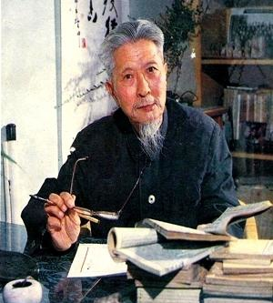
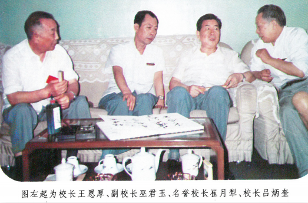

# 光明中医函授大学副校长巫君玉传略

1928年，巫君玉出生于江苏无锡。自幼他便随父学医，又先后拜师11位医学名家。17岁时，他便开始行医。20岁出头，就已经在无锡小有医名了。

1954年，巫君玉赴京就学于卫生部北京中医进修学校，同年9月由卫生部录用于直属卫生部的第六医院，在建立了第六医院第一批中医科后，任中医科主任，1956年，巫君玉在《中华医学杂志》上发表了第一篇临床总结《以茵陈蒿汤为主治疗黄疸》。1958年随院与北京市第六医院合并，随之建立北京市综合医院中第一个中医病房，1962年晋升为中医科副主任。

　　

**巫老被称为新中国成立之后中医界的技术领军人物。他博学多才，堪称大家，长于中医温病、急性热病以及消化系统病，精通内、外、妇、儿、杂病、疑难病，善用经方。他是新时代的中医，思想不守旧，主张西医的精髓为我所用，善于教学。**

可就是这样一位中医大家，却在1966年受到文革冲击，被遣送回乡，不得不说，这是我国60年代中医事业的一项损失。所幸他在1970年得到平反，并任无锡县东绛人民医院中医内科、针灸科、骨科负责人，还担任了无锡县中华医学会秘书长。

获得平反后，巫老的工作开始变得极其繁重。他身兼数职，同时还在不断地专研学术，发表过30余篇论文。**1984年，巫老出任光明中医函授大学副校长，再次为中医教育做贡献**。在[光明函大](http://www.gmzywx.com/)的一次会议上，巫老发言说：“只要我们认真去做，我相信一定能够搞好！这是我们在座的各位责无旁贷的任务。我们把问题解决了，才能保证我们的教学质量，才能为国家、为中医事业培养出更多的人才！”

　　

**1990年，巫老被批准成为全国第一批500名老中医之一。**

巫老这一生为中医事业呕心沥血，最后更积劳成疾。巫老临终前，红学家冯其庸来看望他。巫老只对自己的这位挚友说了两句话，他先是嘱咐冯老“不要感冒”，然后又说，“中医问题看来是个哲学问题”。冯老后来回忆起这一天的时候，眼角不禁湿润了。

1999年6月10日，中医教育家巫君玉在北京因病逝世，享年70岁。