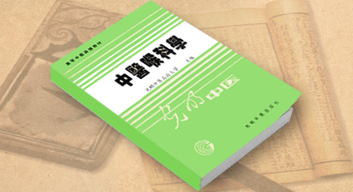

# 干祖望-《中医喉科学》编者

光明中医函授大学教材《中医喉科学》编者

1912年9月，干祖望医生出生在上海市金山县一个书香门第，5岁就被送往著名的姚石子家塾。1929年2月，拜师马培之高徒钟道生门下，平时除了跟师待诊，还要做扫地、挑水、擦灯罩、配方磨药等杂事。为了学习治疗急性喉梗塞病人施救时常用的擒拿术，苦练“三指抓坛功”。22岁时学成出师，在上海市金山县张堰镇挂牌行医，他听祖父不与名医撞车的告诫，诊病以外科为主，治疗外伤所敷药膏全是自己用麻油熬制，因疗效显著而备受欢迎。在上世纪30、40年代，卫生防疫工作差，每年都有“疫喉”流行，干祖望凭借娴熟的擒拿技术，配合中药内服、外敷，挽救了许多危重病人。

1946年，34岁的的干祖望将诊所迁至松江县城蒋金桥。1951年，个体诊所兼并，干祖望与同道们在松江城建立了第四联合诊所，并设立耳鼻喉科，成为中国第一个挂上“中医耳鼻喉科”牌子的诊所。1935年，进入上海张崇熙主办的东亚医学函授学校学习4年，获得毕业文凭。1947年任松江中医公会理事、江苏省中医师公会监事。1952年，来到北京“中央机关直属第二医院”耳鼻喉科进修学习半年。从带额镜、执音叉，到写西医病历，做手术操作，干祖望在短时间内逐步了解了西医耳鼻喉科的解剖、生理、病理知识；掌握了对耳鼻喉科疾病的检查手段和诊断方法；对一些简单疾病的手术操作也有所了解。1972年，以干祖望为首，江苏省中医院正式挂上了“中医耳鼻喉科”的牌子。

1980年卫生部委托南京中医学院主办全国中医耳鼻喉科进修班、师资班，此任务就落在干祖望肩上。年近七旬的他接受任务后马上开始赶编教材，编写了《耳鼻咽喉科中医古代文献选读》《中医耳鼻咽喉科总论》《中医鼻科学》《中医咽喉科学》《中医耳科学》等近100万字的书稿，备课、讲课也都是他一人。1980年成功举办了第一期学习班，反响良好。之后的1981年、1982年、1985年又连续以“独角戏”的形式举办了5期学习班，为全国各地培养了近100名专科人才。

1983年，江苏省中医学会成立了“中医耳鼻喉科专业委员会”，干祖望当选为主任委员；1987年中华中医药学会成立了“中华中医药学会耳鼻喉科分会”，干祖望担任主任委员。专业学会成立之后，干祖望毫无保留的将自己的毕生经验和学术思想与之交流、讨论，推动了整个中医耳鼻喉科领域的发展。

1988年，干祖望率先将中医耳鼻喉科专业推向世界舞台，在国家中医药管理局厦门国济中医培训中心，成功举办了第一期国际中医耳鼻喉科培训班，学员来自美国、新加坡、马来西亚、香港、台湾等国家和地区

1990年“全国500名名老中医师带徒”、1991年7月江苏省举办“拜师大会”时，干祖望收徒两名：陈国丰与徐轩。2001年至2004年，广东省中医院开展“院内师带徒”活动，干祖望作为老师之一，带教了李云英、廖月红两名徒弟。