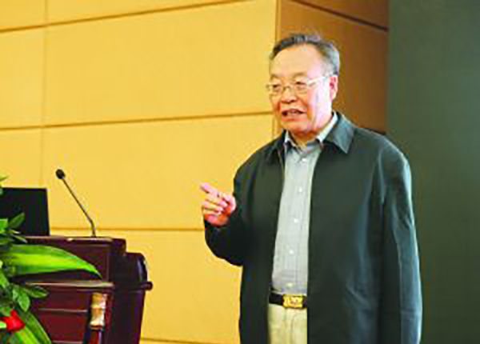
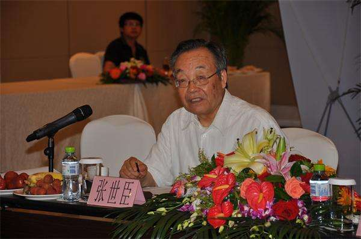

# 光明中医函授大学顾问张世臣传略

张世臣，中药学家，原北京中医学院（现北京中医药大学）教授，中药系（现中药学院）主任，中药研究所所长， 卫生部药政局副局长、原国家食品药品监督管理局注册司司长，精通中药鉴定学、中药炮制学。现任中国医药保健品，进出口商会中药饮片，分会专家组组长。

获国务院批为“有突出贡献专家”，并获发“政府特殊津贴”；曾获国家计委、科委、财政部三部委“国家八五科技攻关重大成果奖”；“国家中医药管理局中医药科学技术进步奖”（一等奖）。

1993年至1998年，任卫生部药政局副局长期间，在领导支 持下，推动完成了全国中成药整顿工作，组织完成了藏、 蒙、维三个民族药上部颁标准的工作；贯彻《国务院中药 品种保护条例》，启动开展了中药品种保护工作；推动了戒毒中药新药的研发、审批工作；推动了濒危物种中药新药的研发、审批工作，如人工麝香、人工虎骨、人工牛黄等；推动了癌症病人疼痛“三阶梯止痛”工作；推动了血液制品生产企业加快实施GMP的工作。其间任中华中医药学会副会长。

1998年至2000年，任国家食品药品监督管理局注册司司长期间，在组织修订《新药审批管理办法》时，提出了中药复方二类、一类新药的理念，并形成了相应条文；建议并设置了“注册受理办公室”，使药品注册工作实现了受理 、审评、审批三分离；建议并制定了《药品注册工作程序 》，促进了药品注册工作的规范、透明；顶住压力，排除阻力，批准“亚砷酸注射剂”（砒霜注射液）为新药，体现了中药的优势和特色，为白血病的治疗提供了新药，并走在了美国FDA的前面；启动、开展了将中药纳入法国药品法定标准进行管理的政府间合作的工作。

2000年退休后，应香港特区政府卫生署邀聘，赴港襄助中药管理相关工作（中药注册相关规定，中药GMP、GCP制定 ，与内地部分省市药检所、新药临床研究基地的合作等） 任中国中药协会副会长兼中药饮片专业委员会主任。

张世臣十分重视中医教育，1984年，他担任了[光明中医函授大学](http://www.gmzyjc.com/)的顾问一职。