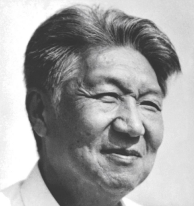

# 光明中医函授大学副校长张协和传略

　　1920年3月20日，张协和出生于江苏省铜山县。张协和的父亲在当地积极协助中共地下党工作，负责着地下党的情报联络和物资供应等工作。1937年，张协和山东高工毕业，随即参加了革命工作，以文艺方式宣传抗日且协助父亲掩护地下党的活动。

　　

　　**1940年，年仅21岁的张协和成为了延安高级技术专家之一。他在极端困难的条件下，创造性地就地取材，在解放区进行技术革新，为大生产运动开展做出重要贡献，被誉为“延安四杰”之一。1945年10月，他正式加入中国共产党。**

　　

　　建国初期物资匮乏，师资紧缺。他竭尽所能地为学校发展奠定了必须的物质基础和技术资料；同时又独具慧眼，积极地引进优秀的师资力量。他注重培养学员理论联系实际的品德和创业精神，培养了一大批新中国急需的专门人才，为中国的新型高等教育事业和山东的经济建设作出了重大贡献。

　　

　　从1954年开始，张协和同志就利用电子技术进行中医经络研究，独立发明了我国首台“经络测定仪”，这项发明填补了国内外的医学空白，证明了人体经络现象的客观存在，引起不小轰动。当时，周恩来总理、邓颖超和卫生部长李德全等领导同志都亲自充作了这台测定仪的试验对象，他们为挖掘祖国中医宝库和大力支持医学科研事业的献身精神，极大地鼓舞了张协和同志，使他在经络学研究及其应用方面取得了更大的进展。他50年代末、60年代初所组织此项研究的试验成果和论著至今仍保持着世界先进水平。

　　

　　张协和精于中医，有不少研究成果及专著。他十三岁即学习中医为人看病，后结合西医知识，坚持业余时间义务行医。他曾经周恩来总理推荐，兼任中央保健局医疗顾问，先后为毛泽东、刘少奇、周恩来、朱德、陈云等许多领导同志及国内外十数万患者义务诊治。由于他在中医临床与疑难病治疗方面的医术高超，虽非专业医生却享有“半个御医”之美称。他根据周恩来总理生前的当面指示，坚持利用经络原理对肿瘤的预测进行科学研究，并自费研制成测肿瘤等疾病的仪器，还编写了有关医学论著。

　　

　　为了给缺医少药的农村和边远地区培训基层中医药人才，**1984年，张协和同志参与创建了光明中医函授大学，同时义务兼任副校长**。一次大型会议上，张老风趣地发言道：“我是学机械的，我是在德日制学校里，选修的应用化学和建筑。同志们一定很奇怪，那我怎么能到这里来讲话呢？”但风趣归风趣，张老心中仍然装满了对中医教育的责任感，随即他又发言道：“毛主席曾经讲过，利用现代科学放大，研究、整理、发掘、提高祖国医学，使之成为第三医学，为世界、为全人类的健康服务——这是毛主席的思想，所以，我们要搞好中医教育，办好光明中医函大，为振兴中医事业做出贡献！”

　　

　　**张老为创建一个美好的新中国奉献了他的一生。1996年3月10日，张协和在北京逝世，享年76岁。**