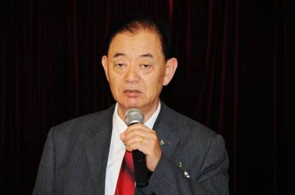

# 光明中医函授大学顾问张奇文传略

张奇文，1935年出生于山东寿光上口镇北半截河村。清雍正年间，当地出了一位名中医“李老爷”——李莪华。对于这位老中医的事迹，张奇文从小就耳濡目染，“李老爷”看病，十里以内不劳车马，看过一次后便主动上门复诊，且自带干粮烧酒，御寒防饥，决不食病人家酒饭。他去世后，乡亲们为他建庙立碑，并在他的忌日农历四月十三开始举行三天庙会。张奇文小时候总爱到庙会上去瞻仰这位医术高超、医德高尚的“李老爷”，并立志要做他那样的医生。

1957年，张奇文从昌潍医校毕业，来到昌潍地区人民医院中医科工作。为了提高医术，张奇文拜晚清秀才儒医郄秋浦、名医曹同文为师，夜以继日地锻炼自己。

　　

看病时，他视救死扶伤为天职，不遗余力为病人医治。病号出院后，仍主动上门为其复诊。碰到困难的家庭，拿出工资为其垫付医药费。那时，张奇文因医德医术兼具而受到老百姓的爱戴。1960年6月，经过层层推选，张奇文被选为“全国劳模”，出席全国文教卫生“群英会”。

此后，张奇文对自己要求更高，刻苦钻研中医知识。到1978年已在重要刊物上发表论文50余篇，再次因为突出贡献而被评为“全国劳模”，作为全国医药科技大会代表团成员受到国家领导人接见。“劳模”的精神发挥至今。

1981年—1985年，张奇文牵头与周凤梧等人主编了《名老中医之路》一书，共三辑，刊载了近现代97位名老中医的治学与成才之路。出版后，该书印刷万余册，很快被抢购一空，不得不再版。20多年过去了，张奇文认为又涌现出新一轮全国名老中医，于是，张奇文决定再编辑《名老中医之路续编》，拟于2010年出版完成。作出这个决定看似简单，而张奇文却要为此付出太多，“责任心使然”，这是老先生的解释。很多业内人士感叹于他的奉献精神。

　　

著名国医大师、广州中医药大学93岁的邓铁涛教授称该书“是一部20世纪当代名医的‘成才史’，是历史的新分支；是一部世界独有的中医教育史；也是一本20世纪中医传奇文学。

张奇文退休后先办本草阁、慈幼堂，后办百寿堂，沉潜社区，问病乡里。他目前已年过七旬，但对待每一个病人都耐心、认真。他说：“我的前半生很大一部分时间是当官、做学问，现在有时间了，我要把精力放在自己终生所热爱的事业上来。”