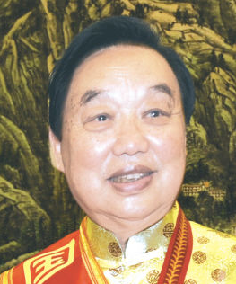
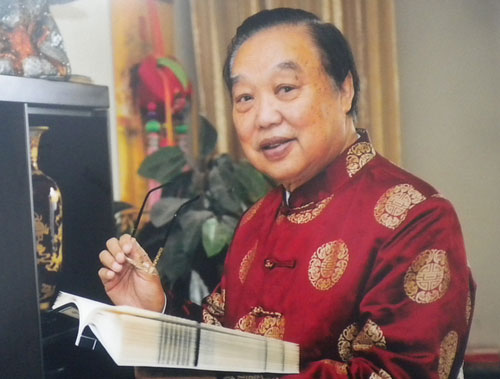

# 光明中医函授大学顾问张学文传略

1935年，张学文出生于陕西汉中的一个中医世家。年幼时，他在祖父和父亲的指导下，背诵《医学三字经》、《濒湖脉学》、《药性赋》、《汤头歌诀》等医籍，很快跨进了中医药的神秘之门。

“鸡鸣而起，星高而息”是张学文幼年苦读医书的真实写照。从15岁起，他随父亲学习中医，临证诊病，辨认药材。张学文回忆，每天父亲都听自己背诵《药性赋》、《汤头歌诀》，稍有错误，马上给予纠正，并要求反复吟诵。自己也从不敢懈怠，早背诵，晚抄写，直到学会记牢。对古代经典著作，他视为珍宝，爱不释手，每有体会则点批强记。

　　

18岁时，张学文参加了汉中南郑县的统一考试。他至今还记得当时考试的情景。考官问考生，知道“龙虎汤”的举手，张学文左右看看，自己是唯一举手的。在50名考生中，他的成绩第一。以优异成绩出师后，他开始了独立的从医生涯。1953年，张学文到该县武乡镇父亲创办的“致和堂”诊所应诊。

1956年，张学文考入“汉中中医进修班”学习，重点攻读了《内经》、《伤寒杂病论》等经典著作。日后之所以能成为临床大家，与他对经典医籍的熟读深悟、强记硬背、灵活运用分不开。

1958年，张学文又考入陕西省中医进修学校(陕西中医学院前身)中医师资班学习，毕业后留校任教。次年，他参加卫生部委托南京中医学院举办的“全国首届温病师资班”学习，师从全国著名中医内科专家孟澍江教授。在此期间，他对温病学说等学派产生浓厚兴趣，对其细细研究品味，并撷取其精华。

在临床上，他将自己多年积累的宝贵经验毫无保留地传给学生。在教学上，张学文率先对本科生和研究生进行了中医内科急症的强化教学。几十年来为国家培养了一大批优秀的高级中医人才。他不辞劳苦，常常奔波于全国各地讲学、诊病，传播中医急症研究的新思路、新方法和新成就。近年来，他退而不休，先后为广东、浙江、陕西带教高级学徒7人。如今，很多学生已成为享誉全国、闻名海外的高级中医药专家，成为推动中医药事业发展的生力军。

　　

2008年，张学文成为陕西省首届名老中医。

2009年，张学文被评为首届国医大师。