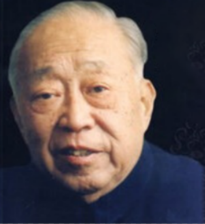

# 光明中医函授大学顾问张海峰传略

　　**张海峰，江苏镇江人。1915年生于中医世家，父亲与伯父均为江西名医。他幼时便继承家学熟读医典，对中医有着特别的爱好和执着。**

　　十几岁时，张海峰拜江西名医姚国美先生为师。1932年，他考入江西中医专门学校，系统地学习了中医基础理论。在学习中，他的学问日臻完善，为后来的成就打下了扎实的基础。对于张海峰来说，那是一段十分艰苦的时光。他白天临证跟师，夜里挑灯看书，直到鸡鸣时分。这样的勤勉精神深植他的心底，即使他后来已经成为一代名医，也未曾改变自己的学习习惯。

　　张海峰的学术思想之一便是坚持临床，他在临床中逐渐认识到，中医的发展在一定程度上需要借鉴西医的理论以及诊疗手段。想要中西医融通，需要很强的实践性，所以除了多读书外还要多临床、早临床。张海峰未及弱冠之年即跟随其父张佩宜先生侍诊抄方，前后五十余年。他一贯认为中医理论来源于实践，又反过来指导实践。

　　**张海峰十分重视中医教育，自从1959年江西中医学院成立，他在学院从事中医内科的教学、医疗和科研工作。在七、八十年代，中医人才出现断层时，他忧心忡忡，深为中医之前景担忧，他曾在多种场合，多次强调人才培养的重要性，1983年当选第六届全国人大代表，并在大会上为中医事业高声疾呼。**

　　**1984年，张海峰担任了**[光明中医函授大学](http://www.gmzywx.com/NewsDetail/1078385.html)**的顾问。**

　　1988年，张海峰教授去世，享年73岁。