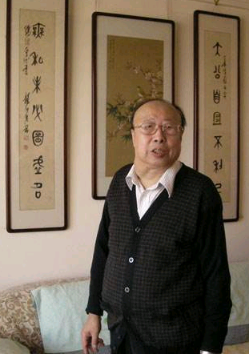
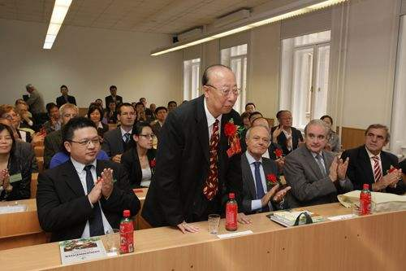

# 光明中医函授大学顾问张缙传略

张缙，1930年出生在辽宁省黑山县，自小受到母家影响，对中国传统文化十分痴迷。

1951年，张缙毕业于沈阳中国医科大学，毕业后在东北军区的廿六后方医院做了一名外科大夫。后来，一次偶然的机会，他得到了一本针灸家朱琏写的《新针灸学》，每当得闲，张缙便认真阅读、仔细揣摩，在不知不觉中便走进了中医的世界。

潜心学习了一段时间后，张缙开始为单位同事及家属扎针灸了。1952年，他在工作单位附近的乡镇向一位针灸大夫请教如何扎好针灸，老大夫说：“你就苦练，熟能生巧。”。张缙把“苦练”二字铭记在心，回到医院后便开始在质地松软的松木办公桌上练针，一练便是两年。

1956年，张缙调入黑龙江省祖国医药研究所，负责针灸经络研究室的工作。正当他要放开手大干一场的时候，却在次年被划为右派，下放到林口县刁翎乡。

在刁翎乡的四年半，张缙每天都为附近的乡亲扎针，从而积累了大量的实践经验，也算是因祸得福。

1963年，张缙调回原单位。之后，张缙对针刺手法进行了全面的研究。对于针灸复式手法，张缙也产生了自己的见解。他说，基本手法一个是烧火山，一个是透天凉，阴中引阳。再一个是飞经走气，气至病所，这两套东西完全掌握后，所有手法也就都学会了。

在临床上，张缙用针少，用穴巧，擅长飞经走气、气至病所以及用针取热取凉等手法，临床效果极佳。

　　

张缙的成就还体现在他作为一名真正的学者所具有的高瞻远瞩的战略胆识。他在1978年就提出了针灸学术的分科方案，并撰写了分科内容大纲。在把中医推向全世界方面，他更是倾注了极大的热忱。1984年，张缙还在光明中医函授大学任顾问一职。

张缙60年来从事中医研究工作，可谓历尽艰辛坎坷。他具有百折不挠的奋进向上精神，卓越的组织才能和超人的胆识，是一位精于科学技术研究的学者，又是一位中医药宏观战略方面的专家，这使他在循经感传、针刺手法、古典针灸文献及中医软科学研究等方面都取得了重要成就，为我国的针灸事业和中医药的发展作出了突出的贡献。