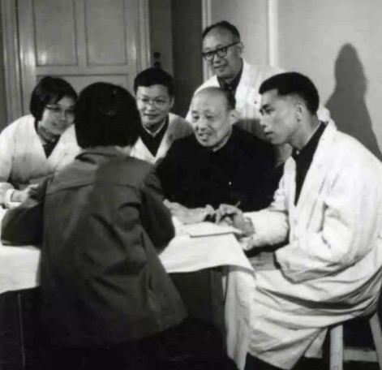

# 光明中医函授大学顾问张赞臣传略

　　张赞臣，1904年出生，江苏武进蓉湖人。张赞臣家中世操医业，他幼承家学，16岁随父来沪，入上海中医专门学校，后转读于上海中医大学，**师从谢利恒、曹颖甫等诸名家。民国15年毕业后，悬壶沪上。精内、外、妇、儿、五官各科，尤以外、喉科见长。**

　　

　　民国18年，旧国民政府中央卫生会议企图通过“废止中医案”，张赞臣闻知消息后，痛心疾首，即奔波呐喊，联合全国中医界人士奋起抗争，终于取得胜利，其对维护中医事业之一片热忱,于此可见。

　　解放后，张氏响应人民政府的号召，率先参加国家医疗单位工作，先后任上海市第五门诊部（原中医门诊所）副主任、上海市卫生局中医处副处长、上海市中医文献研究馆副馆长以及上海中医学院曙光医院顾问等职，撰写了《本草概要》、[《中医外科诊疗学》](http://www.gmzywx.com/ProductDetail/2750819.html)、《张赞臣临床经验选编》等书，并在有关刊物上发表了不少学术论文。自1960年开始，张氏目击中医耳鼻咽喉科未能受到应有重视，以致后继乏人，濒将失传，毅然决定侧重于中医耳鼻咽喉科的临床与科研工作，还兼任了上海中医学院耳鼻咽喉科教研组主任，主办全国和上海耳鼻咽喉科医师进修班等，在培育人才、学术研究各个方面，为中医耳鼻咽喉科的继承和发扬作出了一定的贡献。

　　

　　**张赞臣创制了“金灯山根汤”、“养阴利喉汤”、“前胡玉屏汤”及外用“喉科牛黄散”、“银硼嗽口液”等多种喉科验方。他为人诚笃，治学严谨，既重视前人根据临床实践总结之理论认识，又能在自己处方遣药的经验基础上，不断提高与发展。**

**光明中医函授大学办校期间张赞臣曾出任光明中医函授大学顾问。**　

　　

　　1993年，张赞臣逝世，享年89岁。