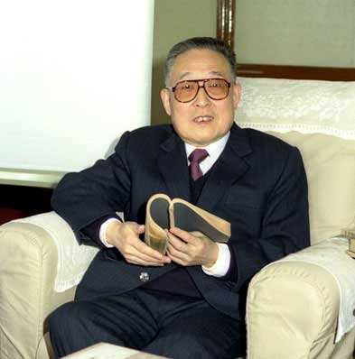
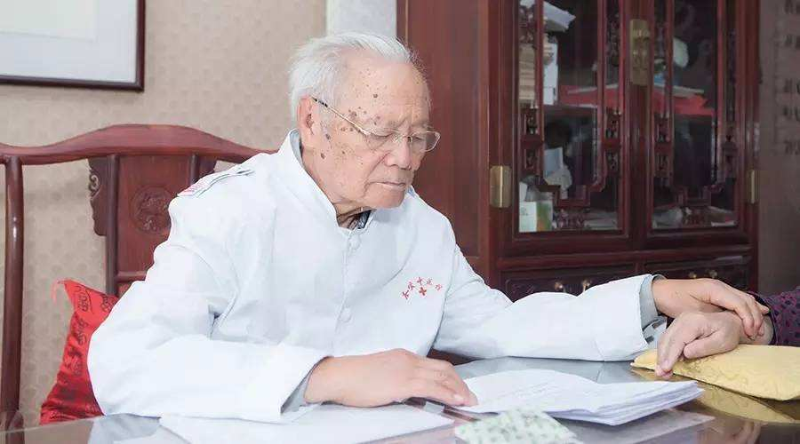

# 光明中医函授大学顾问张镜人传略

1923年6月，张镜人出生在上海。张氏世代业医，以擅治热病而闻名于江南，由明末相传至今。张镜人教授为第12代传人。

少年时，张镜人半日习文，半日学医，深得张氏内科家传之奥秘；青年时参加全国中医考试，一举成名。

300多年前，张镜人的祖先张君调弃儒从医，悬壶济世，扭转了这个世居沪上、耕读传家的家族的历史方向。自此，张氏医学代代相传，以治疗伤寒热病著称。在《上海县志》、《上海续县志》等地方志书中，记载有张氏一门7代11人以医而名的事迹，可谓门楣光耀，名重一方。

　　

因家族中立有长子必继祖业的规矩，张镜人童年时便被长辈寄予继承家族医学的厚望。他4岁时入家族私塾发蒙，习诵从《三字经》到《四书五经》的传统经典，也夹杂着《汤头歌》、《本草经》一类篇目。到12岁，家中开始遍请名医，安排他半日习文，半日学医。张家培养传人按部就班，颇有章法。张镜人从少年起即随长辈抄方，18岁单独随父张君益侍诊，并开始一试身手。在这一阶段，据说他每晚回家，都要接受父亲对接诊病例的剖析点拨，还要继续温习经典名著，加以印证对照。

1945年，张镜人独立应诊，医名渐起。1946年，他以家传医师身份参加民国政府举办的抗战胜利后首届全国中医考试，在3000余名考生中脱颖而出，荣登不足300人的榜单。当时考试主要的项目是论文，题目是《亢则害承乃制论》，他古文医典烂熟于胸，一看即知语出[《内经》](http://www.gmzywx.com/NewsDetail/1123200.html)，挥笔而就2000余言，条分缕析，议论备至。自此他被视为一代青年才俊，在上海中医界崭露头角。

1954年，张镜人接受上海市人民政府市长陈毅署名委任，担任市卫生局医疗预防处中医科副科长。他毅然关闭自己的私人诊所，放弃高薪收入，辞退保姆、司机，成为沪上中医界加入公共医疗机构第一人。此后，他历任上海市卫生局中医处副处长、副局长。

在任上，张镜人重点抓了全市的中医带徒工作，同时还在上海中医学院、上海医科大学等高校兼任教职，参与培养了成批的中医人才。“文革”期间，他无论下放到乡村还是基层单位，都要主动自编教材，带教赤脚医生和工人医生。1973年起，他受市卫生局委托主持西医学习中医学习班的教育工作。改革开放后，他任上海市第一人民医院中医科主任，开始在科室定期开展“读书会”活动，带领大家温习经典、医论医著；跨入新世纪，他以八旬高龄担任了上海市优秀青年医学人才的指导老师。同时，他还作为全国和上海市名老中医药专家学术经验继承工作指导老师亲自带教多名学生。

　　

1984年，张镜人担任了[光明中医函授大学](http://www.gmzywx.com/)顾问一职。

1994年，张镜人获“上海市名中医”。

2009年，张镜人荣获全国首届“国医大师”称号。

然而，在国医大师表彰大会前夕的6月14日，张老在上海华东医院病逝，享年86岁。