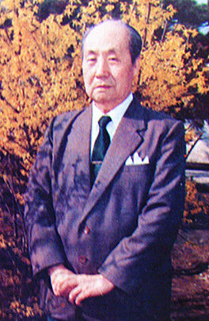
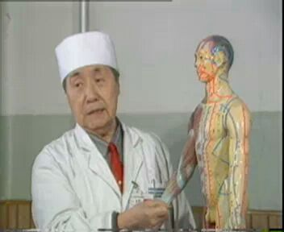

# 光明中医函授大学顾问彭静山传略

　　1909年，彭静山出生于奉天开原。他从小就是孤儿，叔父拼凑了学费，在他16岁时送他到当地秀才刘景川创办的“必仁医学社”学习医经。在那里，他学习了《药性赋》、《汤头歌诀》、《濒湖脉学》、《医学三字经》等医学经典。但因刘景川只解医经却不会医术，第三年，彭静山就离开了必仁医学社。

　　

　　彭静山的第二位老师是刘景贤先生。当时刘景贤只有26岁，开设了一家“瑞霖医社”，在当地很有名望，求诊者络绎不绝。这位老师在接诊时口若悬河、高谈阔论，可大多是只谈闲话，不谈医理。开给病人的药物也以丸药为主，较少开方。不过病人却反应吃药有效。这便令彭静山产生了疑惑，第一位老师会讲课却不会看病，第二位老师会看病却不讲医理，究竟理论和临床该怎样联系起来呢？他仍旧莫名其妙。

　　

　　不久，开原来了一位针灸专业的唐先生，针灸手法十分老到，病人很多。彭静山与刘景贤一同拜入这位唐先生门下。但彭静山因家境贫寒，交不起太多学费，只能学到了一些皮毛。

　　

　　开原别无名医，彭静山的叔父费了九牛二虎之力，托人把彭静山送到沈阳去拜师。这第四位老师，便是当时在沈阳鼎鼎有名的马二琴先生。彭静山拜师马二琴的时候，马二琴还不到四十岁。他从马先生学习二年，除了讲解过去读过而不理解的医经字句外，又补读了[《温病条辨》](http://www.gmzywx.com/ProductDetail/2743553.html)。马老不但医术高超，为人也谦虚诚朴。当时统治东三省的张作霖的常请马老看病，时人多称赞。但马老总笑曰：“比如我开个鞋店，张大帅买了找一双鞋，并不等于我的鞋每双都特别好，这不算什么。”

　　

　　在马老门下，彭静山的医术日益精进。22岁时，他开业行医。从此济世悬壶近70年，他精通内、外、妇、儿、针灸，提倡针药并用，临床经验丰富。新中国成立后，彭静山历任中国医科大学、辽宁中医学院针灸教研室主任、副教授、教授和附属医院针灸科主任、副院长。

　　

　　然而，在上世纪60年代，彭静山却因受到迫害而失去听力。在之后的临床中，他无法进行听诊。但他克服了重重困难，突破望诊极限，根据[《黄帝内经》](http://www.gmzywx.com/ProductDetail/2743547.html)“观眼察病”和《证治准绳》对眼的脏腑划分理论，于1970年代创眼针疗法。

　　

　　眼针疗法。自1982年公布于世后，不少学者分别对眼针进行临床研究和实验研究，其临床和解剖学结果均肯定彭氏的眼针穴区划分和眼针疗法的临床价值，使眼针疗法得到推广应用，并在海内外针灸界产生了较大的影响。

​    

**光明中医函授大学办校期间彭静山出任光明中医函授大学顾问。**

　

　　2003年3月20日，彭静山在沈阳病故, 享年95岁。