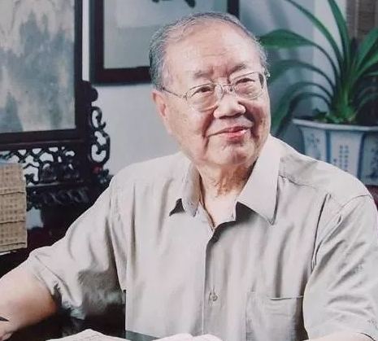
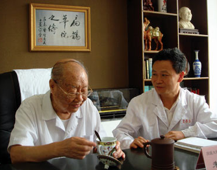

# 光明中医函授大学顾问朱良春传略

　　偏于一隅而名闻天下者，朱良春也。“朱良春现象”是中医界称道的话题。他老师章次公曾送他一方印章，上刻：“神仙手眼，菩萨心肠”这句话，是朱良春一生的真实写照。

　　1917年，朱良春生于江苏镇江。17岁时，他在武进孟河拜御医世家马慧卿先生为师，开始学习中医。次年，又转至苏州国医专科学校学习。1939年2月，他就开始在南通设立诊所，开业行医了。在当时，朱良春有一个“五毒医生”的雅号，因为他善用有毒的虫类药。虫类药为血肉有情之品，生物活性强，但作用峻猛、具有一定的毒性，能搜剔深入精髓骨骱之病邪，没有功底的医生是不敢乱用的。当年，药店老药工当得知开方子的朱良春只有20多岁时，赞叹道：“这个年轻大夫，胆识可真大。”

　　**1945年起，朱良春开始筹备创办南通中医专科学校，自任副校长。1952年，他又参与创办中西医联合诊所，任所长。后改为联合中医院，任院长。1956年，他无偿将医院全部设备捐给政府，成立市级中医院，担任院长。**

　　**中医界治风湿病素称“南朱北焦”，即指南通朱良春和北京焦树德。而朱良春经验方“益肾蠲痹丸”是目前唯一能修复骨膜破坏的中药制剂，很多癌症患者在朱良春这里绝处逢生。**

　　朱良春既和邓铁涛、路志正、任继学、颜德馨等名师大家相知很深，也和民间医生、无名晚辈私交甚笃。多年来，朱良春从不以名医、大家自居，对同事、下属、学生、徒弟、平民百姓皆一视同仁，对求教者真正做到了有信必复，有问必答。他90高龄还四处看病讲学，使中医薪火相传。他常说，世上只有“不知”之症，没有“不治”之症。山西名医李可先生在一次会议上见到朱良春，热情地跑过来拥抱这位素未谋面的老师，因李可早年吸取了朱良春用虫类药的部分经验，效果很好，心仪已久。朱良春笑道：“不敢当，我现在用药审慎，不如你那样胆大有魄力。”

　　90多岁的朱良春有着骄人的精力和体力，气度儒雅，虽然一脸平和与安然，但其纵贯古今之学识、浩荡之胸怀、仁善之心肠，总让人生出无限敬意。朱良春虽久居南通，却成为一代名医，不以位高职显，而是真正以德服人，以术服人。

　　直到90多岁，朱良春也还没有退休。20多年前国务院发了一个“杰出高级专家，暂缓退休”的文件，使朱良春一直成为南通市中医院的职工，既然是医院的职工，就要尽义务，所以朱良春每周都到南通市中医院出诊。2009年，他被国家评为国医大师。

　　2015年12月14日凌晨0点06分，名医朱良春因突发肺栓医治无效在南通中医院去世，享年98岁。