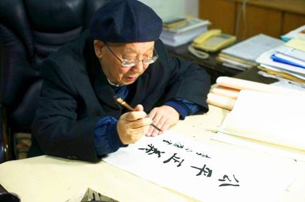
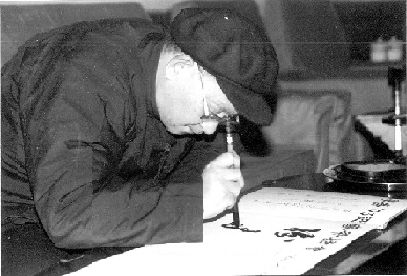

# 光明中医函授大学顾问李今庸传略

　　1925年，李今庸生于湖北枣阳市唐家店镇的一个世医之家。家人为他取名今庸，取自**《三字经》**“**中不偏，庸不易。**”之句。意为**立定志向**，**矢志不移**，**永不改易**。

　　李今庸7岁进入私塾，开始攻读**《论语》《孟子》《大学》**等儒家经典，他博闻强记，日记千言，常过目成诵。1939年。李今庸开始随父学医，先研读**《黄帝内经》《伤寒论》《金匮要略》**等医典。他只用了约一年时间，便将《黄帝内经》的内容烂熟于心。到了后来，他更因能将经典医籍原文一字不差地背诵，而被人们誉为“内经王”。

　　

　　不过在当时，由于父亲的严格要求，李今庸学医11年后，才被父亲允许独立行医。

　　

　　1953年，李今庸响应政府号召，在家乡以父亲的诊所为基础组建了“联合诊所”，成为当地政府领导下的主要医疗机构，为四邻八乡的百姓防病治病。次年，他进入湖北省中医进修学校深造，1957年，他在母校任教，担任中医教学工作。

　　

　　**李今庸非常重视教材建设。1959年，他首先在湖北中医学院筹建《金匮》教研组，并担任组长，其间编写了《金匮讲义》，作为本院本科专业使用。**1963年代理主编全国中医学院第二版试用教材**《金匮要略讲义》**，从而将**《金匮》**这一学科推向了全国；1973年为适应社会上的需求，该书再版发行；1974年协编全国中医学院教材**《中医学基础》**；1978年，主编《内经选读》，供中医本科专业使用，该教材受到全国**《内经》**教师的好评；1978年，参与编著高等中医药院校教学参考丛书——**《内经》**；1987年为光明中医函授大学编写了《金匮要略讲解》，2008年该书更名为**《金匮要略讲稿》**再版发行。几十年来，李今庸为中医药院校教材建设，倾注了满腔心血。

　　

　　另一方面，目睹几十年来中医行业不断衰落的现状，李今庸为保护发展中医药这份中华民族文化瑰宝，四处奔走，呼吁呐喊。1982年，他同全国中医专家一起签名，向中央反映全国中医药事业情况，并建议成立国家中医药管理机构；1984年又同全国11位中医药专家一起签名，上书国务院总理，建议通过成立国家中医药管理机构，这便是中医史上有名的“**十老上书**”；**2003年4月还直接给中央领导写信，恳请迅速制定保护和发展中医药的法规，保护和发展具有东方特色的中医药学。同年，国务院颁布《中华人民共和国中医药条例》。从上世纪70年代至今，李今庸教授共写下提案、建议、信函200余篇，推动了中医药发展。**

　

　　2014年10月30日，人社部、国家卫计委、国家中医药局在北京人民大会堂举行国医大师表彰大会，湖北中医药大学90岁高龄的李今庸教授获得这一中医界的最高荣誉。李老通过不懈的奋斗，为祖国医学创建了美好的未来。这样的精神，值得每一个中医从业者学习。